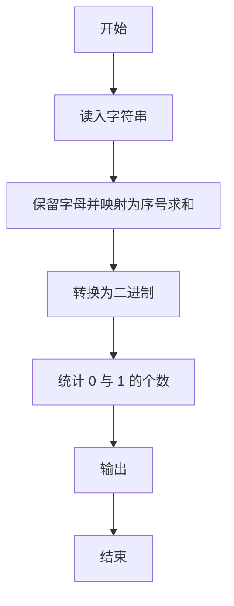
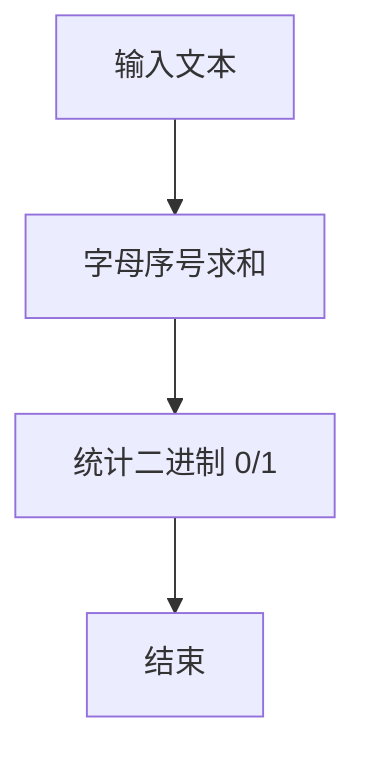

# 1057 数零壹

- **分值：** 20分

### 题目描述

给定一串长度不超过 $10^5$ 的字符串，本题要求你将其中所有英文字母的序号（字母 a-z 对应序号 1-26，不分大小写）相加，得到整数 N，然后再分析一下 N 的二进制表示中有多少 0、多少 1。例如给定字符串 `PAT (Basic)`，其字母序号之和为：16+1+20+2+1+19+9+3=71，而 71 的二进制是 1000111，即有 3 个 0、4 个 1。

### 输入格式：

输入在一行中给出长度不超过 $10^5$、以回车结束的字符串。

### 输出格式：

在一行中先后输出 0 的个数和 1 的个数，其间以空格分隔。注意：若字符串中不存在字母，则视为 N 不存在，也就没有 0 和 1。

### 输入样例：
```
PAT (Basic)
```

### 输出样例：
```
3 4
```

**鸣谢浙江工业大学之江学院石洗凡老师补充题面说明。**


### 解题思路

本题的核心是：忽略非字母字符，将字母序号求和，再统计二进制表示中 0 和 1 的数量。程序先读取题目输入，再按照上述规则完成数据处理，最后严格按照题目要求输出结果。实现时应优先根据题目约束选择合适的数据类型和数据结构，避免溢出或不必要的重复计算。

时间复杂度为 O(L)；空间复杂度取决于输入规模，主要用于保存题目数据和中间结果。

### 代码流程说明

1. 读入字符串，仅保留字母。
2. 将 A/a 记 1，累加得到 sum。
3. 统计 sum 的二进制中 0 与 1 的个数。

### 代码实现

```ruby
# 题目：1057-数零壹
# 实现原理：
# 本题的核心是：忽略非字母字符，将字母序号求和，再统计二进制表示中 0 和 1 的数量
# 时间复杂度为 O(L)；空间复杂度取决于输入规模，主要用于保存题目数据和中间结果。
# 代码步骤：
# 1. 读取输入并初始化必要的数据结构。
# 2. 按题意完成核心计算，处理边界情况。
# 3. 按题目要求格式化并输出结果。
#
value = STDIN.gets.to_s.chars.select { |char| char.match?(/[A-Za-z]/) }.sum { |char| char.downcase.ord - "a".ord + 1 }
bits = value.to_s(2)
puts "#{bits.count('0')} #{bits.count('1')}"
```

### 代码流程图



### 解题流程图



### 常见易错点

- A 和 a 都算 1。
- 非字母忽略。
- 输出顺序是 0 的个数再 1 的个数。
