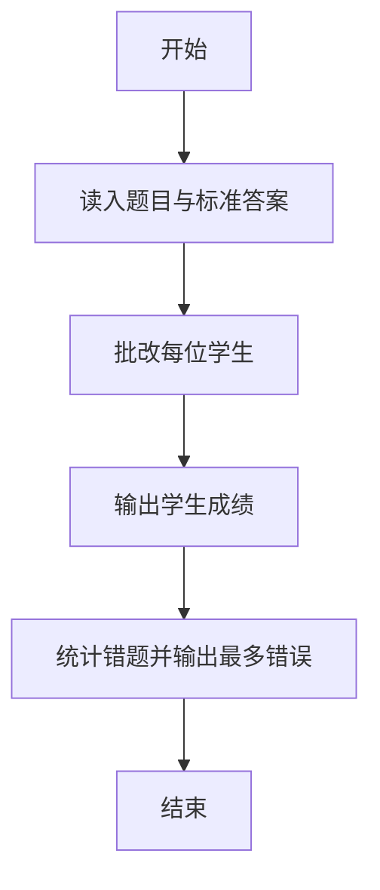
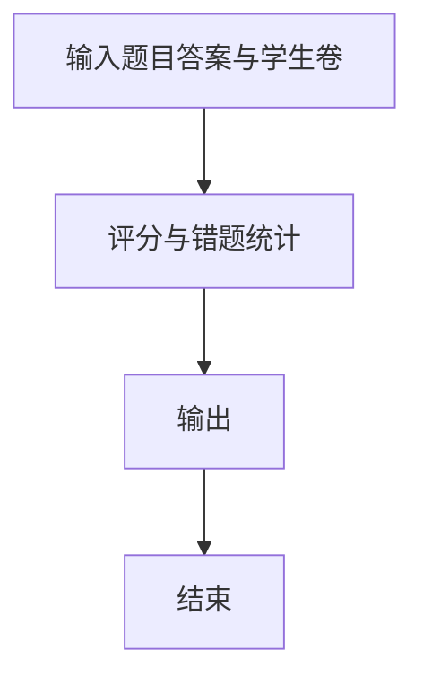

# 1058 选择题

- **分值：** 20分

### 题目描述

批改多选题是比较麻烦的事情，本题就请你写个程序帮助老师批改多选题，并且指出哪道题错的人最多。

### 输入格式：

输入在第一行给出两个正整数 $N$（$N\le 1000$）和 $M$（$M\le 100$），分别是学生人数和多选题的个数。随后 $M$ 行，每行顺次给出一道题的满分值（不超过 5 的正整数）、选项个数（不少于 2 且不超过 5 的正整数）、正确选项个数（不超过选项个数的正整数）、所有正确选项。注意每题的选项从小写英文字母 a 开始顺次排列。各项间以 1 个空格分隔。最后 $N$ 行，每行给出一个学生的答题情况，其每题答案格式为 `(选中的选项个数 选项1 ……)`，按题目顺序给出。注意：题目保证学生的答题情况是合法的，即不存在选中的选项数超过实际选项数的情况。

### 输出格式：

按照输入的顺序给出每个学生的得分，每个分数占一行。注意判题时只有选择全部正确才能得到该题的分数。最后一行输出错得最多的题目的错误次数和编号（题目按照输入的顺序从 1 开始编号）。如果有并列，则按编号递增顺序输出。数字间用空格分隔，行首尾不得有多余空格。如果所有题目都没有人错，则在最后一行输出 `Too simple`。

### 输入样例：
```
3 4
3 4 2 a c
2 5 1 b
5 3 2 b c
1 5 4 a b d e
(2 a c) (2 b d) (2 a c) (3 a b e)
(2 a c) (1 b) (2 a b) (4 a b d e)
(2 b d) (1 e) (2 b c) (4 a b c d)
```

### 输出样例：
```
3
6
5
2 2 3 4
```


### 解题思路

本题的核心是：读取标准答案与每题分值，逐项计算学生答案得分和各题错误人数。程序先读取题目输入，再按照上述规则完成数据处理，最后严格按照题目要求输出结果。实现时应优先根据题目约束选择合适的数据类型和数据结构，避免溢出或不必要的重复计算。

时间复杂度为 O(nm)；空间复杂度取决于输入规模，主要用于保存题目数据和中间结果。

### 代码流程说明

1. 读入每题分值与标准答案。
2. 批改每位学生并累计错误题。
3. 输出学生成绩与错误最多的题。

### 代码实现

```ruby
# 题目：1058-选择题
# 实现原理：
# 本题的核心是：读取标准答案与每题分值，逐项计算学生答案得分和各题错误人数
# 时间复杂度为 O(nm)；空间复杂度取决于输入规模，主要用于保存题目数据和中间结果。
# 代码步骤：
# 1. 读取输入并初始化必要的数据结构。
# 2. 按题意完成核心计算，处理边界情况。
# 3. 按题目要求格式化并输出结果。
#
text = STDIN.read.gsub(/[()]/, " ").split
index = 0
students = text[index].to_i
index += 1
questions = text[index].to_i
index += 1
scores = []
correct = []
errors = Array.new(questions, 0)
questions.times do |i|
  scores[i] = text[index].to_f
  options = text[index + 1].to_i
  correct_count = text[index + 2].to_i
  correct[i] = text[(index + 3), correct_count]
  index += 3 + correct_count
end
students.times do
  total = 0.0
  questions.times do |i|
    selected_count = text[index].to_i
    selected = text[(index + 1), selected_count]
    index += selected_count + 1
    same = selected.sort == correct[i].sort
    total += scores[i] if same
    errors[i] += 1 unless selected.sort == correct[i].sort
  end
  puts total == total.to_i ? total.to_i : format("%.1f", total)
end
max_error = errors.max.to_i
if max_error.zero?
  puts "Too simple"
else
  puts ([max_error] + errors.each_index.select { |i| errors[i] == max_error }.map { |i| i + 1 }).join(" ")
end
```

### 代码流程图



### 解题流程图



### 常见易错点

- 多选题答案比较要考虑选项集合。
- 错误次数并列时按题号输出。
- 没有错题时按题面输出。
