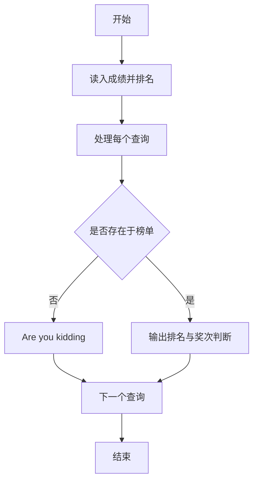
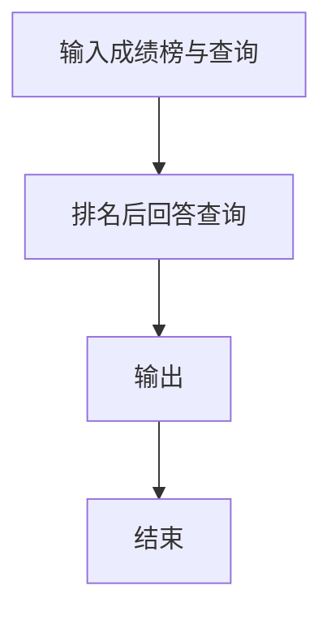

# 1059 C语言竞赛

- **分值：** 20分

### 题目描述

C 语言竞赛是浙江大学计算机学院主持的一个欢乐的竞赛。既然竞赛主旨是为了好玩，颁奖规则也就制定得很滑稽：

- 0、冠军将赢得一份“神秘大奖”（比如很巨大的一本学生研究论文集……）。
- 1、排名为素数的学生将赢得最好的奖品 —— 小黄人玩偶！
- 2、其他人将得到巧克力。

给定比赛的最终排名以及一系列参赛者的 ID，你要给出这些参赛者应该获得的奖品。

### 输入格式：

输入第一行给出一个正整数 $N$（$\le 10^4$），是参赛者人数。随后 $N$ 行给出最终排名，每行按排名顺序给出一位参赛者的 ID（4 位数字组成）。接下来给出一个正整数 $K$ 以及 $K$ 个需要查询的 ID。

### 输出格式：

对每个要查询的 ID，在一行中输出 `ID: 奖品`，其中奖品或者是 `Mystery Award`（神秘大奖）、或者是 `Minion`（小黄人）、或者是 `Chocolate`（巧克力）。如果所查 ID 根本不在排名里，打印 `Are you kidding?`（耍我呢？）。如果该 ID 已经查过了（即奖品已经领过了），打印 `ID: Checked`（不能多吃多占）。

### 输入样例：
```
6
1111
6666
8888
1234
5555
0001
6
8888
0001
1111
2222
8888
2222
```

### 输出样例：
```
8888: Minion
0001: Chocolate
1111: Mystery Award
2222: Are you kidding?
8888: Checked
2222: Are you kidding?
```


### 解题思路

本题的核心是：按成绩降序排名，并用集合标记出现过的成绩及其是否通过检查。程序先读取题目输入，再按照上述规则完成数据处理，最后严格按照题目要求输出结果。实现时应优先根据题目约束选择合适的数据类型和数据结构，避免溢出或不必要的重复计算。

时间复杂度为 O(n+k√n)；空间复杂度为 O(n)。

### 代码流程说明

1. 读入成绩并排名。
2. 读入查询编号。
3. 输出排名；未出现输出 Are you kidding，查重输出 Checked，素数奖提示。

### 代码实现

```ruby
# 题目：1059-C语言竞赛
# 实现原理：
# 本题的核心是：按成绩降序排名，并用集合标记出现过的成绩及其是否通过检查
# 时间复杂度为 O(n+k√n)；空间复杂度为 O(n)。
# 代码步骤：
# 1. 读取输入并初始化必要的数据结构。
# 2. 按题意完成核心计算，处理边界情况。
# 3. 按题目要求格式化并输出结果。
#
tokens = STDIN.read.split.map(&:to_i)
count = tokens.shift
ranks = {}
tokens.first(count).each_with_index { |id, i| ranks[id] = i + 1 }
query_count = tokens[count]
queries = tokens[(count + 1), query_count]
prime = ->(number) { number >= 2 && (2..Math.sqrt(number).to_i).none? { |d| (number % d).zero? } }
queries.each do |id|
  rank = ranks[id]
  if rank.nil?
    puts format("%04d: Are you kidding?", id)
  elsif rank == -1
    puts format("%04d: Checked", id)
  else
    label = rank == 1 ? "Mystery Award" : prime.call(rank) ? "Minion" : "Chocolate"
    puts format("%04d: %s", id, label)
    ranks[id] = -1
  end
end
```

### 代码流程图



### 解题流程图



### 常见易错点

- 排名并列规则要与题面一致。
- 素数判断不要忘记 1 不是素数。
- 查询输出格式固定。
