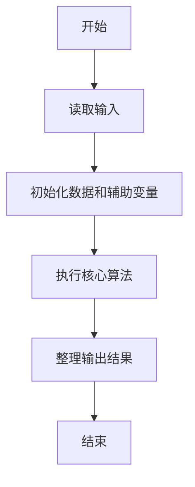
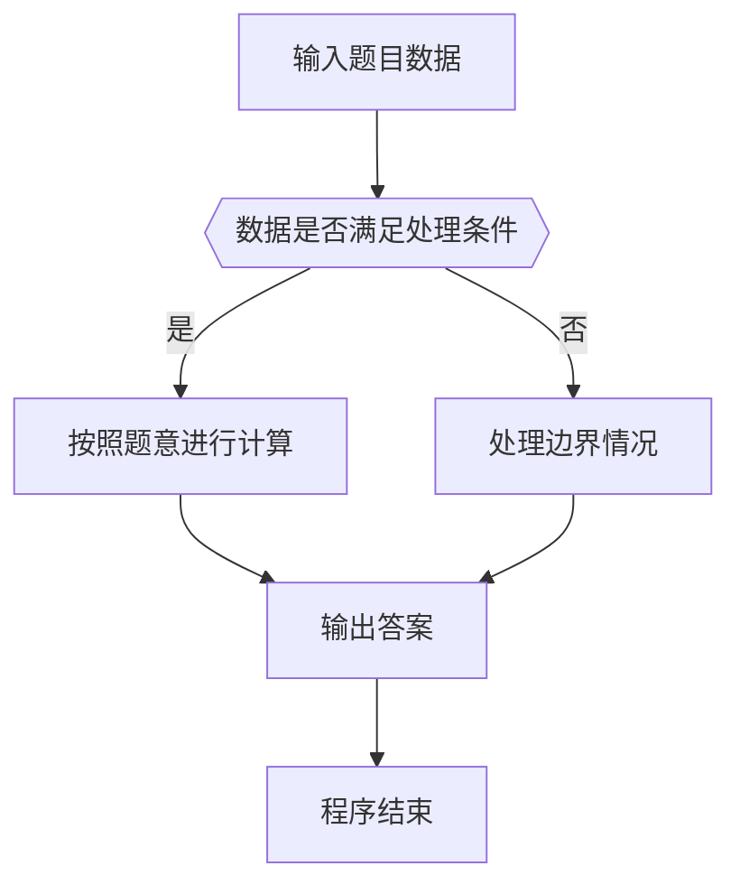

# 1060 爱丁顿数

- **分值：** 25分

### 题目描述

英国天文学家爱丁顿很喜欢骑车。据说他为了炫耀自己的骑车功力，还定义了一个“爱丁顿数” $E$ ，即满足有 $E$ 天骑车超过 $E$ 英里的最大整数 $E$。据说爱丁顿自己的 $E$ 等于87。

现给定某人 $N$ 天的骑车距离，请你算出对应的爱丁顿数 $E$（$\le N$）。

### 输入格式：

输入第一行给出一个正整数 $N$（$N\le 10^5$），即连续骑车的天数；第二行给出 $N$ 个非负整数，代表每天的骑车距离。

### 输出格式：

在一行中给出 $N$ 天的爱丁顿数。

### 输入样例：
```
10
6 7 6 9 3 10 8 2 7 8
```

### 输出样例：
```
6
```


### 解题思路

本题的核心是：按骑行天数降序排列，找出满足至少 E 天严格超过 E 英里的最大 E。程序先读取题目输入，再按照上述规则完成数据处理，最后严格按照题目要求输出结果。实现时应优先根据题目约束选择合适的数据类型和数据结构，避免溢出或不必要的重复计算。

时间复杂度为 O(n log n)；空间复杂度取决于输入规模，主要用于保存题目数据和中间结果。

### 代码流程说明

1. 读取 1060 爱丁顿数 所需的输入数据。
2. 初始化计数器、数组或其他辅助变量。
3. 按骑行天数降序排列，找出满足至少 E 天严格超过 E 英里的最大 E。
4. 按题目规定的格式输出计算结果。

### 代码实现

```ruby
# 题目：1060-爱丁顿数
# 实现原理：
# 本题的核心是：按骑行天数降序排列，找出满足至少 E 天严格超过 E 英里的最大 E。程序先读取题目输入，再按照上述规则完成数据处理，最后严格按照题目要求输出结果。实现时应优先根据题目约束选择合适的数据类型和数据结构，避免溢出或不必要的重复计算。
# 时间复杂度为 O(n log n)；空间复杂度取决于输入规模，主要用于保存题目数据和中间结果。
# 代码步骤：
# 1. 读取输入并初始化必要的数据结构。
# 2. 按题意完成核心计算，处理边界情况。
# 3. 按题目要求格式化并输出结果。
#
tokens = STDIN.read.split.map(&:to_i)
count = tokens.shift
distances = tokens.first(count).sort.reverse
answer = (1..count).select { |days| distances[days - 1] > days }.max || 0
puts answer
```

### 代码流程图



### 解题流程图



### 常见易错点

- 注意输入数据的范围，选择足够大的整数类型，并正确处理边界值。
- 循环、数组下标和字符串结束位置要严格对应题目定义，避免越界。
- 输出格式必须与题目要求完全一致，包括空格、换行、大小写和特殊符号。
- 如果存在排序、去重、进位、约分或四舍五入等操作，应在输出前统一完成。
