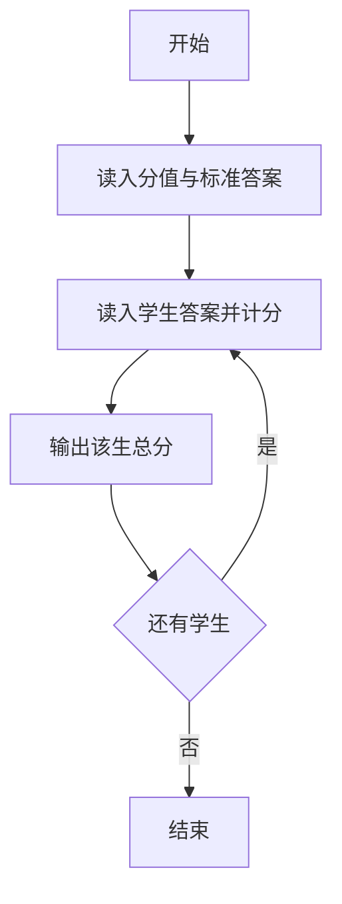
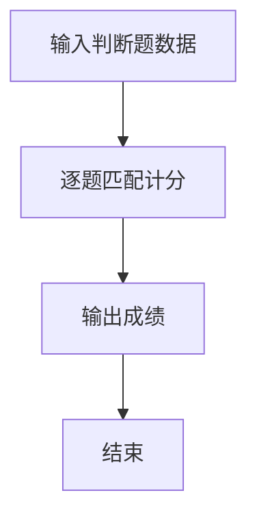

# 1061 判断题

- **分值：** 15分

### 题目描述

判断题的评判很简单，本题就要求你写个简单的程序帮助老师判题并统计学生们判断题的得分。

### 输入格式：

输入在第一行给出两个不超过 100 的正整数 $N$ 和 $M$，分别是学生人数和判断题数量。第二行给出 $M$ 个不超过 5 的正整数，是每道题的满分值。第三行给出每道题对应的正确答案，0 代表“非”，1 代表“是”。随后 $N$ 行，每行给出一个学生的解答。数字间均以空格分隔。

### 输出格式：

按照输入的顺序输出每个学生的得分，每个分数占一行。

### 输入样例：
```
3 6
2 1 3 3 4 5
0 0 1 0 1 1
0 1 1 0 0 1
1 0 1 0 1 0
1 1 0 0 1 1
```

### 输出样例：
```
13
11
12
```


### 解题思路

本题的核心是：逐题比较学生答案与标准答案，累加对应分值。程序先读取题目输入，再按照上述规则完成数据处理，最后严格按照题目要求输出结果。实现时应优先根据题目约束选择合适的数据类型和数据结构，避免溢出或不必要的重复计算。

时间复杂度为 O(nm)；空间复杂度为 O(m)。

### 代码流程说明

1. 读入每题分值与答案。
2. 逐个学生比较并计分。
3. 每行输出一个总分。

### 代码实现

```ruby
# 题目：1061-判断题
# 实现原理：
# 本题的核心是：逐题比较学生答案与标准答案，累加对应分值
# 时间复杂度为 O(nm)；空间复杂度为 O(m)。
# 代码步骤：
# 1. 读取输入并初始化必要的数据结构。
# 2. 按题意完成核心计算，处理边界情况。
# 3. 按题目要求格式化并输出结果。
#
tokens = STDIN.read.split.map(&:to_i)
students, questions = tokens.shift(2)
scores = tokens.shift(questions)
answers = tokens.shift(questions)
students.times do
  choices = tokens.shift(questions)
  puts choices.each_with_index.sum { |choice, i| choice == answers[i] ? scores[i] : 0 }
end
```

### 代码流程图



### 解题流程图



### 常见易错点

- 答案比较要完全一致。
- 每行一个成绩。
- 分值累加用整数。
