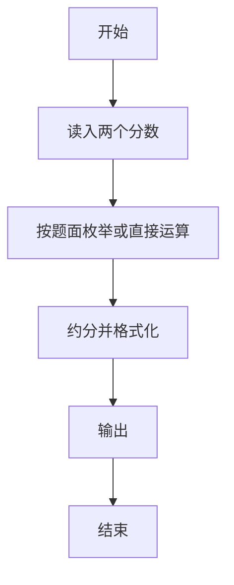
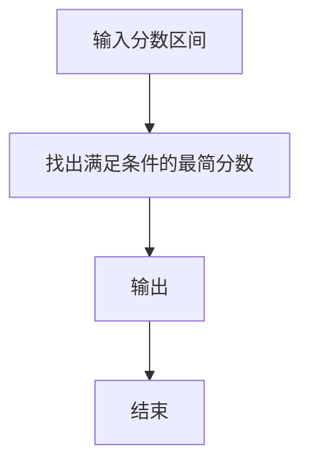

# 1062 最简分数

- **分值：** 20分

### 题目描述

一个分数一般写成两个整数相除的形式：$N/M$，其中 $M$ 不为0。最简分数是指分子和分母没有公约数的分数表示形式。

现给定两个不相等的正分数 $N_1/M_1$ 和 $N_2/M_2$，要求你按从小到大的顺序列出它们之间分母为 $K$ 的最简分数。

### 输入格式：

输入在一行中按 $N/M$ 的格式给出两个正分数，随后是一个正整数分母 $K$，其间以空格分隔。题目保证给出的所有整数都不超过 10000。

### 输出格式：

在一行中按 $N/M$ 的格式列出两个给定分数之间分母为 $K$ 的所有最简分数，按从小到大的顺序，其间以 1 个空格分隔。行首尾不得有多余空格。题目保证至少有 1 个输出。

### 输入样例：
```
7/18 13/20 12
```

### 输出样例：
```
5/12 7/12
```
**鸣谢海南师范大学王心诗慧同学修正题面！**


### 解题思路

本题的核心是：将两个分数转成统一分母，计算和、差、积、商并约分输出。程序先读取题目输入，再按照上述规则完成数据处理，最后严格按照题目要求输出结果。实现时应优先根据题目约束选择合适的数据类型和数据结构，避免溢出或不必要的重复计算。

时间复杂度为 O(k log k)；空间复杂度为 O(1)。

### 代码流程说明

1. 读入两个分数与进制/范围参数。
2. 按题面找范围内最简分数或进行四则运算。
3. 约分输出。

### 代码实现

```ruby
# 题目：1062-最简分数
# 实现原理：
# 本题的核心是：将两个分数转成统一分母，计算和、差、积、商并约分输出
# 时间复杂度为 O(k log k)；空间复杂度为 O(1)。
# 代码步骤：
# 1. 读取输入并初始化必要的数据结构。
# 2. 按题意完成核心计算，处理边界情况。
# 3. 按题目要求格式化并输出结果。
#
first, second, denominator = STDIN.read.split
numerator_a, denominator_a = first.split("/").map(&:to_i)
numerator_b, denominator_b = second.split("/").map(&:to_i)
result = (1...denominator.to_i).select do |numerator|
  numerator.gcd(denominator.to_i) == 1 &&
    numerator_a * denominator.to_i < numerator * denominator_a &&
    numerator * denominator_b < numerator_b * denominator.to_i
end
puts result.map { |numerator| "#{numerator}/#{denominator}" }.join(" ")
```

### 代码流程图



### 解题流程图



### 常见易错点

- 分子分母要约到最简。
- 区间开闭要与题面一致。
- 输出空格分隔或按样例。
