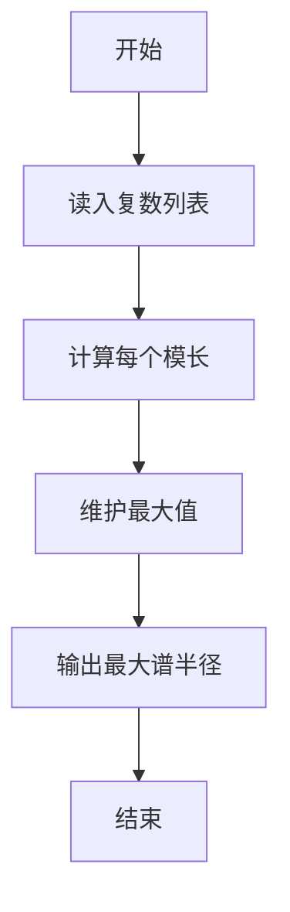
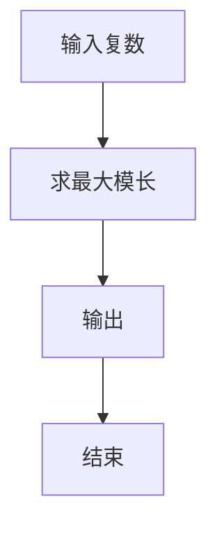

# 1063 计算谱半径

- **分值：** 20分

### 题目描述

在数学中，矩阵的“谱半径”是指其特征值的模集合的上确界。换言之，对于给定的 $n$ 个复数特征值 $a_1+b_1i,\ldots,a_n+b_ni$，它们的模为实部与虚部的平方和的开方，而“谱半径”就是最大模。

现在给定一些复数空间的特征值，请你计算并输出这些特征值的谱半径。

### 输入格式：

输入第一行给出正整数 $N$（$N\le 10\,000$），是输入的特征值的个数。随后 $N$ 行，每行给出 1 个特征值的实部和虚部，其间以空格分隔。注意：题目保证实部和虚部均为绝对值不超过 1000 的整数。

### 输出格式：

在一行中输出谱半径，四舍五入保留小数点后 2 位。

### 输入样例：
```
5
0 1
2 0
-1 0
3 3
0 -3
```

### 输出样例：
```
4.24
```


### 解题思路

本题的核心是：计算每个复数的模长，保留最大值并按指定精度输出。程序先读取题目输入，再按照上述规则完成数据处理，最后严格按照题目要求输出结果。实现时应优先根据题目约束选择合适的数据类型和数据结构，避免溢出或不必要的重复计算。

时间复杂度为 O(n)；空间复杂度取决于输入规模，主要用于保存题目数据和中间结果。

### 代码流程说明

1. 读入 n 个复数实部虚部。
2. 计算模长平方/模长。
3. 输出最大模长，保留两位小数。

### 代码实现

```ruby
# 题目：1063-计算谱半径
# 实现原理：
# 本题的核心是：计算每个复数的模长，保留最大值并按指定精度输出
# 时间复杂度为 O(n)；空间复杂度取决于输入规模，主要用于保存题目数据和中间结果。
# 代码步骤：
# 1. 读取输入并初始化必要的数据结构。
# 2. 按题意完成核心计算，处理边界情况。
# 3. 按题目要求格式化并输出结果。
#
tokens = STDIN.read.split.map(&:to_f)
count = tokens.shift
maximum = tokens.each_slice(2).first(count).map { |x, y| Math.sqrt(x * x + y * y) }.max
puts format("%.2f", maximum)
```

### 代码流程图



### 解题流程图



### 常见易错点

- 模长是 sqrt(a^2+b^2)。
- 保留两位小数。
- n 可能为 0 的边界按题面。
