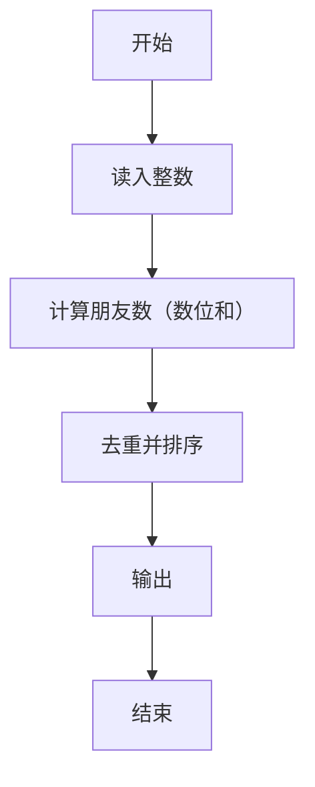
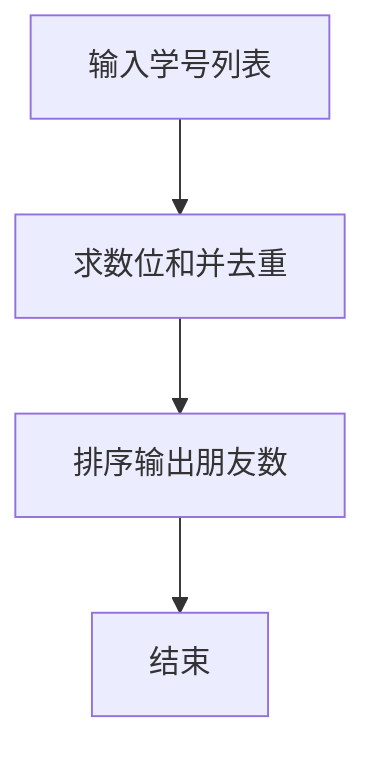

# 1064 朋友数

- **分值：** 20分

### 题目描述

如果两个整数各位数字的和是一样的，则被称为是“朋友数”，而那个公共的和就是它们的“朋友证号”。例如 123 和 51 就是朋友数，因为 1+2+3 = 5+1 = 6，而 6 就是它们的朋友证号。给定一些整数，要求你统计一下它们中有多少个不同的朋友证号。

### 输入格式：

输入第一行给出正整数 $N$。随后一行给出 $N$ 个正整数，数字间以空格分隔。题目保证所有数字小于 $10^4$。

### 输出格式：

首先第一行输出给定数字中不同的朋友证号的个数；随后一行按递增顺序输出这些朋友证号，数字间隔一个空格，且行末不得有多余空格。

### 输入样例：
```
8
123 899 51 998 27 33 36 12
```

### 输出样例：
```
4
3 6 9 26
```


### 解题思路

本题的核心是：计算每个数各位数字和，去重后排序输出。程序先读取题目输入，再按照上述规则完成数据处理，最后严格按照题目要求输出结果。实现时应优先根据题目约束选择合适的数据类型和数据结构，避免溢出或不必要的重复计算。

时间复杂度为 O(nL)；空间复杂度取决于输入规模，主要用于保存题目数据和中间结果。

### 代码流程说明

1. 读入 n 个整数。
2. 计算各位数字和。
3. 去重排序后空格输出。

### 代码实现

```ruby
# 题目：1064-朋友数
# 实现原理：
# 本题的核心是：计算每个数各位数字和，去重后排序输出
# 时间复杂度为 O(nL)；空间复杂度取决于输入规模，主要用于保存题目数据和中间结果。
# 代码步骤：
# 1. 读取输入并初始化必要的数据结构。
# 2. 按题意完成核心计算，处理边界情况。
# 3. 按题目要求格式化并输出结果。
#
tokens = STDIN.read.split.map(&:to_i)
count = tokens.shift
friends = tokens.first(count).map { |value| value.digits.sum }.uniq.sort
puts friends.length
puts friends.join(" ")
```

### 代码流程图



### 解题流程图



### 常见易错点

- 只输出去重后的数位和。
- 按升序。
- 0 的数位和为 0。
