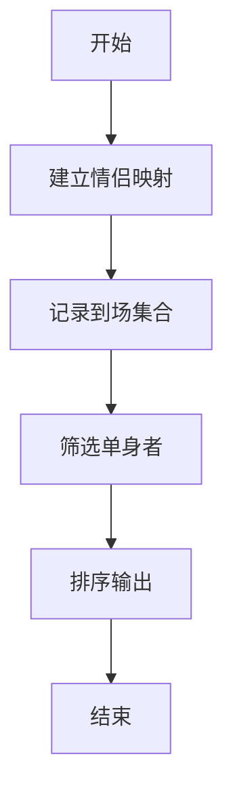
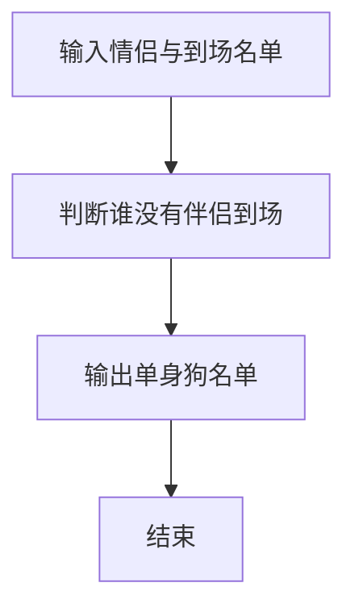

# 1065 单身狗

- **分值：** 25分

### 题目描述

“单身狗”是中文对于单身人士的一种爱称。本题请你从上万人的大型派对中找出落单的客人，以便给予特殊关爱。

### 输入格式：

输入第一行给出一个正整数 $N$（$N\le 50\,000$），是已知夫妻/伴侣的对数；随后 $N$ 行，每行给出一对夫妻/伴侣——为方便起见，每人对应一个 ID 号，为 5 位数字（从 00000 到 99999），ID 间以空格分隔；之后给出一个正整数 $M$（$M\le 10\,000$），为参加派对的总人数；随后一行给出这 $M$ 位客人的 ID，以空格分隔。题目保证无人重婚或脚踩两条船。

### 输出格式：

首先第一行输出落单客人的总人数；随后第二行按 ID 递增顺序列出落单的客人。ID 间用 1 个空格分隔，行的首尾不得有多余空格。

### 输入样例：
```
3
11111 22222
33333 44444
55555 66666
7
55555 44444 10000 88888 22222 11111 23333
```

### 输出样例：
```
5
10000 23333 44444 55555 88888
```


### 解题思路

本题的核心是：建立情侣映射，用集合判断现场出现者是否有伴侣；没有伴侣的即为单身。程序先读取题目输入，再按照上述规则完成数据处理，最后严格按照题目要求输出结果。实现时应优先根据题目约束选择合适的数据类型和数据结构，避免溢出或不必要的重复计算。

时间复杂度为 O(n + m)；空间复杂度取决于输入规模，主要用于保存题目数据和中间结果。

### 代码流程说明

1. 读入 n 对情侣。
2. 读入 m 个到场者。
3. 输出到场但伴侣未到的人，按编号升序。

### 代码实现

```ruby
# 题目：1065-单身狗
# 实现原理：
# 本题的核心是：建立情侣映射，用集合判断现场出现者是否有伴侣；没有伴侣的即为单身
# 时间复杂度为 O(n + m)；空间复杂度取决于输入规模，主要用于保存题目数据和中间结果。
# 代码步骤：
# 1. 读取输入并初始化必要的数据结构。
# 2. 按题意完成核心计算，处理边界情况。
# 3. 按题目要求格式化并输出结果。
#
tokens = STDIN.read.split
pair_count = tokens.shift.to_i
couples = {}
pair_count.times do
  left, right = tokens.shift(2)
  couples[left] = right
  couples[right] = left
end
guest_count = tokens.shift.to_i
guests = tokens.first(guest_count)
singles = guests.select { |guest| couples[guest].nil? || !guests.include?(couples[guest]) }.sort
puts singles.length
puts singles.join(" ")
```

### 代码流程图



### 解题流程图



### 常见易错点

- 自己不能算自己的伴侣。
- 输出五位编号并补前导 0。
- 按编号升序。
