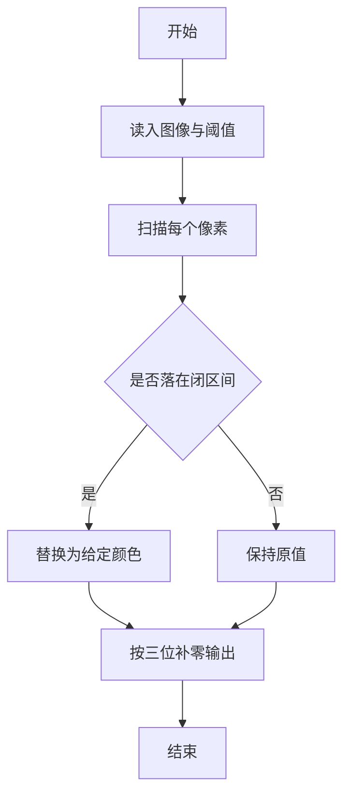
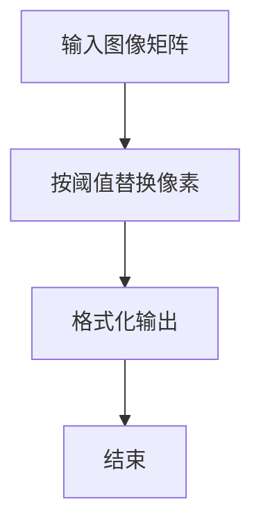

# 1066 图像过滤

- **分值：** 15分

### 题目描述

图像过滤是把图像中不重要的像素都染成背景色，使得重要部分被凸显出来。现给定一幅黑白图像，要求你将灰度值位于某指定区间内的所有像素颜色都用一种指定的颜色替换。

### 输入格式：

输入在第一行给出一幅图像的分辨率，即两个正整数 $M$ 和 $N$（$0<M,N\le 500$），另外是待过滤的灰度值区间端点 $A$ 和 $B$（$0\le A<B\le 255$）、以及指定的替换灰度值。随后 $M$ 行，每行给出 $N$ 个像素点的灰度值，其间以空格分隔。所有灰度值都在 $[0,255]$ 区间内。

### 输出格式：

输出按要求过滤后的图像。即输出 $M$ 行，每行 $N$ 个像素灰度值，每个灰度值占 3 位（例如黑色要显示为 `000`），其间以一个空格分隔。行首尾不得有多余空格。

### 输入样例：
```
3 5 100 150 0
3 189 254 101 119
150 233 151 99 100
88 123 149 0 255
```

### 输出样例：
```
003 189 254 000 000
000 233 151 099 000
088 000 000 000 255
```


### 解题思路

本题的核心是：逐个检查像素值，落在闭区间内则替换为给定颜色。程序先读取题目输入，再按照上述规则完成数据处理，最后严格按照题目要求输出结果。实现时应优先根据题目约束选择合适的数据类型和数据结构，避免溢出或不必要的重复计算。

时间复杂度为 O(RC)；空间复杂度取决于输入规模，主要用于保存题目数据和中间结果。

### 代码流程说明

1. 读入图像与区间及替换色。
2. 扫描每个像素。
3. 在 [low,high] 内则替换并按格式输出。

### 代码实现

```ruby
# 题目：1066-图像过滤
# 实现原理：
# 本题的核心是：逐个检查像素值，落在闭区间内则替换为给定颜色
# 时间复杂度为 O(RC)；空间复杂度取决于输入规模，主要用于保存题目数据和中间结果。
# 代码步骤：
# 1. 读取输入并初始化必要的数据结构。
# 2. 按题意完成核心计算，处理边界情况。
# 3. 按题目要求格式化并输出结果。
#
tokens = STDIN.read.split.map(&:to_i)
height, width, lower, upper, replacement = tokens.shift(5)
pixels = tokens.first(width * height).map { |value| value.between?(lower, upper) ? replacement : value }
pixels.each_slice(width) { |row| puts row.map { |value| format("%03d", value) }.join(" ") }
```

### 代码流程图



### 解题流程图



### 常见易错点

- 颜色输出要按固定宽度补零。
- 区间包含端点。
- 注意行列输出顺序。
