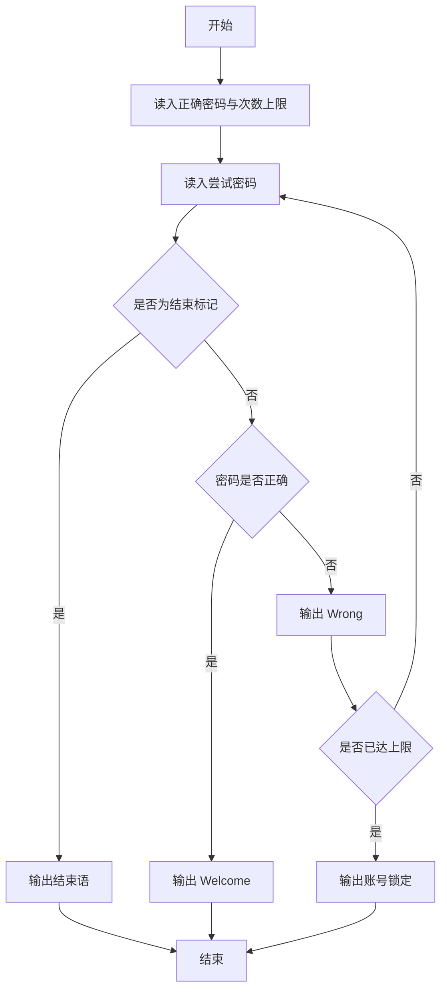
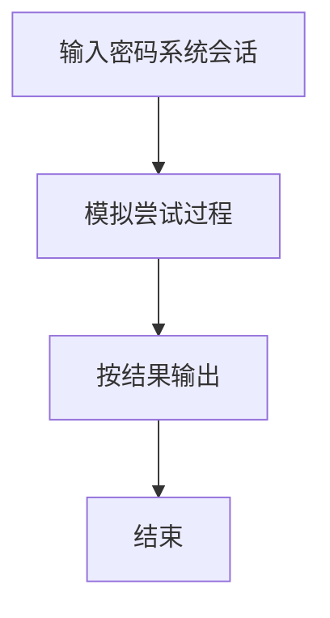

# 1067 试密码

- **分值：** 20分

### 题目描述

当你试图登录某个系统却忘了密码时，系统一般只会允许你尝试有限多次，当超出允许次数时，账号就会被锁死。本题就请你实现这个小功能。

### 输入格式：

输入在第一行给出一个密码（长度不超过 20 的、不包含空格、Tab、回车的非空字符串）和一个正整数 $N$（$N\le 10$），分别是正确的密码和系统允许尝试的次数。随后每行给出一个以回车结束的非空字符串，是用户尝试输入的密码。输入保证至少有一次尝试。当读到一行只有单个 # 字符时，输入结束，并且这一行不是用户的输入。

### 输出格式：

对用户的每个输入，如果是正确的密码且尝试次数不超过 N，则在一行中输出 `Welcome in`，并结束程序；如果是错误的，则在一行中按格式输出 `Wrong password: 用户输入的错误密码`；当错误尝试达到 N 次时，再输出一行 `Account locked`，并结束程序。

### 输入样例 1：
```
Correct%pw 3
correct%pw
Correct@PW
whatisthepassword!
Correct%pw
#
```

### 输出样例 1：
```
Wrong password: correct%pw
Wrong password: Correct@PW
Wrong password: whatisthepassword!
Account locked
```

### 输入样例 2：
```
cool@gplt 3
coolman@gplt
coollady@gplt
cool@gplt
try again
#
```

### 输出样例 2：
```
Wrong password: coolman@gplt
Wrong password: coollady@gplt
Welcome in
```


### 解题思路

本题的核心是：逐行读取密码，与正确密码比较；遇到结束标记或达到尝试次数即停止。程序先读取题目输入，再按照上述规则完成数据处理，最后严格按照题目要求输出结果。实现时应优先根据题目约束选择合适的数据类型和数据结构，避免溢出或不必要的重复计算。

时间复杂度为 O(nL)；空间复杂度取决于输入规模，主要用于保存题目数据和中间结果。

### 代码流程说明

1. 读入正确密码与最大尝试次数。
2. 逐行尝试。
3. 成功/失败/过多/结束分别输出提示。

### 代码实现

```ruby
# 题目：1067-试密码
# 实现原理：
# 本题的核心是：逐行读取密码，与正确密码比较；遇到结束标记或达到尝试次数即停止
# 时间复杂度为 O(nL)；空间复杂度取决于输入规模，主要用于保存题目数据和中间结果。
# 代码步骤：
# 1. 读取输入并初始化必要的数据结构。
# 2. 按题意完成核心计算，处理边界情况。
# 3. 按题目要求格式化并输出结果。
#
lines = STDIN.readlines.map(&:chomp)
password, limit = lines.shift.split
attempts = 0
lines.each do |attempt|
  break if attempt == "#"
  if attempt == password
    puts "Welcome in"
    break
  end
  puts "Wrong password: #{attempt}"
  attempts += 1
  if attempts == limit.to_i
    puts "Account locked"
    break
  end
end
```

### 代码流程图



### 解题流程图



### 常见易错点

- 密码可能包含空格，应整行比较。
- 结束标记单独判断。
- 达到上限后即使后面正确也不再接受。
