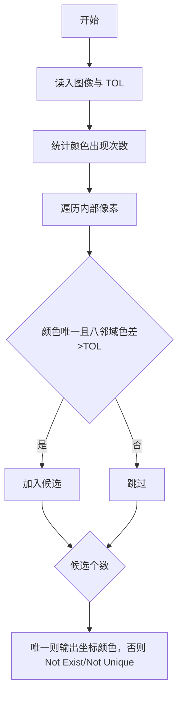
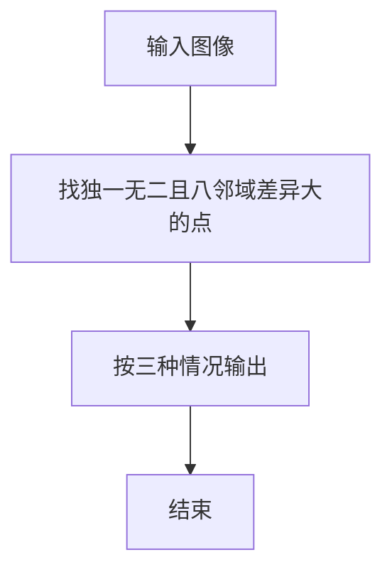

# 1068 万绿丛中一点红

- **分值：** 20分

### 题目描述

对于计算机而言，颜色不过是像素点对应的一个 24 位的数值。现给定一幅分辨率为 $M\times N$ 的画，要求你找出万绿丛中的一点红，即有独一无二颜色的那个像素点，并且该点的颜色与其周围 8 个相邻像素的颜色差充分大。

### 输入格式：

输入第一行给出三个正整数，分别是 $M$ 和 $N$（$M,N\le 1000$），即图像的分辨率；以及 $TOL$，是所求像素点与相邻点的颜色差阈值，色差超过 $TOL$ 的点才被考虑。随后 $N$ 行，每行给出 $M$ 个像素的颜色值，范围在 $[0,2^{24})$ 内。所有同行数字间用空格或 TAB 分开。

### 输出格式：

在一行中按照 `(x, y): color` 的格式输出所求像素点的位置以及颜色值，其中位置 `x` 和 `y` 分别是该像素在图像矩阵中的列、行编号（从 1 开始编号）。如果这样的点不唯一，则输出 `Not Unique`；如果这样的点不存在，则输出 `Not Exist`。

### 输入样例 1：
```
8 6 200
0 	 0 	  0 	   0	    0 	     0 	      0        0
65280 	 65280    65280    16711479 65280    65280    65280    65280
16711479 65280    65280    65280    16711680 65280    65280    65280
65280 	 65280    65280    65280    65280    65280    165280   165280
65280 	 65280 	  16777015 65280    65280    165280   65480    165280
16777215 16777215 16777215 16777215 16777215 16777215 16777215 16777215
```

### 输出样例 1：
```
(5, 3): 16711680
```

### 输入样例 2：
```
4 5 2
0 0 0 0
0 0 3 0
0 0 0 0
0 5 0 0
0 0 0 0
```

### 输出样例 2：
```
Not Unique
```

### 输入样例 3：
```
3 3 5
1 2 3
3 4 5
5 6 7
```

### 输出样例 3：
```
Not Exist
```


### 解题思路

本题的核心是：先统计颜色出现次数，再检查唯一颜色像素与其八邻域的差值，筛选符合阈值的像素。程序先读取题目输入，再按照上述规则完成数据处理，最后严格按照题目要求输出结果。实现时应优先根据题目约束选择合适的数据类型和数据结构，避免溢出或不必要的重复计算。

时间复杂度为 O(RC log(RC))；空间复杂度取决于输入规模，主要用于保存题目数据和中间结果。

### 代码流程说明

1. 读入 M×N 图像与阈值 TOL。
2. 统计颜色频次，只检查内部唯一色像素。
3. 八邻域差值均超过 TOL 则入选，按唯一/不存在/多解输出。

### 代码实现

```ruby
# 题目：1068-万绿丛中一点红
# 实现原理：见正文「解题思路」。
# 代码步骤：
# 1. 读取输入。
# 2. 按题意完成核心计算。
# 3. 按题目要求输出结果。
#
tokens = STDIN.read.split.map(&:to_i)
width, height, difference = tokens.shift(3)
pixels = tokens.first(width * height)
counts = pixels.tally
candidates = []
directions = [-1, 0, 1].product([-1, 0, 1]) - [[0, 0]]
(1...(height - 1)).each do |row|
  (1...(width - 1)).each do |column|
    index = row * width + column
    value = pixels[index]
    next unless counts[value] == 1
    ok = directions.all? do |dr, dc|
      neighbor = pixels[(row + dr) * width + (column + dc)]
      (value - neighbor).abs > difference
    end
    candidates << [column + 1, row + 1, value] if ok
  end
end
if candidates.length == 1
  puts "(#{candidates[0][0]}, #{candidates[0][1]}): #{candidates[0][2]}"
elsif candidates.empty?
  puts "Not Exist"
else
  puts "Not Unique"
end
```

### 代码流程图



### 解题流程图



### 常见易错点

- 必须检查 8 个邻域，不只是上下左右。
- 只有图像内部像素才有完整邻域。
- 坐标 x y 是列行，且从 1 开始。
