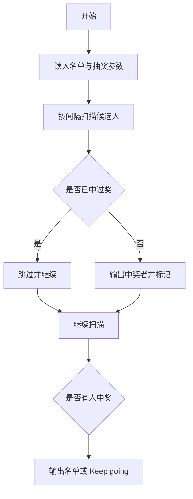
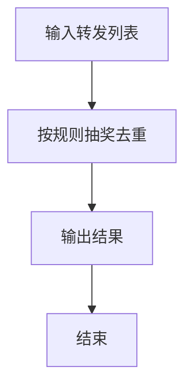

# 1069 微博转发抽奖

- **分值：** 20分

### 题目描述

小明 PAT 考了满分，高兴之余决定发起微博转发抽奖活动，从转发的网友中按顺序每隔 N 个人就发出一个红包。请你编写程序帮助他确定中奖名单。

### 输入格式：

输入第一行给出三个正整数 $M$（$M\le 1000$）、$N$ 和 $S$，分别是转发的总量、小明决定的中奖间隔、以及第一位中奖者的序号（编号从 1 开始）。随后 $M$ 行，顺序给出转发微博的网友的昵称（不超过 20 个字符、不包含空格回车的非空字符串）。

注意：可能有人转发多次，但不能中奖多次。所以如果处于当前中奖位置的网友已经中过奖，则跳过他顺次取下一位。

### 输出格式：

按照输入的顺序输出中奖名单，每个昵称占一行。如果没有人中奖，则输出 `Keep going...`。

### 输入样例 1：
```
9 3 2
Imgonnawin!
PickMe
PickMe
LookHere
Imgonnawin!
TryAgainAgain
TryAgainAgain
Imgonnawin!
TryAgainAgain

```

### 输出样例 1：
```
PickMe
Imgonnawin!
TryAgainAgain

```

### 输入样例 2：
```
2 3 5
Imgonnawin!
PickMe

```

### 输出样例 2：
```
Keep going...

```

**鸣谢用户 谢成星 补充数据！**


### 解题思路

本题的核心是：按转发序号检查抽奖间隔，跳过重复中奖者并保存中奖姓名。程序先读取题目输入，再按照上述规则完成数据处理，最后严格按照题目要求输出结果。实现时应优先根据题目约束选择合适的数据类型和数据结构，避免溢出或不必要的重复计算。

时间复杂度为 O(M²)；空间复杂度为 O(M)。

### 代码流程说明

1. 读入转发名单与间隔。
2. 从第 s 人起每隔 m 人抽奖。
3. 跳过已中奖者，输出中奖名单或 Keep going。

### 代码实现

```ruby
# 题目：1069-微博转发抽奖
# 实现原理：
# 本题的核心是：按转发序号检查抽奖间隔，跳过重复中奖者并保存中奖姓名
# 时间复杂度为 O(M²)；空间复杂度为 O(M)。
# 代码步骤：
# 1. 读取输入并初始化必要的数据结构。
# 2. 按题意完成核心计算，处理边界情况。
# 3. 按题目要求格式化并输出结果。
#
tokens = STDIN.read.split
total, step, start = tokens.shift(3).map(&:to_i)
users = tokens.first(total)
selected = []
position = start - 1
while position < users.length
  while position < users.length && selected.include?(users[position])
    position += 1
  end
  break if position >= users.length
  selected << users[position]
  puts users[position]
  position += step
end
puts "Keep going..." if selected.empty?
```

### 代码流程图



### 解题流程图



### 常见易错点

- 中奖间隔从第 s 个人开始计。
- 同一用户重复转发只算第一次有效中奖。
- 无人中奖输出 Keep going...
