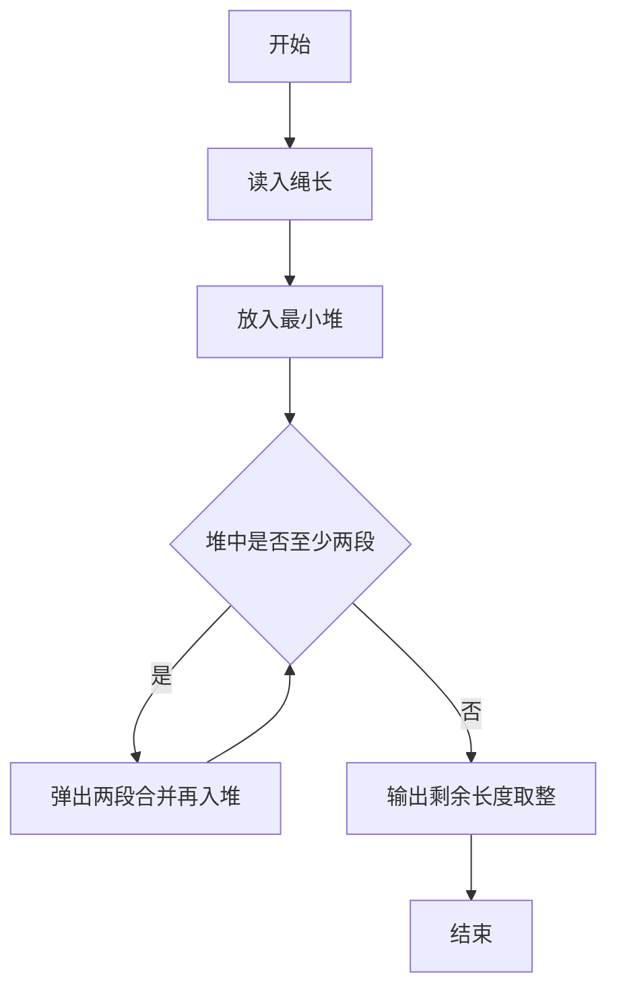
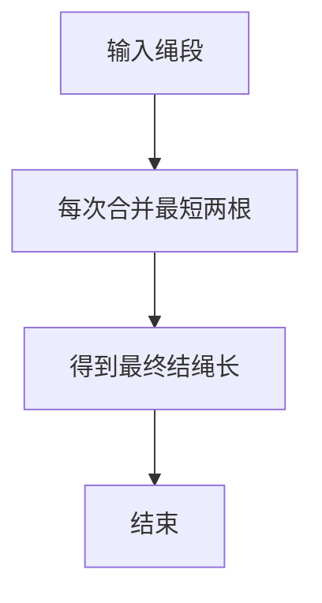

# 1070 结绳

- **分值：** 25分

### 题目描述

给定一段一段的绳子，你需要把它们串成一条绳。每次串连的时候，是把两段绳子对折，再如下图所示套接在一起。这样得到的绳子又被当成是另一段绳子，可以再次对折去跟另一段绳子串连。每次串连后，原来两段绳子的长度就会减半。


给定 $N$ 段绳子的长度，你需要找出它们能串成的绳子的最大长度。

### 输入格式：

每个输入包含 1 个测试用例。每个测试用例第 1 行给出正整数 $N$（$2\le N\le 10^4$）；第 2 行给出 $N$ 个正整数，即原始绳段的长度，数字间以空格分隔。所有整数都不超过 $10^4$。

### 输出格式：

在一行中输出能够串成的绳子的最大长度。结果向下取整，即取为不超过最大长度的最近整数。

### 输入样例：
```
8
10 15 12 3 4 13 1 15
```

### 输出样例：
```
14
```


### 解题思路

本题的核心是：反复取两个最小长度合并，使用最小堆计算最终平均长度。程序先读取题目输入，再按照上述规则完成数据处理，最后严格按照题目要求输出结果。实现时应优先根据题目约束选择合适的数据类型和数据结构，避免溢出或不必要的重复计算。

时间复杂度为 O(n log n)；空间复杂度取决于输入规模，主要用于保存题目数据和中间结果。

### 代码流程说明

1. 读入 n 段绳子。
2. 每次合并最短两段，新长度为半和。
3. 输出最终长度整数部分。

### 代码实现

```ruby
# 题目：1070-结绳
# 实现原理：
# 本题的核心是：反复取两个最小长度合并，使用最小堆计算最终平均长度
# 时间复杂度为 O(n log n)；空间复杂度取决于输入规模，主要用于保存题目数据和中间结果。
# 代码步骤：
# 1. 读取输入并初始化必要的数据结构。
# 2. 按题意完成核心计算，处理边界情况。
# 3. 按题目要求格式化并输出结果。
#
values = STDIN.read.split.map(&:to_f).sort
while values.length > 1
  first, second = values.shift(2)
  values << (first + second) / 2
  values.sort!
end
puts values.first.to_i
```

### 代码流程图



### 解题流程图



### 常见易错点

- 每次都要合并当前最短的两段。
- 输出整数部分（向下取整）。
- n=1 时直接输出该长度。
