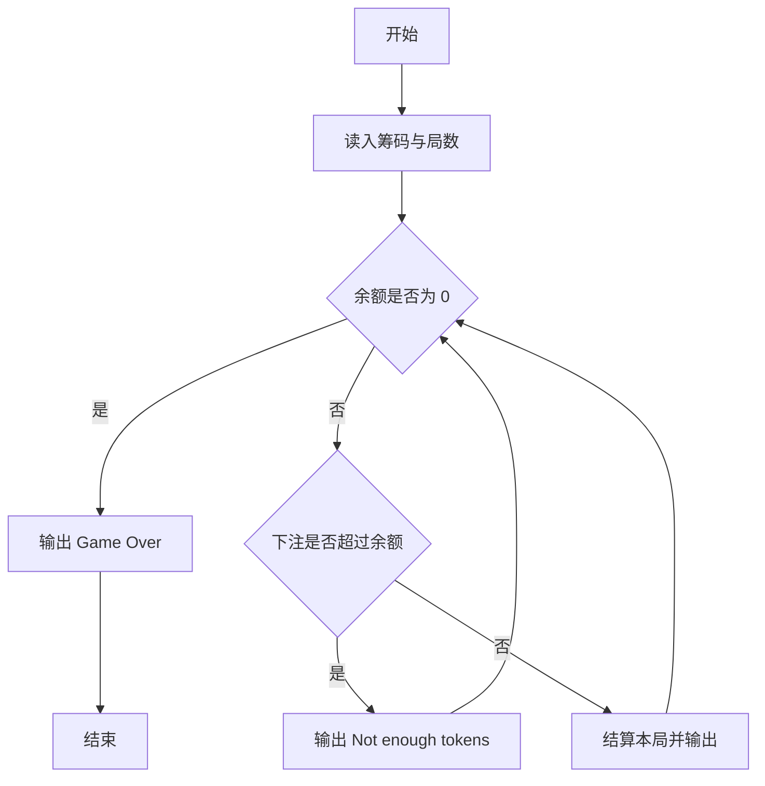
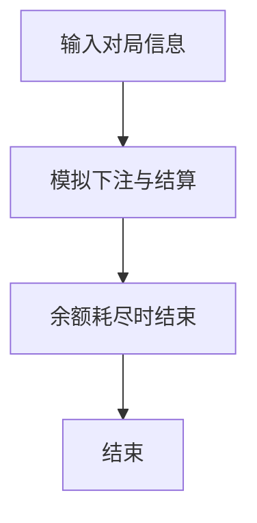

# 1071 小赌怡情

- **分值：** 15分

### 题目描述

常言道“小赌怡情”。这是一个很简单的小游戏：首先由计算机给出第一个整数；然后玩家下注赌第二个整数将会比第一个数大还是小；玩家下注 t 个筹码后，计算机给出第二个数。若玩家猜对了，则系统奖励玩家 t 个筹码；否则扣除玩家 t 个筹码。

注意：玩家下注的筹码数不能超过自己帐户上拥有的筹码数。当玩家输光了全部筹码后，游戏就结束。

### 输入格式：

输入在第一行给出 2 个正整数 $T$ 和 $K$（$T,K\le 100$），分别是系统在初始状态下赠送给玩家的筹码数、以及需要处理的游戏次数。随后 $K$ 行，每行对应一次游戏，顺序给出 4 个数字：
```
n1 b t n2
```
其中 `n1` 和 `n2` 是计算机先后给出的两个 $[0,9]$ 内的整数，保证两个数字不相等。`b` 为 0 表示玩家赌“小”，为 1 表示玩家赌“大”。`t` 表示玩家下注的筹码数，保证在整型范围内。

### 输出格式：

对每一次游戏，根据下列情况对应输出（其中 `t` 是玩家下注量，`x` 是玩家当前持有的筹码量）：

- 玩家赢，输出 `Win t!  Total = x.`；
- 玩家输，输出 `Lose t.  Total = x.`；
- 玩家下注超过持有的筹码量，输出 `Not enough tokens.  Total = x.`；
- 玩家输光后，输出 `Game Over.` 并结束程序。

### 输入样例 1：
```
100 4
8 0 100 2
3 1 50 1
5 1 200 6
7 0 200 8
```

### 输出样例 1：
```
Win 100!  Total = 200.
Lose 50.  Total = 150.
Not enough tokens.  Total = 150.
Not enough tokens.  Total = 150.
```

### 输入样例 2：
```
100 4
8 0 100 2
3 1 200 1
5 1 200 6
7 0 200 8
```

### 输出样例 2：
```
Win 100!  Total = 200.
Lose 200.  Total = 0.
Game Over.
```


### 解题思路

本题的核心是：按每局下注额和结果更新余额，余额不足时立即停止。程序先读取题目输入，再按照上述规则完成数据处理，最后严格按照题目要求输出结果。实现时应优先根据题目约束选择合适的数据类型和数据结构，避免溢出或不必要的重复计算。

时间复杂度为 O(n)；空间复杂度取决于输入规模，主要用于保存题目数据和中间结果。

### 代码流程说明

1. 读入初始筹码与局数。
2. 每局判断猜大小胜负并更新余额。
3. 余额为 0 或不足时停止并输出 Game Over。

### 代码实现

```ruby
# 题目：1071-小赌怡情
# 实现原理：见正文「解题思路」。
# 代码步骤：
# 1. 读取输入。
# 2. 按题意完成核心计算。
# 3. 按题目要求输出结果。
#
tokens = STDIN.read.split.map(&:to_i)
balance, rounds = tokens.shift(2)
game_over = false
rounds.times do
  break if balance.zero?
  first, side, bet, second = tokens.shift(4)
  if bet > balance
    puts format("Not enough tokens.  Total = %d.", balance)
    next
  end
  win = (side == 1 && second > first) || (side.zero? && second < first)
  balance += win ? bet : -bet
  puts format("%s %d%s  Total = %d.", win ? "Win" : "Lose", bet, win ? "!" : ".", balance)
  if balance.zero?
    game_over = true
    break
  end
end
puts "Game Over." if game_over || balance.zero?
```

### 代码流程图



### 解题流程图



### 常见易错点

- 余额不足时本局不下注，不是直接失败。
- 余额变为 0 要输出 Game Over.
- 输出中的空格与标点要与样例完全一致。
