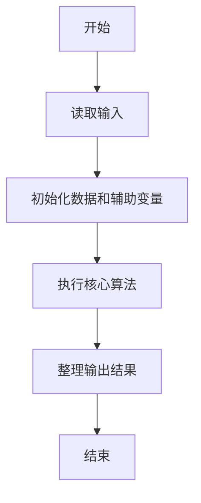
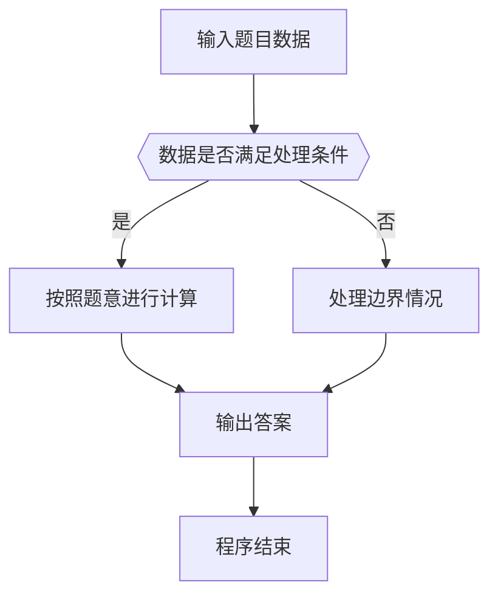

# 1072 开学寄语

- **分值：** 20分

### 题目描述

下图是上海某校的新学期开学寄语：天将降大任于斯人也，必先删其微博，卸其 QQ，封其电脑，夺其手机，收其 ipad，断其 wifi，使其百无聊赖，然后，净面、理发、整衣，然后思过、读书、锻炼、明智、开悟、精进。而后必成大器也！


本题要求你写个程序帮助这所学校的老师检查所有学生的物品，以助其成大器。

### 输入格式：

输入第一行给出两个正整数 $N$（$N\le 1000$）和 $M$（$M\le 6$），分别是学生人数和需要被查缴的物品种类数。第二行给出 $M$ 个需要被查缴的物品编号，其中编号为 4 位数字。随后 $N$ 行，每行给出一位学生的姓名缩写（由 1-4 个大写英文字母组成）、个人物品数量 $K$（$0\le K\le 10$）、以及 $K$ 个物品的编号。

### 输出格式：

顺次检查每个学生携带的物品，如果有需要被查缴的物品存在，则按以下格式输出该生的信息和其需要被查缴的物品的信息（注意行末不得有多余空格）：
```
姓名缩写: 物品编号1 物品编号2 ……
```
最后一行输出存在问题的学生的总人数和被查缴物品的总数。

### 输入样例：
```
4 2
2333 6666
CYLL 3 1234 2345 3456
U 4 9966 6666 8888 6666
GG 2 2333 7777
JJ 3 0012 6666 2333
```

### 输出样例：
```
U: 6666 6666
GG: 2333
JJ: 6666 2333
3 5
```


### 解题思路

本题的核心是：记录危险物品编号集合，逐个检查学生携带的每件物品并统计数量。程序先读取题目输入，再按照上述规则完成数据处理，最后严格按照题目要求输出结果。实现时应优先根据题目约束选择合适的数据类型和数据结构，避免溢出或不必要的重复计算。

时间复杂度为 O(T)（其中 T 为所有学生携带物品的总数）；空间复杂度取决于输入规模，主要用于保存题目数据和中间结果。

### 代码流程说明

1. 读取 1072 开学寄语 所需的输入数据。
2. 初始化计数器、数组或其他辅助变量。
3. 记录危险物品编号集合，逐个检查学生携带的每件物品并统计数量。
4. 按题目规定的格式输出计算结果。

### 代码实现

```ruby
# 题目：1072-开学寄语
# 实现原理：
# 本题的核心是：记录危险物品编号集合，逐个检查学生携带的每件物品并统计数量。程序先读取题目输入，再按照上述规则完成数据处理，最后严格按照题目要求输出结果。实现时应优先根据题目约束选择合适的数据类型和数据结构，避免溢出或不必要的重复计算。
# 时间复杂度为 O(T)（其中 T 为所有学生携带物品的总数）；空间复杂度取决于输入规模，主要用于保存题目数据和中间结果。
# 代码步骤：
# 1. 读取输入并初始化必要的数据结构。
# 2. 按题意完成核心计算，处理边界情况。
# 3. 按题目要求格式化并输出结果。
#
tokens = STDIN.read.split
student_count, forbidden_count = tokens.shift(2).map(&:to_i)
forbidden = tokens.shift(forbidden_count)
affected_students = 0
affected_items = 0
messages = []
student_count.times do
  name = tokens.shift
  item_count = tokens.shift.to_i
  items = tokens.shift(item_count)
  bad = items.select { |item| forbidden.include?(item) }
  next if bad.empty?
  affected_students += 1
  affected_items += bad.length
  messages << "#{name}: #{bad.map { |item| format('%04s', item) }.join(' ')}"
end
puts messages
puts "#{affected_students} #{affected_items}"
```

### 代码流程图



### 解题流程图



### 常见易错点

- 注意输入数据的范围，选择足够大的整数类型，并正确处理边界值。
- 循环、数组下标和字符串结束位置要严格对应题目定义，避免越界。
- 输出格式必须与题目要求完全一致，包括空格、换行、大小写和特殊符号。
- 如果存在排序、去重、进位、约分或四舍五入等操作，应在输出前统一完成。
