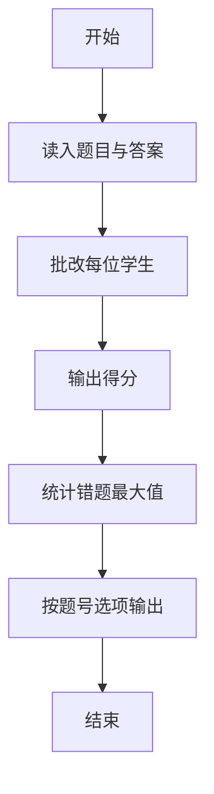
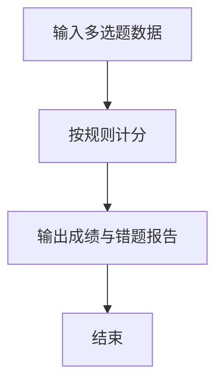

# 1073 多选题常见计分法

- **分值：** 20分

### 题目描述

批改多选题是比较麻烦的事情，有很多不同的计分方法。有一种最常见的计分方法是：如果考生选择了部分正确选项，并且没有选择任何错误选项，则得到 50% 分数；如果考生选择了任何一个错误的选项，则不能得分。本题就请你写个程序帮助老师批改多选题，并且指出哪道题的哪个选项错的人最多。

### 输入格式：

输入在第一行给出两个正整数 $N$（$N\le 1000$）和 $M$（$M\le 100$），分别是学生人数和多选题的个数。随后 $M$ 行，每行顺次给出一道题的满分值（不超过 5 的正整数）、选项个数（不少于 2 且不超过 5 的正整数）、正确选项个数（不超过选项个数的正整数）、所有正确选项。注意每题的选项从小写英文字母 a 开始顺次排列。各项间以 1 个空格分隔。最后 $N$ 行，每行给出一个学生的答题情况，其每题答案格式为 `(选中的选项个数 选项1 ……)`，按题目顺序给出。注意：题目保证学生的答题情况是合法的，即不存在选中的选项数超过实际选项数的情况。另一方面，题目也保证“选中的选项个数”是正整数。

### 输出格式：

按照输入的顺序给出每个学生的得分，每个分数占一行，输出小数点后 1 位。最后输出错得最多的题目选项的信息，格式为：`错误次数 题目编号（题目按照输入的顺序从1开始编号）-选项号`。如果有并列，则每行一个选项，按题目编号递增顺序输出；再并列则按选项号递增顺序输出。行首尾不得有多余空格。如果所有题目都没有人错，则在最后一行输出 `Too simple`。

### 输入样例 1：
```
3 4
3 4 2 a c
2 5 1 b
5 3 2 b c
1 5 4 a b d e
(2 a c) (3 b d e) (2 a c) (3 a b e)
(2 a c) (1 b) (2 a b) (4 a b d e)
(2 b d) (1 e) (1 c) (4 a b c d)
```

### 输出样例 1：
```
3.5
6.0
2.5
2 2-e
2 3-a
2 3-b
```

### 输入样例 2：
```
2 2
3 4 2 a c
2 5 1 b
(2 a c) (1 b)
(2 a c) (1 b)
```

### 输出样例 2：
```
5.0
5.0
Too simple
```

**感谢温州大学虞铭财老师补充题面说明！**


### 解题思路

本题的核心是：按每题分值和选项比较学生答案，累计得分并统计每题错误数。程序先读取题目输入，再按照上述规则完成数据处理，最后严格按照题目要求输出结果。实现时应优先根据题目约束选择合适的数据类型和数据结构，避免溢出或不必要的重复计算。

时间复杂度为 O(nm)；空间复杂度取决于输入规模，主要用于保存题目数据和中间结果。

### 代码流程说明

1. 读入题目分值与正确选项。
2. 批改学生：全对满分，少选半分，多选或错选 0 分。
3. 输出成绩与错误最多的选项。

### 代码实现

```ruby
# 题目：1073-多选题常见计分法
# 实现原理：见正文「解题思路」。
# 代码步骤：
# 1. 读取输入。
# 2. 按题意完成核心计算。
# 3. 按题目要求输出结果。
#
text = STDIN.read.gsub(/[()]/, " ").split
index = 0
students, questions = text[index, 2].map(&:to_i)
index += 2
scores = []
correct = []
errors = Array.new(questions) { Hash.new(0) }
questions.times do |i|
  scores[i] = text[index].to_f
  option_count = text[index + 1].to_i
  answer_count = text[index + 2].to_i
  correct[i] = text[index + 3, answer_count]
  index += 3 + answer_count
end
students.times do
  total = 0.0
  questions.times do |i|
    count = text[index].to_i
    selected = text[index + 1, count]
    index += count + 1
    common = (selected & correct[i]).length
    if selected.sort == correct[i].sort
      total += scores[i]
    elsif selected.length == common && common.positive?
      total += scores[i] / 2
    end
    (correct[i] | selected).each do |option|
      errors[i][option] += 1 if selected.include?(option) != correct[i].include?(option)
    end
  end
  puts format("%.1f", total)
end
maximum = errors.flat_map(&:values).max.to_i
if maximum.zero?
  puts "Too simple"
else
  pairs = []
  errors.each_with_index do |hash, i|
    hash.each { |option, value| pairs << [i + 1, option] if value == maximum }
  end
  pairs.sort_by! { |q, o| [q, o] }
  pairs.each { |q, o| puts "#{maximum} #{q}-#{o}" }
end
```

### 代码流程图



### 解题流程图



### 常见易错点

- 多选、少选、错选计分规则不同。
- 错误次数并列时按题号、选项字母排序。
- 得分输出保留一位小数。
