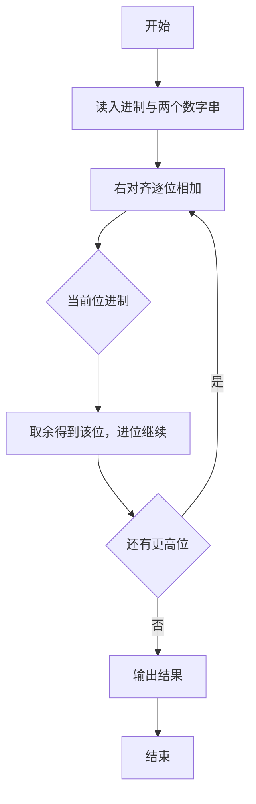
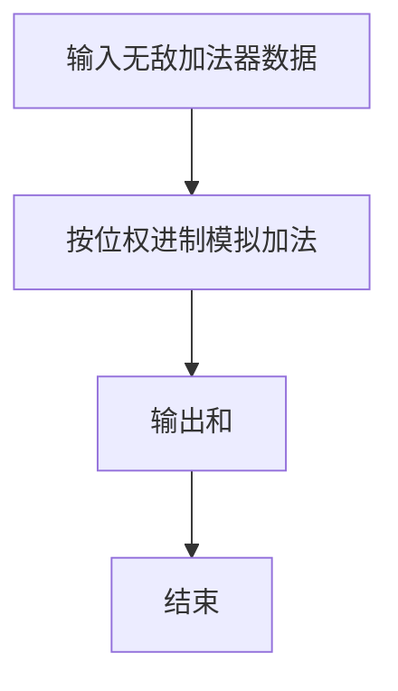

# 1074 宇宙无敌加法器

- **分值：** 20分

### 题目描述

地球人习惯使用十进制数，并且默认一个数字的每一位都是十进制的。而在 PAT 星人开挂的世界里，每个数字的每一位都是不同进制的，这种神奇的数字称为“PAT数”。每个 PAT 星人都必须熟记各位数字的进制表，例如“……0527”就表示最低位是 7 进制数、第 2 位是 2 进制数、第 3 位是 5 进制数、第 4 位是 10 进制数，等等。每一位的进制 d 或者是 0（表示十进制）、或者是 [2，9] 区间内的整数。理论上这个进制表应该包含无穷多位数字，但从实际应用出发，PAT 星人通常只需要记住前 20 位就够用了，以后各位默认为 10 进制。

在这样的数字系统中，即使是简单的加法运算也变得不简单。例如对应进制表“0527”，该如何计算“6203 + 415”呢？我们得首先计算最低位：3 + 5 = 8；因为最低位是 7 进制的，所以我们得到 1 和 1 个进位。第 2 位是：0 + 1 + 1（进位）= 2；因为此位是 2 进制的，所以我们得到 0 和 1 个进位。第 3 位是：2 + 4 + 1（进位）= 7；因为此位是 5 进制的，所以我们得到 2 和 1 个进位。第 4 位是：6 + 1（进位）= 7；因为此位是 10 进制的，所以我们就得到 7。最后我们得到：6203 + 415 = 7201。

### 输入格式：

输入首先在第一行给出一个 $N$ 位的进制表（$0<N\le 20$），以回车结束。随后两行，每行给出一个不超过 $N$ 位的非负 PAT 数。

### 输出格式：

在一行中输出两个 PAT 数之和。

### 输入样例：
```
30527
06203
415
```

### 输出样例：
```
7201
```


### 解题思路

本题的核心是：逐位从低位相加，使用当前位进制处理余数和进位。程序先读取题目输入，再按照上述规则完成数据处理，最后严格按照题目要求输出结果。实现时应优先根据题目约束选择合适的数据类型和数据结构，避免溢出或不必要的重复计算。

时间复杂度为 O(L)；空间复杂度取决于输入规模，主要用于保存题目数据和中间结果。

### 代码流程说明

1. 读入每位进制串与两个数字串。
2. 右对齐逐位相加，进制 0 视为 10。
3. 处理最高位进位并输出。

### 代码实现

```ruby
# 题目：1074-宇宙无敌加法器
# 实现原理：
# 本题的核心是：逐位从低位相加，使用当前位进制处理余数和进位
# 时间复杂度为 O(L)；空间复杂度取决于输入规模，主要用于保存题目数据和中间结果。
# 代码步骤：
# 1. 读取输入并初始化必要的数据结构。
# 2. 按题意完成核心计算，处理边界情况。
# 3. 按题目要求格式化并输出结果。
#
base, first, second = STDIN.read.split.map(&:chars)
value = ->(digit) { digit <= "9" ? digit.to_i : digit.ord - "a".ord + 10 }
digit = ->(number) { number < 10 ? number.to_s : ("a".ord + number - 10).chr }
length = [base.length, first.length, second.length].max
output = []
carry = 0
length.times do |offset|
  x = first[-1 - offset] ? value.call(first[-1 - offset]) : 0
  y = second[-1 - offset] ? value.call(second[-1 - offset]) : 0
  radix = base[-1 - offset] ? value.call(base[-1 - offset]) : 10
  radix = 10 if radix.zero?
  sum = x + y + carry
  output << digit.call(sum % radix)
  carry = sum / radix
end
output << digit.call(carry) while carry.positive?
puts output.reverse.join.sub(/^0+(?=\d)/, "")
```

### 代码流程图



### 解题流程图



### 常见易错点

- 进制中的 0 表示十进制。
- 两串长度不同要对齐。
- 结果前导 0 的处理与题面一致。
