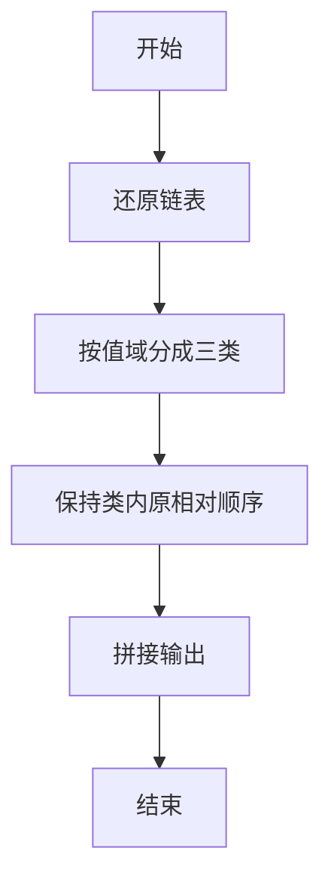
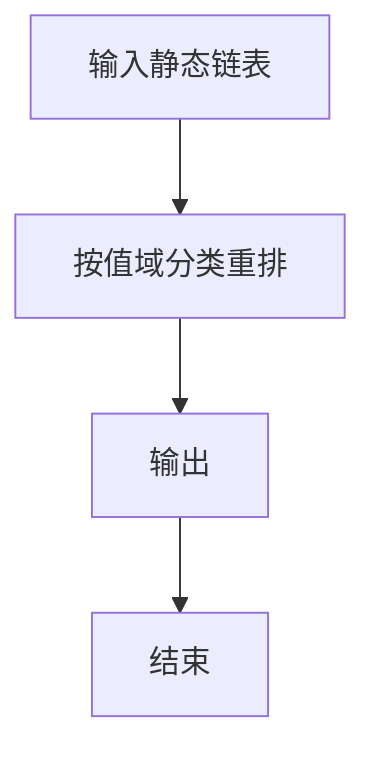

# 1075 链表元素分类

- **分值：** 25分

### 题目描述

给定一个单链表，请编写程序将链表元素进行分类排列，使得所有负值元素都排在非负值元素的前面，而 [0, K] 区间内的元素都排在大于 K 的元素前面。但每一类内部元素的顺序是不能改变的。例如：给定链表为 18→7→-4→0→5→-6→10→11→-2，K 为 10，则输出应该为 -4→-6→-2→7→0→5→10→18→11。

### 输入格式：

每个输入包含一个测试用例。每个测试用例第 1 行给出：第 1 个结点的地址；结点总个数，即正整数 $N$（$N\le 10^5$）；以及正整数 $K$（$K\le 10^3$）。结点的地址是 5 位非负整数，NULL 地址用 $-1$ 表示。

接下来有 $N$ 行，每行格式为：
```
Address Data Next
```
其中 `Address` 是结点地址；`Data` 是该结点保存的数据，为 $[-10^5, 10^5]$ 区间内的整数；`Next` 是下一结点的地址。题目保证给出的链表不为空。

### 输出格式：

对每个测试用例，按链表从头到尾的顺序输出重排后的结果链表，其上每个结点占一行，格式与输入相同。

### 输入样例：
```
00100 9 10
23333 10 27777
00000 0 99999
00100 18 12309
68237 -6 23333
33218 -4 00000
48652 -2 -1
99999 5 68237
27777 11 48652
12309 7 33218
```

### 输出样例：
```
33218 -4 68237
68237 -6 48652
48652 -2 12309
12309 7 00000
00000 0 99999
99999 5 23333
23333 10 00100
00100 18 27777
27777 11 -1
```


### 解题思路

本题的核心是：按负值、[0,K] 和大于 K 三类依次收集链表节点，并保持各类内部顺序不变。程序先读取题目输入，再按照上述规则完成数据处理，最后严格按照题目要求输出结果。实现时应优先根据题目约束选择合适的数据类型和数据结构，避免溢出或不必要的重复计算。

时间复杂度为 O(n)；空间复杂度取决于输入规模，主要用于保存题目数据和中间结果。

### 代码流程说明

1. 还原链表真实顺序。
2. 按 <0、0..K、>K 三类重排。
3. 输出新链表。

### 代码实现

```ruby
# 题目：1075-链表元素分类
# 实现原理：
# 本题的核心是：按负值、[0,K] 和大于 K 三类依次收集链表节点，并保持各类内部顺序不变
# 时间复杂度为 O(n)；空间复杂度取决于输入规模，主要用于保存题目数据和中间结果。
# 代码步骤：
# 1. 读取输入并初始化必要的数据结构。
# 2. 按题意完成核心计算，处理边界情况。
# 3. 按题目要求格式化并输出结果。
#
tokens = STDIN.read.split
head, count, limit = tokens.shift(3)
records = {}
count.to_i.times do
  address, value, next_address = tokens.shift(3)
  records[address] = [value.to_i, next_address]
end
groups = [[], [], []]
current = head
while current != "-1"
  value, = records[current]
  groups[value.negative? ? 0 : value <= limit.to_i ? 1 : 2] << current
  current = records[current][1]
end
order = groups.flatten
order.each_with_index { |address, i| puts "#{address} #{records[address][0]} #{i + 1 == order.length ? '-1' : order[i + 1]}" }
```

### 代码流程图



### 解题流程图



### 常见易错点

- 只处理链上的结点。
- 三类顺序固定。
- Next 指针要重写。
