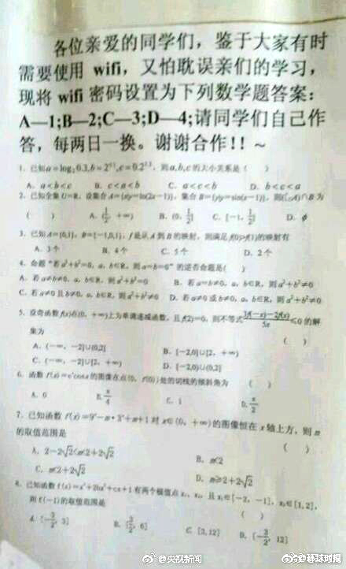
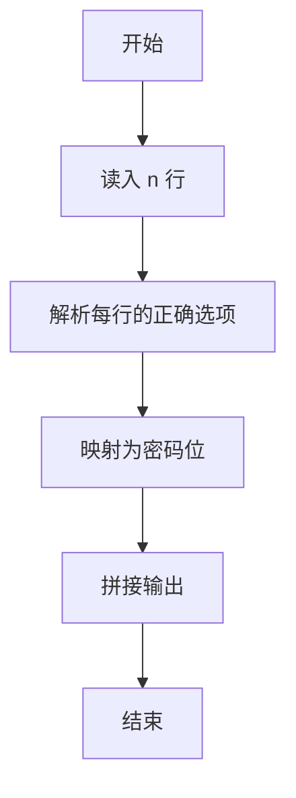
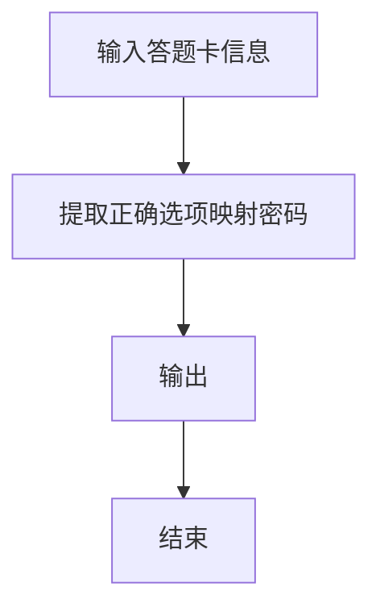

# 1076 Wifi密码

- **分值：** 15分

### 题目描述

下面是微博上流传的一张照片：“各位亲爱的同学们，鉴于大家有时需要使用 wifi，又怕耽误亲们的学习，现将 wifi 密码设置为下列数学题答案：A-1；B-2；C-3；D-4；请同学们自己作答，每两日一换。谢谢合作！！~”—— 老师们为了促进学生学习也是拼了…… 本题就要求你写程序把一系列题目的答案按照卷子上给出的对应关系翻译成 wifi 的密码。这里简单假设每道选择题都有 4 个选项，有且只有 1 个正确答案。



### 输入格式：

输入第一行给出一个正整数 $N$（$N\le 100$），随后 $N$ 行，每行按照 `编号-答案` 的格式给出一道题的 4 个选项，`T` 表示正确选项，`F` 表示错误选项。选项间用空格分隔。

### 输出格式：

在一行中输出 wifi 密码。

### 输入样例：
```
8
A-T B-F C-F D-F
C-T B-F A-F D-F
A-F D-F C-F B-T
B-T A-F C-F D-F
B-F D-T A-F C-F
A-T C-F B-F D-F
D-T B-F C-F A-F
C-T A-F B-F D-F
```

### 输出样例：
```
13224143
```


### 解题思路

本题的核心是：从字符串中定位数字 T，并按题目规则将其转换为密码数字。程序先读取题目输入，再按照上述规则完成数据处理，最后严格按照题目要求输出结果。实现时应优先根据题目约束选择合适的数据类型和数据结构，避免溢出或不必要的重复计算。

时间复杂度为 O(L)；空间复杂度取决于输入规模，主要用于保存题目数据和中间结果。

### 代码流程说明

1. 读入 n 行选项记录。
2. 每行找选项后面的选择字母。
3. 按映射输出密码数字。

### 代码实现

```ruby
# 题目：1076-Wifi密码
# 实现原理：
# 本题的核心是：从字符串中定位数字 T，并按题目规则将其转换为密码数字
# 时间复杂度为 O(L)；空间复杂度取决于输入规模，主要用于保存题目数据和中间结果。
# 代码步骤：
# 1. 读取输入并初始化必要的数据结构。
# 2. 按题意完成核心计算，处理边界情况。
# 3. 按题目要求格式化并输出结果。
#
tokens = STDIN.read.split
count = tokens.shift.to_i
answer = []
(count * 4).times do
  letter, state = tokens.shift.split("-")
  answer << (letter.ord - "A".ord + 1).to_s if state == "T"
end
puts answer.join
```

### 代码流程图



### 解题流程图



### 常见易错点

- 每行结构固定，注意解析位置。
- 映射表不要弄反。
- 输出连续数字串。
