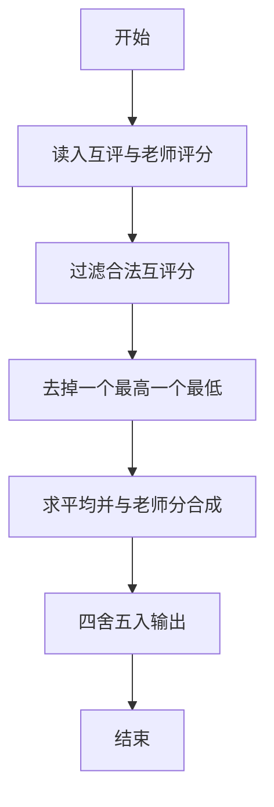
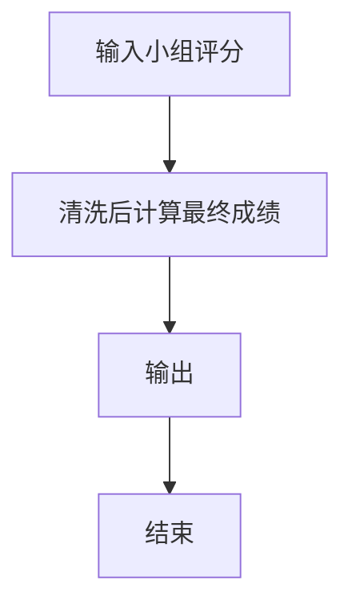

# 1077 互评成绩计算

- **分值：** 20分

### 题目描述

在浙大的计算机专业课中，经常有互评分组报告这个环节。一个组上台介绍自己的工作，其他组在台下为其表现评分。最后这个组的互评成绩是这样计算的：所有其他组的评分中，去掉一个最高分和一个最低分，剩下的分数取平均分记为 $G_1$；老师给这个组的评分记为 $G_2$。该组得分为 $(G_1+G_2)/2$，最后结果四舍五入后保留整数分。本题就要求你写个程序帮助老师计算每个组的互评成绩。

### 输入格式：

输入第一行给出两个正整数 $N$（$N>3$）和 $M$，分别是分组数和满分，均不超过 100。随后 $N$ 行，每行给出该组得到的 $N$ 个分数（均保证为整型范围内的整数），其中第 1 个是老师给出的评分，后面 $N-1$ 个是其他组给的评分。合法的输入应该是 $[0,M]$ 区间内的整数，若不在合法区间内，则该分数须被忽略。题目保证老师的评分都是合法的，并且每个组至少会有 3 个来自同学的合法评分。

### 输出格式：

为每个组输出其最终得分。每个得分占一行。

### 输入样例：
```
6 50
42 49 49 35 38 41
36 51 50 28 -1 30
40 36 41 33 47 49
30 250 -25 27 45 31
48 0 0 50 50 1234
43 41 36 29 42 29
```

### 输出样例：
```
42
33
41
31
37
39
```


### 解题思路

本题的核心是：过滤无效互评分后，去掉一个最高分和一个最低分，计算平均分并与老师评分合成。程序先读取题目输入，再按照上述规则完成数据处理，最后严格按照题目要求输出结果。实现时应优先根据题目约束选择合适的数据类型和数据结构，避免溢出或不必要的重复计算。

时间复杂度为 O(nm)；空间复杂度为 O(m)。

### 代码流程说明

1. 读入小组互评分与老师分。
2. 过滤超出范围的互评分。
3. 去掉最高最低求平均，再与老师分按题面合成并四舍五入。

### 代码实现

```ruby
# 题目：1077-互评成绩计算
# 实现原理：
# 本题的核心是：过滤无效互评分后，去掉一个最高分和一个最低分，计算平均分并与老师评分合成
# 时间复杂度为 O(nm)；空间复杂度为 O(m)。
# 代码步骤：
# 1. 读取输入并初始化必要的数据结构。
# 2. 按题意完成核心计算，处理边界情况。
# 3. 按题目要求格式化并输出结果。
#
tokens = STDIN.read.split.map(&:to_i)
count, limit = tokens.shift(2)
count.times do
  teacher = tokens.shift
  peer = tokens.shift(count - 1).select { |score| score.between?(0, limit) }
  average = (peer.sum - peer.min - peer.max).to_f / (peer.length - 2)
  puts ((teacher + average) / 2).round
end
```

### 代码流程图



### 解题流程图



### 常见易错点

- 非法互评分直接丢弃。
- 去极值各去掉一个。
- 最终成绩四舍五入到整数。
