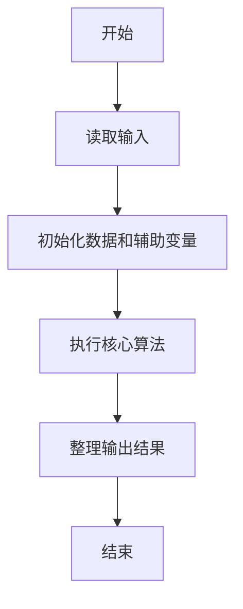
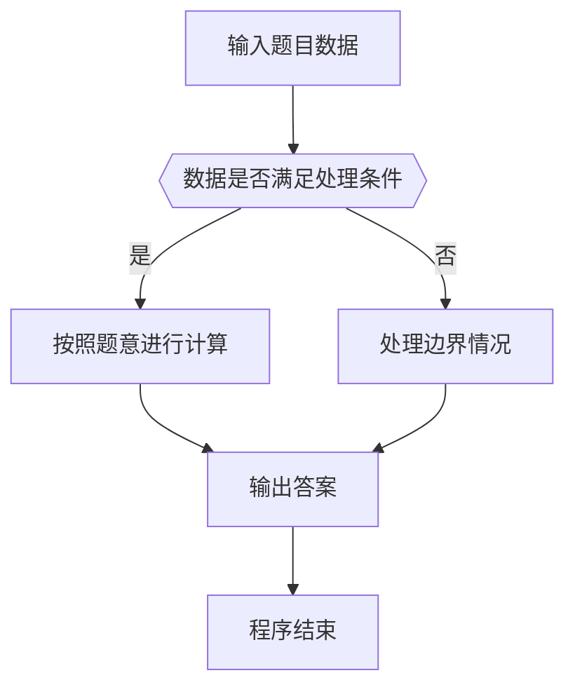

# 1079 延迟的回文数

- **分值：** 20分

### 题目描述

给定一个 $k+1$ 位的正整数 $N$，写成 $a_k \cdots a_1 a_0$ 的形式，其中对所有 $i$ 有 $0 \le a_i < 10$ 且 $a_k > 0$。$N$ 被称为一个**回文数**，当且仅当对所有 $i$ 有 $a_i = a_{k-i}$。零也被定义为一个回文数。

非回文数也可以通过一系列操作变出回文数。首先将该数字逆转，再将逆转数与该数相加，如果和还不是一个回文数，就重复这个逆转再相加的操作，直到一个回文数出现。如果一个非回文数可以变出回文数，就称这个数为**延迟的回文数**。（定义翻译自 https://en.wikipedia.org/wiki/Palindromic_number ）

给定任意一个正整数，本题要求你找到其变出的那个回文数。

### 输入格式：

输入在一行中给出一个不超过1000位的正整数。

### 输出格式：

对给定的整数，一行一行输出其变出回文数的过程。每行格式如下
```
A + B = C
```
其中 `A` 是原始的数字，`B` 是 `A` 的逆转数，`C` 是它们的和。`A` 从输入的整数开始。重复操作直到 `C` 在 10 步以内变成回文数，这时在一行中输出 `C is a palindromic number.`；或者如果 10 步都没能得到回文数，最后就在一行中输出 `Not found in 10 iterations.`。

### 输入样例 1：
```
97152
```

### 输出样例 1：
```
97152 + 25179 = 122331
122331 + 133221 = 255552
255552 is a palindromic number.
```

### 输入样例 2：
```
196
```

### 输出样例 2：
```
196 + 691 = 887
887 + 788 = 1675
1675 + 5761 = 7436
7436 + 6347 = 13783
13783 + 38731 = 52514
52514 + 41525 = 94039
94039 + 93049 = 187088
187088 + 880781 = 1067869
1067869 + 9687601 = 10755470
10755470 + 07455701 = 18211171
Not found in 10 iterations.
```


### 解题思路

本题的核心是：检查数字是否为回文；不是时与其逆序数相加，最多执行规定次数。程序先读取题目输入，再按照上述规则完成数据处理，最后严格按照题目要求输出结果。实现时应优先根据题目约束选择合适的数据类型和数据结构，避免溢出或不必要的重复计算。

时间复杂度为 O(kL)；空间复杂度取决于输入规模，主要用于保存题目数据和中间结果。

### 代码流程说明

1. 读取 1079 延迟的回文数 所需的输入数据。
2. 初始化计数器、数组或其他辅助变量。
3. 检查数字是否为回文；不是时与其逆序数相加，最多执行规定次数。
4. 按题目规定的格式输出计算结果。

### 代码实现

```ruby
# 题目：1079-延迟的回文数
# 实现原理：
# 本题的核心是：检查数字是否为回文；不是时与其逆序数相加，最多执行规定次数。程序先读取题目输入，再按照上述规则完成数据处理，最后严格按照题目要求输出结果。实现时应优先根据题目约束选择合适的数据类型和数据结构，避免溢出或不必要的重复计算。
# 时间复杂度为 O(kL)；空间复杂度取决于输入规模，主要用于保存题目数据和中间结果。
# 代码步骤：
# 1. 读取输入并初始化必要的数据结构。
# 2. 按题意完成核心计算，处理边界情况。
# 3. 按题目要求格式化并输出结果。
#
number = STDIN.read.split.first
palindrome = ->(value) { value == value.reverse }
10.times do
  if palindrome.call(number)
    puts "#{number} is a palindromic number."
    exit
  end
  reversed = number.reverse
  sum = number.to_i + reversed.to_i
  puts "#{number} + #{reversed} = #{sum}"
  number = sum.to_s
end
puts "Not found in 10 iterations."
```

### 代码流程图



### 解题流程图



### 常见易错点

- 注意输入数据的范围，选择足够大的整数类型，并正确处理边界值。
- 循环、数组下标和字符串结束位置要严格对应题目定义，避免越界。
- 输出格式必须与题目要求完全一致，包括空格、换行、大小写和特殊符号。
- 如果存在排序、去重、进位、约分或四舍五入等操作，应在输出前统一完成。
