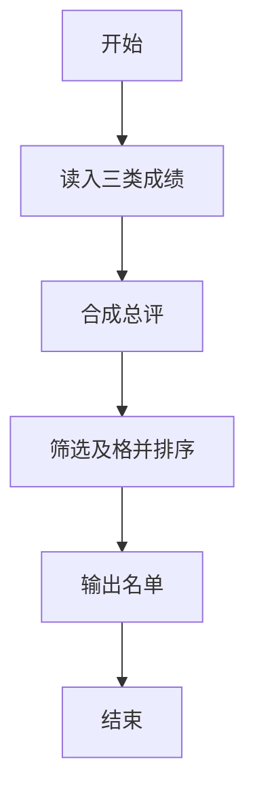
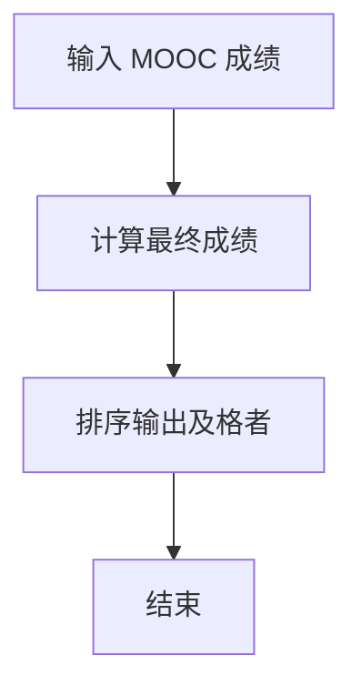

# 1080 MOOC期终成绩

- **分值：** 25分

### 题目描述

对于在中国大学MOOC（http://www.icourse163.org/ ）学习“数据结构”课程的学生，想要获得一张合格证书，必须首先获得不少于200分的在线编程作业分，然后总评获得不少于60分（满分100）。总评成绩的计算公式为 $G = (G_{mid-term}\times 40\% + G_{final}\times 60\%)$，如果 $G_{mid-term} > G_{final}$；否则总评 $G$ 就是 $G_{final}$。这里 $G_{mid-term}$ 和 $G_{final}$ 分别为学生的期中和期末成绩。

现在的问题是，每次考试都产生一张独立的成绩单。本题就请你编写程序，把不同的成绩单合为一张。

### 输入格式：

输入在第一行给出3个整数，分别是 P（做了在线编程作业的学生数）、M（参加了期中考试的学生数）、N（参加了期末考试的学生数）。每个数都不超过10000。

接下来有三块输入。第一块包含 P 个在线编程成绩 $G_p$；第二块包含 M 个期中考试成绩 $G_{mid-term}$；第三块包含 N 个期末考试成绩 $G_{final}$。每个成绩占一行，格式为：`学生学号 分数`。其中`学生学号`为不超过20个字符的英文字母和数字；`分数`是非负整数（编程总分最高为900分，期中和期末的最高分为100分）。

### 输出格式：

打印出获得合格证书的学生名单。每个学生占一行，格式为：

`学生学号` $G_p$ $G_{mid-term}$ $G_{final}$ $G$

如果有的成绩不存在（例如某人没参加期中考试），则在相应的位置输出“$-1$”。输出顺序为按照总评分数（四舍五入精确到整数）递减。若有并列，则按学号递增。题目保证学号没有重复，且至少存在1个合格的学生。

### 输入样例：
```
6 6 7
01234 880
a1903 199
ydjh2 200
wehu8 300
dx86w 220
missing 400
ydhfu77 99
wehu8 55
ydjh2 98
dx86w 88
a1903 86
01234 39
ydhfu77 88
a1903 66
01234 58
wehu8 84
ydjh2 82
missing 99
dx86w 81
```

### 输出样例：
```
missing 400 -1 99 99
ydjh2 200 98 82 88
dx86w 220 88 81 84
wehu8 300 55 84 84
```


### 解题思路

本题的核心是：合并三类成绩记录，按规则计算最终成绩后排序输出。程序先读取题目输入，再按照上述规则完成数据处理，最后严格按照题目要求输出结果。实现时应优先根据题目约束选择合适的数据类型和数据结构，避免溢出或不必要的重复计算。

时间复杂度为 O(T²)；空间复杂度为 O(T)，其中 T=P+M+N。

### 代码流程说明

1. 读入编程、期中、期末成绩。
2. 按题面合成总评。
3. 按总评排序输出及格名单。

### 代码实现

```ruby
# 题目：1080-MOOC期终成绩
# 实现原理：
# 本题的核心是：合并三类成绩记录，按规则计算最终成绩后排序输出
# 时间复杂度为 O(T²)；空间复杂度为 O(T)，其中 T=P+M+N。
# 代码步骤：
# 1. 读取输入并初始化必要的数据结构。
# 2. 按题意完成核心计算，处理边界情况。
# 3. 按题目要求格式化并输出结果。
#
tokens = STDIN.read.split
p_count, mid_count, final_count = tokens.shift(3).map(&:to_i)
students = {}
p_count.times { students[tokens.shift] = [tokens.shift.to_i, -1, -1] }
(mid_count + final_count).times do |i|
  id, score = tokens.shift(2)
  students[id] ||= [-1, -1, -1]
  students[id][i < mid_count ? 1 : 2] = score.to_i
end
result = students.filter_map do |id, (program, mid, final)|
  next if program < 200
  total = mid < 0 || final >= mid ? final : (mid * 0.4 + final * 0.6).round
  [id, program, mid, final, total] if total >= 60
end
result.sort_by! { |id, _, _, _, total| [-total, id] }
result.each { |row| puts row.join(" ") }
```

### 代码流程图



### 解题流程图



### 常见易错点

- 缺考成绩处理要按题面。
- 排序键包含总分与学号。
- 总评取整规则要一致。
