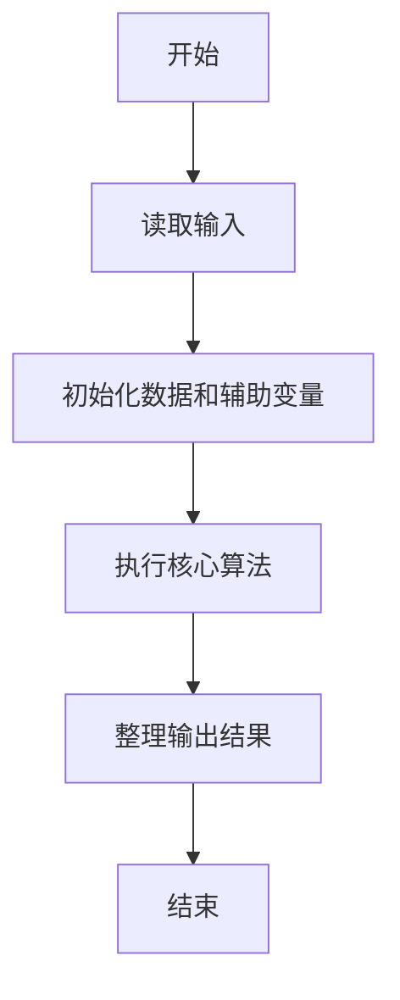
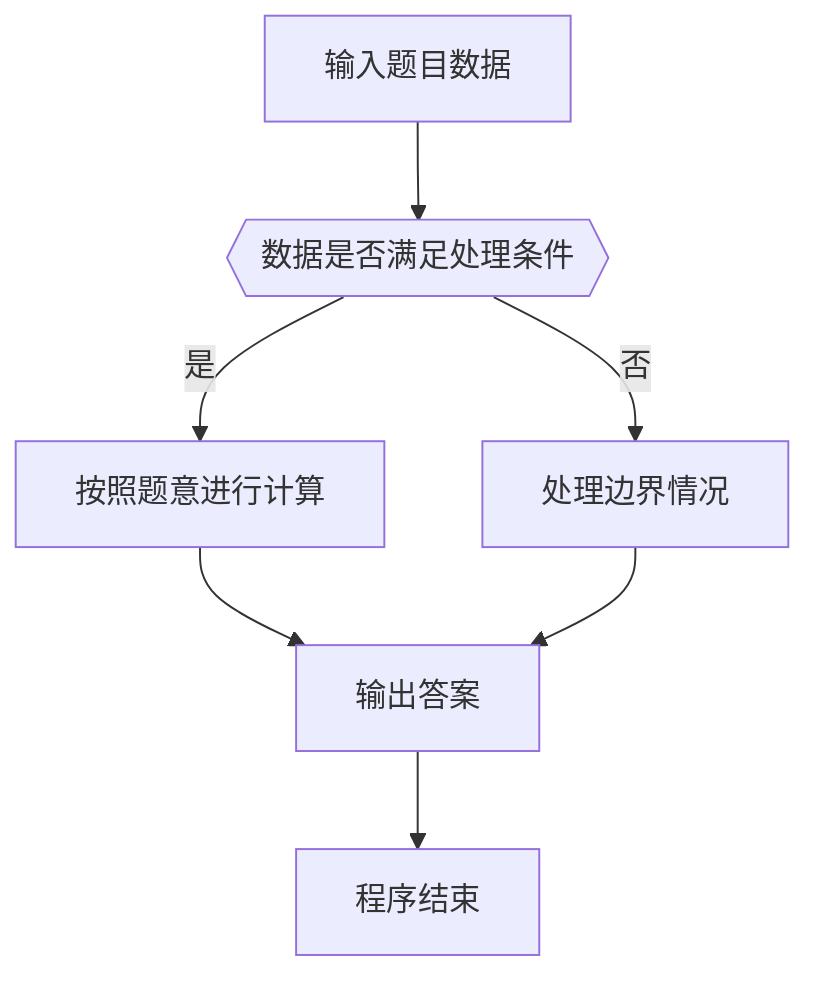

# 1081 检查密码

- **分值：** 15分

### 题目描述

本题要求你帮助某网站的用户注册模块写一个密码合法性检查的小功能。该网站要求用户设置的密码必须由不少于6个字符组成，并且只能有英文字母、数字和小数点 `.`，还必须既有字母也有数字。

### 输入格式：

输入第一行给出一个正整数 $N$（$N\le 100$），随后 $N$ 行，每行给出一个用户设置的密码，为不超过 80 个字符的非空字符串，以回车结束。

**注意：** 题目保证不存在只有小数点的输入。

### 输出格式：

对每个用户的密码，在一行中输出系统反馈信息，分以下5种：

- 如果密码合法，输出`Your password is wan mei.`；
- 如果密码太短，不论合法与否，都输出`Your password is tai duan le.`；
- 如果密码长度合法，但存在不合法字符，则输出`Your password is tai luan le.`；
- 如果密码长度合法，但只有字母没有数字，则输出`Your password needs shu zi.`；
- 如果密码长度合法，但只有数字没有字母，则输出`Your password needs zi mu.`。

### 输入样例：
```
5
123s
zheshi.wodepw
1234.5678
WanMei23333
pass*word.6

```

### 输出样例：
```
Your password is tai duan le.
Your password needs shu zi.
Your password needs zi mu.
Your password is wan mei.
Your password is tai luan le.

```


### 解题思路

本题的核心是：扫描密码并记录长度、数字、小写、大写及特殊字符条件是否满足。程序先读取题目输入，再按照上述规则完成数据处理，最后严格按照题目要求输出结果。实现时应优先根据题目约束选择合适的数据类型和数据结构，避免溢出或不必要的重复计算。

时间复杂度为 O(L)；空间复杂度取决于输入规模，主要用于保存题目数据和中间结果。

### 代码流程说明

1. 读取 1081 检查密码 所需的输入数据。
2. 初始化计数器、数组或其他辅助变量。
3. 扫描密码并记录长度、数字、小写、大写及特殊字符条件是否满足。
4. 按题目规定的格式输出计算结果。

### 代码实现

```ruby
# 题目：1081-检查密码
# 实现原理：
# 本题的核心是：扫描密码并记录长度、数字、小写、大写及特殊字符条件是否满足。程序先读取题目输入，再按照上述规则完成数据处理，最后严格按照题目要求输出结果。实现时应优先根据题目约束选择合适的数据类型和数据结构，避免溢出或不必要的重复计算。
# 时间复杂度为 O(L)；空间复杂度取决于输入规模，主要用于保存题目数据和中间结果。
# 代码步骤：
# 1. 读取输入并初始化必要的数据结构。
# 2. 按题意完成核心计算，处理边界情况。
# 3. 按题目要求格式化并输出结果。
#
lines = STDIN.readlines.map(&:chomp)
count = lines.shift.to_i
lines.first(count).each do |password|
  message = if password.length < 6
              "Your password is tai duan le."
            elsif !password.match?(/\A[A-Za-z0-9.]+\z/)
              "Your password is tai luan le."
            elsif !password.match?(/[0-9]/)
              "Your password needs shu zi."
            elsif !password.match?(/[A-Za-z]/)
              "Your password needs zi mu."
            else
              "Your password is wan mei."
            end
  puts message
end
```

### 代码流程图



### 解题流程图



### 常见易错点

- 注意输入数据的范围，选择足够大的整数类型，并正确处理边界值。
- 循环、数组下标和字符串结束位置要严格对应题目定义，避免越界。
- 输出格式必须与题目要求完全一致，包括空格、换行、大小写和特殊符号。
- 如果存在排序、去重、进位、约分或四舍五入等操作，应在输出前统一完成。
