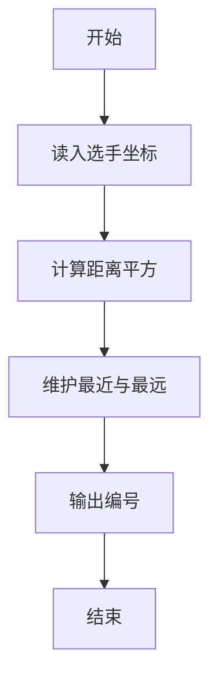
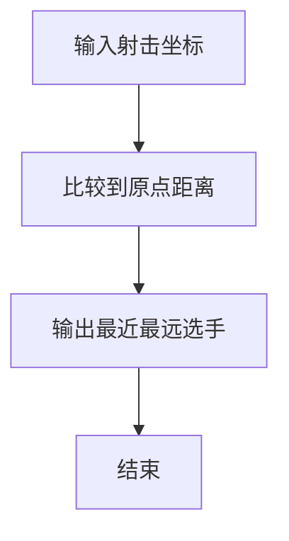

# 1082 射击比赛

- **分值：** 20分

### 题目描述

本题目给出的射击比赛的规则非常简单，谁打的弹洞距离靶心最近，谁就是冠军；谁差得最远，谁就是菜鸟。本题给出一系列弹洞的平面坐标(x,y)，请你编写程序找出冠军和菜鸟。我们假设靶心在原点(0,0)。

### 输入格式：

输入在第一行中给出一个正整数 $N$（$N\le 10\,000$）。随后 $N$ 行，每行按下列格式给出：

```
ID x y
```

其中 `ID` 是运动员的编号（由 4 位数字组成）；$x$ 和 $y$ 是其打出的弹洞的平面坐标 $(x,y)$，均为整数，且 $0\le |x|,|y|\le 100$。题目保证每个运动员的编号不重复，且每人只打 1 枪。

### 输出格式：

输出冠军和菜鸟的编号，中间空 1 格。题目保证他们是唯一的。

### 输入样例：
```
3
0001 5 7
1020 -1 3
0233 0 -1
```

### 输出样例：
```
0233 0001
```


### 解题思路

本题的核心是：计算每位选手坐标到原点的距离平方，维护最远和最近者。程序先读取题目输入，再按照上述规则完成数据处理，最后严格按照题目要求输出结果。实现时应优先根据题目约束选择合适的数据类型和数据结构，避免溢出或不必要的重复计算。

时间复杂度为 O(n)；空间复杂度取决于输入规模，主要用于保存题目数据和中间结果。

### 代码流程说明

1. 读入 n 位选手坐标。
2. 计算距离平方。
3. 输出最近与最远的编号。

### 代码实现

```ruby
# 题目：1082-射击比赛
# 实现原理：
# 本题的核心是：计算每位选手坐标到原点的距离平方，维护最远和最近者
# 时间复杂度为 O(n)；空间复杂度取决于输入规模，主要用于保存题目数据和中间结果。
# 代码步骤：
# 1. 读取输入并初始化必要的数据结构。
# 2. 按题意完成核心计算，处理边界情况。
# 3. 按题目要求格式化并输出结果。
#
tokens = STDIN.read.split
count = tokens.shift.to_i
records = count.times.map do
  id, x, y = tokens.shift(3)
  [x.to_f * x.to_f + y.to_f * y.to_f, id]
end.sort
puts "#{records.first[1]} #{records.last[1]}"
```

### 代码流程图



### 解题流程图



### 常见易错点

- 比较距离平方即可，无需开方。
- 输出编号不是姓名。
- 并列时按题面规则。
