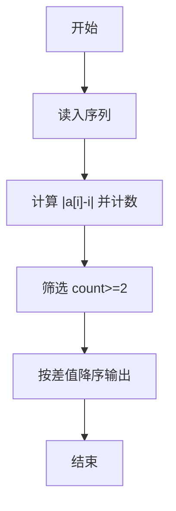
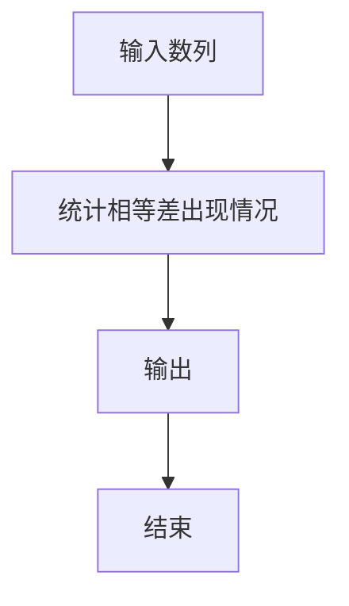

# 1083 是否存在相等的差

- **分值：** 20分

### 题目描述

给定 N 张卡片，正面分别写上 1、2、……、N，然后全部翻面，洗牌，在背面分别写上 1、2、……、N。将每张牌的正反两面数字相减（大减小），得到 N 个非负差值，其中是否存在相等的差？

### 输入格式：

输入第一行给出一个正整数 $N$（$2\le N\le 10\,000$），随后一行给出 1 到 $N$ 的一个洗牌后的排列，第 $i$ 个数表示正面写了 $i$ 的那张卡片背面的数字。

### 输出格式：

按照“差值 重复次数”的格式从大到小输出重复的差值及其重复的次数，每行输出一个结果。

### 输入样例：
```
8
3 5 8 6 2 1 4 7
```

### 输出样例：
```
5 2
3 3
2 2
```


### 解题思路

本题的核心是：统计绝对差值的出现次数，输出出现次数大于等于 2 的差值。程序先读取题目输入，再按照上述规则完成数据处理，最后严格按照题目要求输出结果。实现时应优先根据题目约束选择合适的数据类型和数据结构，避免溢出或不必要的重复计算。

时间复杂度为 O(n)；空间复杂度取决于输入规模，主要用于保存题目数据和中间结果。

### 代码流程说明

1. 读入 n 与序列。
2. 计算 |a[i]-i| 并计数。
3. 按差值降序输出出现至少两次的差与次数。

### 代码实现

```ruby
# 题目：1083-是否存在相等的差
# 实现原理：
# 本题的核心是：统计绝对差值的出现次数，输出出现次数大于等于 2 的差值
# 时间复杂度为 O(n)；空间复杂度取决于输入规模，主要用于保存题目数据和中间结果。
# 代码步骤：
# 1. 读取输入并初始化必要的数据结构。
# 2. 按题意完成核心计算，处理边界情况。
# 3. 按题目要求格式化并输出结果。
#
tokens = STDIN.read.split.map(&:to_i)
count = tokens.shift
differences = tokens.first(count).each_with_index.map { |value, i| (value - i - 1).abs }
differences.tally.sort.reverse_each { |difference, frequency| puts "#{difference} #{frequency}" if frequency > 1 }
```

### 代码流程图



### 解题流程图



### 常见易错点

- 下标从 1 开始。
- 输出按差值从大到小。
- 没有时无输出。
