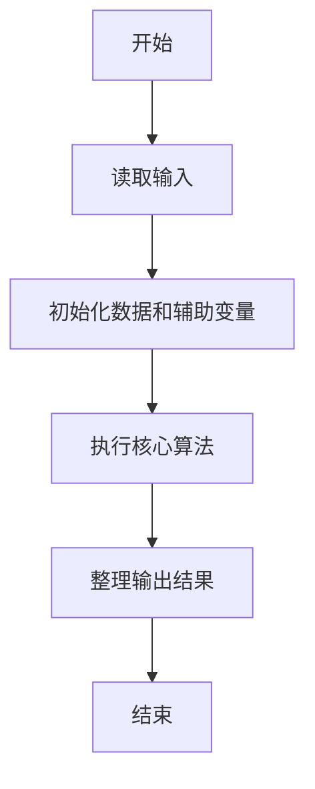
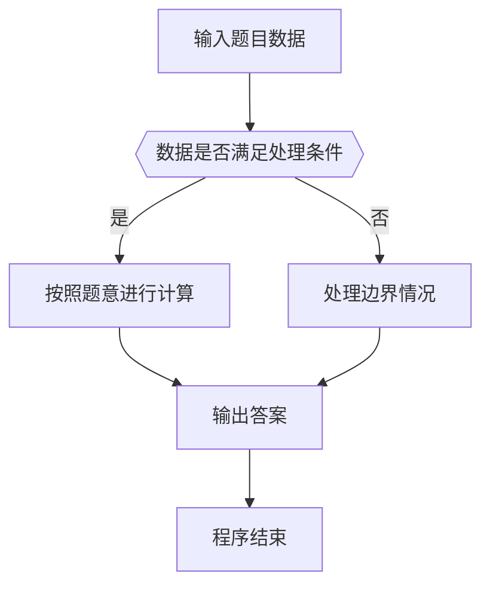

# 1084 外观数列

- **分值：** 20分

### 题目描述

外观数列是指具有以下特点的整数序列：

```
d, d1, d111, d113, d11231, d112213111, ...
```

它从不等于 1 的数字 `d` 开始，序列的第 n+1 项是对第 n 项的描述。比如第 2 项表示第 1 项有 1 个 `d`，所以就是 `d1`；第 2 项是 1 个 `d`（对应 `d1`）和 1 个 1（对应 11），所以第 3 项就是 `d111`。又比如第 4 项是 `d113`，其描述就是 1 个 `d`，2 个 1，1 个 3，所以下一项就是 `d11231`。当然这个定义对 `d` = 1 也成立。本题要求你推算任意给定数字 `d` 的外观数列的第 N 项。

### 输入格式：

输入第一行给出 $[0,9]$ 范围内的一个整数 $d$、以及一个正整数 $N$（$N\le 40$），用空格分隔。

### 输出格式：

在一行中给出数字 `d` 的外观数列的第 N 项。

### 输入样例：
```
1 8
```

### 输出样例：
```
1123123111
```


### 解题思路

本题的核心是：按当前字符串的连续段计数并输出字符，重复指定次数得到下一项。程序先读取题目输入，再按照上述规则完成数据处理，最后严格按照题目要求输出结果。实现时应优先根据题目约束选择合适的数据类型和数据结构，避免溢出或不必要的重复计算。

时间复杂度为 O(kL)；空间复杂度取决于输入规模，主要用于保存题目数据和中间结果。

### 代码流程说明

1. 读取 1084 外观数列 所需的输入数据。
2. 初始化计数器、数组或其他辅助变量。
3. 按当前字符串的连续段计数并输出字符，重复指定次数得到下一项。
4. 按题目规定的格式输出计算结果。

### 代码实现

```ruby
# 题目：1084-外观数列
# 实现原理：
# 本题的核心是：按当前字符串的连续段计数并输出字符，重复指定次数得到下一项。程序先读取题目输入，再按照上述规则完成数据处理，最后严格按照题目要求输出结果。实现时应优先根据题目约束选择合适的数据类型和数据结构，避免溢出或不必要的重复计算。
# 时间复杂度为 O(kL)；空间复杂度取决于输入规模，主要用于保存题目数据和中间结果。
# 代码步骤：
# 1. 读取输入并初始化必要的数据结构。
# 2. 按题意完成核心计算，处理边界情况。
# 3. 按题目要求格式化并输出结果。
#
value, count = STDIN.read.split
(count.to_i - 1).times do
  result = +""
  value.scan(/((.)\2*)/).each { |full, char| result << char << full.length.to_s }
  value = result
end
puts value
```

### 代码流程图



### 解题流程图



### 常见易错点

- 注意输入数据的范围，选择足够大的整数类型，并正确处理边界值。
- 循环、数组下标和字符串结束位置要严格对应题目定义，避免越界。
- 输出格式必须与题目要求完全一致，包括空格、换行、大小写和特殊符号。
- 如果存在排序、去重、进位、约分或四舍五入等操作，应在输出前统一完成。
