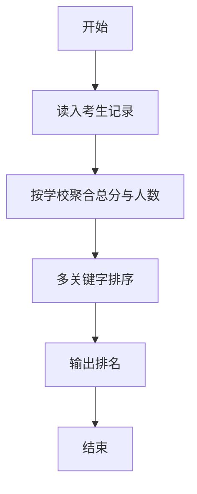
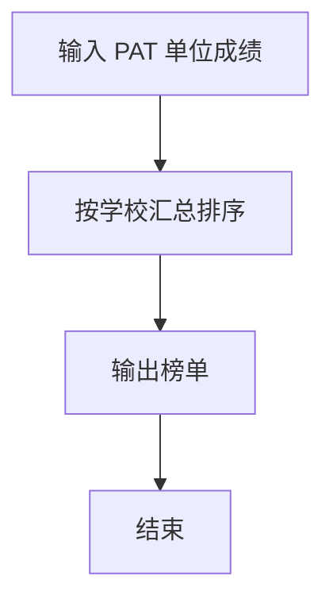

# 1085 PAT单位排行

- **分值：** 25分

### 题目描述

每次 PAT 考试结束后，考试中心都会发布一个考生单位排行榜。本题就请你实现这个功能。

### 输入格式：

输入第一行给出一个正整数 $N$（$N\le 10^5$），即考生人数。随后 $N$ 行，每行按下列格式给出一个考生的信息：

```
准考证号 得分 学校
```

其中`准考证号`是由 6 个字符组成的字符串，其首字母表示考试的级别：`B`代表乙级，`A`代表甲级，`T`代表顶级；`得分`是 $[0,100]$ 区间内的整数；`学校`是由不超过 6 个英文字母组成的单位码（大小写无关）。注意：题目保证每个考生的准考证号是不同的。

### 输出格式：

首先在一行中输出单位个数。随后按以下格式非降序输出单位的排行榜：

```
排名 学校 加权总分 考生人数
```

其中`排名`是该单位的排名（从 1 开始）；`学校`是全部按小写字母输出的单位码；`加权总分`定义为`乙级总分/1.5 + 甲级总分 + 顶级总分*1.5`的**整数部分**；`考生人数`是该属于单位的考生的总人数。

学校首先按加权总分排行。如有并列，则应对应相同的排名，并按考生人数升序输出。如果仍然并列，则按单位码的字典序输出。

### 输入样例：
```
10
A57908 85 Au
B57908 54 LanX
A37487 60 au
T28374 67 CMU
T32486 24 hypu
A66734 92 cmu
B76378 71 AU
A47780 45 lanx
A72809 100 pku
A03274 45 hypu
```

### 输出样例：
```
5
1 cmu 192 2
1 au 192 3
3 pku 100 1
4 hypu 81 2
4 lanx 81 2
```


### 解题思路

本题的核心是：哈希表合并学校成绩，按总分降序和排名规则输出学校名次。程序先读取题目输入，再按照上述规则完成数据处理，最后严格按照题目要求输出结果。实现时应优先根据题目约束选择合适的数据类型和数据结构，避免溢出或不必要的重复计算。

时间复杂度为 O(n log n)；空间复杂度取决于输入规模，主要用于保存题目数据和中间结果。

### 代码流程说明

1. 读入考生并按学校归并。
2. 学校名转小写。
3. 按总分、人数、校名字典序排序输出。

### 代码实现

```ruby
# 题目：1085-PAT单位排行
# 实现原理：
# 本题的核心是：哈希表合并学校成绩，按总分降序和排名规则输出学校名次
# 时间复杂度为 O(n log n)；空间复杂度取决于输入规模，主要用于保存题目数据和中间结果。
# 代码步骤：
# 1. 读取输入并初始化必要的数据结构。
# 2. 按题意完成核心计算，处理边界情况。
# 3. 按题目要求格式化并输出结果。
#
tokens = STDIN.read.split
count = tokens.shift.to_i
schools = {}
count.times do
  id, score, school = tokens.shift(3)
  value = id.start_with?("B") ? score.to_f / 1.5 : id.start_with?("A") ? score.to_f : score.to_f * 1.5
  schools[school.downcase] ||= [0.0, 0]
  schools[school.downcase][0] += value
  schools[school.downcase][1] += 1
end
list = schools.map { |name, (score, students)| [name, score.floor, students] }.sort_by { |name, score, students| [-score, students, name] }
puts list.length
rank = 0
list.each_with_index do |(name, score, students), i|
  rank = i + 1 if i.zero? || list[i - 1][1] != score
  puts "#{rank} #{name} #{score} #{students}"
end
```

### 代码流程图



### 解题流程图



### 常见易错点

- 学校名比较不区分大小写。
- 输出人数是有效考生人数。
- 排名并列规则按题面。
