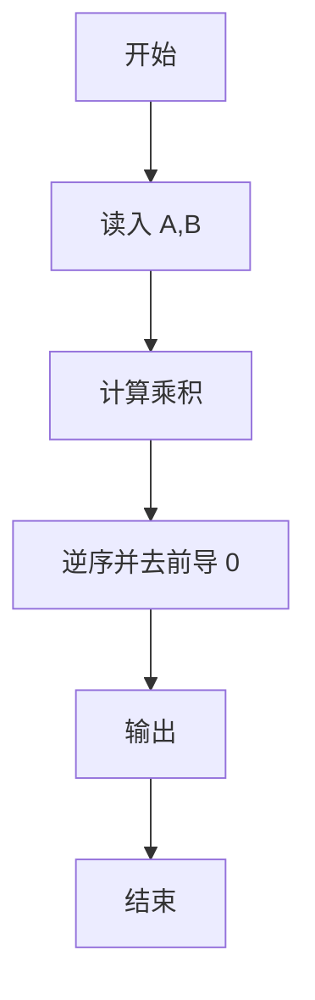
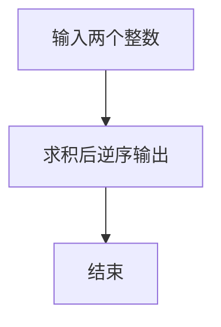

# 1086 就不告诉你

- **分值：** 15分

### 题目描述

做作业的时候，邻座的小盆友问你：“五乘以七等于多少？”你应该不失礼貌地围笑着告诉他：“五十三。”本题就要求你，对任何一对给定的正整数，倒着输出它们的乘积。


### 输入格式：

输入在第一行给出两个不超过 1000 的正整数 A 和 B，其间以空格分隔。

### 输出格式：

在一行中倒着输出 A 和 B 的乘积。

### 输入样例：
```
5 7
```

### 输出样例：
```
53
```


### 解题思路

本题的核心是：计算两个数的乘积并逆序输出各位数字。程序先读取题目输入，再按照上述规则完成数据处理，最后严格按照题目要求输出结果。实现时应优先根据题目约束选择合适的数据类型和数据结构，避免溢出或不必要的重复计算。

时间复杂度为 O(L)；空间复杂度取决于输入规模，主要用于保存题目数据和中间结果。

### 代码流程说明

1. 读入 A、B。
2. 计算乘积。
3. 去掉前导 0 后逆序输出。

### 代码实现

```ruby
# 题目：1086-就不告诉你
# 实现原理：
# 本题的核心是：计算两个数的乘积并逆序输出各位数字
# 时间复杂度为 O(L)；空间复杂度取决于输入规模，主要用于保存题目数据和中间结果。
# 代码步骤：
# 1. 读取输入并初始化必要的数据结构。
# 2. 按题意完成核心计算，处理边界情况。
# 3. 按题目要求格式化并输出结果。
#
a, b = STDIN.read.split.map(&:to_i)
result = (a * b).to_s.reverse.sub(/^0+/, "")
puts result.empty? ? "0" : result
```

### 代码流程图



### 解题流程图



### 常见易错点

- 逆序后要去掉前导 0。
- 乘积为 0 时输出 0。
- 按整数输出。
