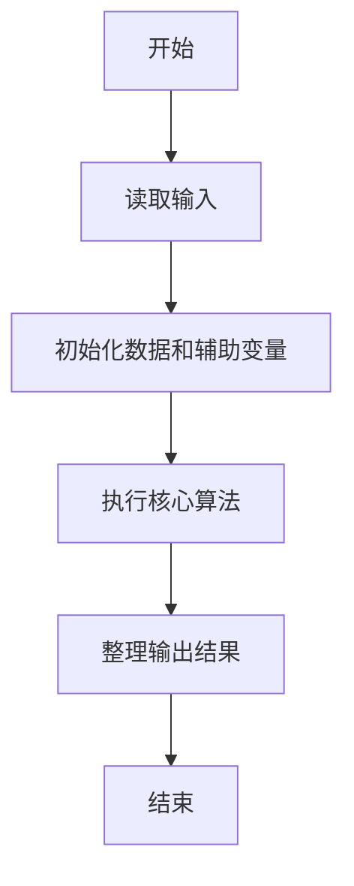
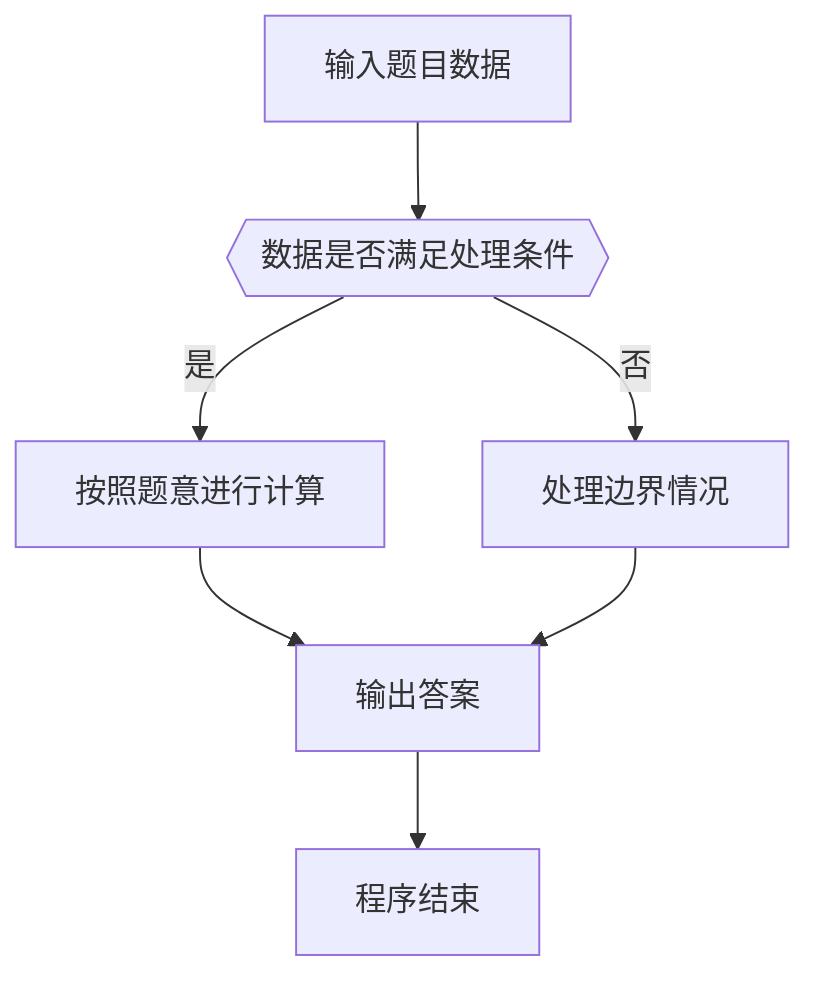

# 1087 有多少不同的值

- **分值：** 20分

### 题目描述

当自然数 $n$ 依次取 1、2、3、……、$N$ 时，算式 $\lfloor n/2\rfloor +\lfloor n/3\rfloor +\lfloor n/5\rfloor $ 有多少个不同的值？（注：$\lfloor x\rfloor$ 为取整函数，表示不超过 $x$ 的最大自然数，即 $x$ 的整数部分。）

### 输入格式：

输入给出一个正整数 $N$（$2 \le N \le 10^4$）。

### 输出格式：

在一行中输出题面中算式取到的不同值的个数。

### 输入样例：
```
2017
```

### 输出样例：
```
1480
```


### 解题思路

本题的核心是：枚举输入范围内的整数，计算题目给出的向下取整表达式并去重。程序先读取题目输入，再按照上述规则完成数据处理，最后严格按照题目要求输出结果。实现时应优先根据题目约束选择合适的数据类型和数据结构，避免溢出或不必要的重复计算。

时间复杂度为 O(n)；空间复杂度为 O(n)。

### 代码流程说明

1. 读取 1087 有多少不同的值 所需的输入数据。
2. 初始化计数器、数组或其他辅助变量。
3. 枚举输入范围内的整数，计算题目给出的向下取整表达式并去重。
4. 按题目规定的格式输出计算结果。

### 代码实现

```ruby
# 题目：1087-有多少不同的值
# 实现原理：
# 本题的核心是：枚举输入范围内的整数，计算题目给出的向下取整表达式并去重。程序先读取题目输入，再按照上述规则完成数据处理，最后严格按照题目要求输出结果。实现时应优先根据题目约束选择合适的数据类型和数据结构，避免溢出或不必要的重复计算。
# 时间复杂度为 O(n)；空间复杂度为 O(n)。
# 代码步骤：
# 1. 读取输入并初始化必要的数据结构。
# 2. 按题意完成核心计算，处理边界情况。
# 3. 按题目要求格式化并输出结果。
#
n = STDIN.read.to_i
puts (1..n).map { |i| i / 2 + i / 3 + i / 5 }.uniq.length
```

### 代码流程图



### 解题流程图



### 常见易错点

- 注意输入数据的范围，选择足够大的整数类型，并正确处理边界值。
- 循环、数组下标和字符串结束位置要严格对应题目定义，避免越界。
- 输出格式必须与题目要求完全一致，包括空格、换行、大小写和特殊符号。
- 如果存在排序、去重、进位、约分或四舍五入等操作，应在输出前统一完成。
