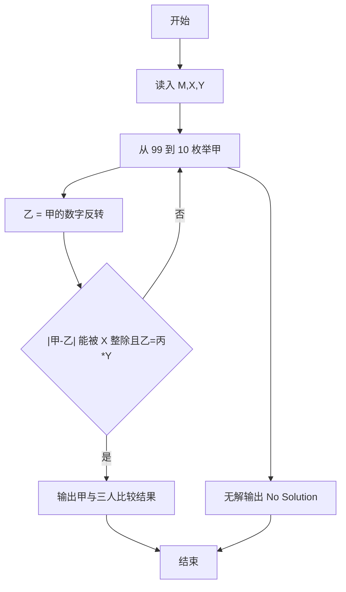
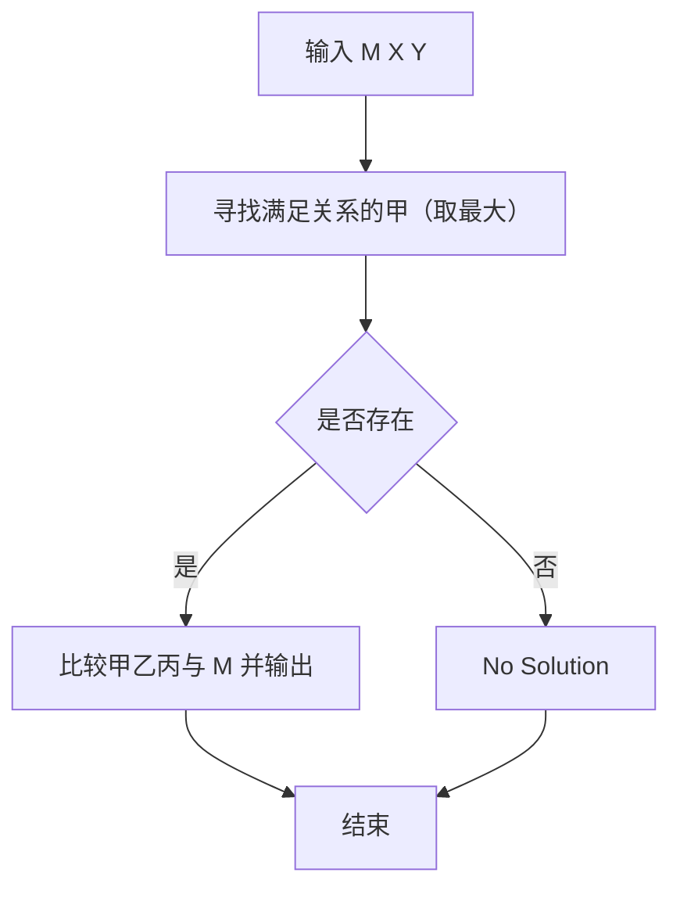

# 1088 三人行

- **分值：** 20分

### 题目描述

子曰：“三人行，必有我师焉。择其善者而从之，其不善者而改之。”

本题给定甲、乙、丙三个人的能力值关系为：甲的能力值确定是 2 位正整数；把甲的能力值的 2 个数字调换位置就是乙的能力值；甲乙两人能力差是丙的能力值的 X 倍；乙的能力值是丙的 Y 倍。请你指出谁比你强应“从之”，谁比你弱应“改之”。

### 输入格式：

输入在一行中给出三个数，依次为：M（你自己的能力值）、X 和 Y。三个数字均为不超过 1000 的正整数。

### 输出格式：

在一行中首先输出甲的能力值，随后依次输出甲、乙、丙三人与你的关系：如果其比你强，输出 `Cong`；平等则输出 `Ping`；比你弱则输出 `Gai`。其间以 1 个空格分隔，行首尾不得有多余空格。

注意：如果解不唯一，则以甲的最大解为准进行判断；如果解不存在，则输出 `No Solution`。

### 输入样例 1：
```
48 3 7
```

### 输出样例 1：
```
48 Ping Cong Gai
```

### 输入样例 2：
```
48 11 6
```

### 输出样例 2：
```
No Solution
```


### 解题思路

本题的核心是：枚举两位数甲，由乙为逆序、丙为能力差/X 且乙=丙*Y 验证，输出与 M 的比较。程序先读取题目输入，再按照上述规则完成数据处理，最后严格按照题目要求输出结果。实现时应优先根据题目约束选择合适的数据类型和数据结构，避免溢出或不必要的重复计算。

时间复杂度为 O(10³)；空间复杂度取决于输入规模，主要用于保存题目数据和中间结果。

### 代码流程说明

1. 读入 M、X、Y。
2. 从大到小枚举两位数甲，乙为数字反转，校验能力关系。
3. 输出甲以及甲乙丙相对 M 的 Cong/Ping/Gai。

### 代码实现

```ruby
# 题目：1088-三人行
# 实现原理：见正文「解题思路」。
# 代码步骤：
# 1. 读取输入。
# 2. 按题意完成核心计算。
# 3. 按题目要求输出结果。
#
mean, x, y = STDIN.read.split.map(&:to_i)
label = ->(value) { value > mean ? "Cong" : value < mean ? "Gai" : "Ping" }
solution = nil
99.downto(10) do |a|
  b = (a % 10) * 10 + (a / 10)
  diff = (a - b).abs
  next if diff.zero? || x.zero? || (diff % x) != 0
  c = diff / x
  if c.positive? && c * y == b
    solution = [a, b, c]
    break
  end
end
if solution
  puts "#{solution[0]} #{label.call(solution[0])} #{label.call(solution[1])} #{label.call(solution[2])}"
else
  puts "No Solution"
end
```

### 代码流程图



### 解题流程图



### 常见易错点

- 甲是两位数，乙是甲的数字反转。
- 比较关系：比 M 强输出 Cong，弱输出 Gai，相等 Ping。
- 多解时取甲的最大值。
