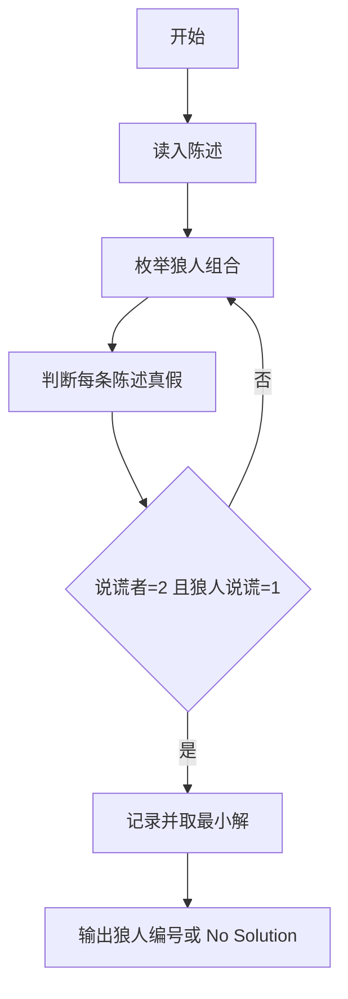
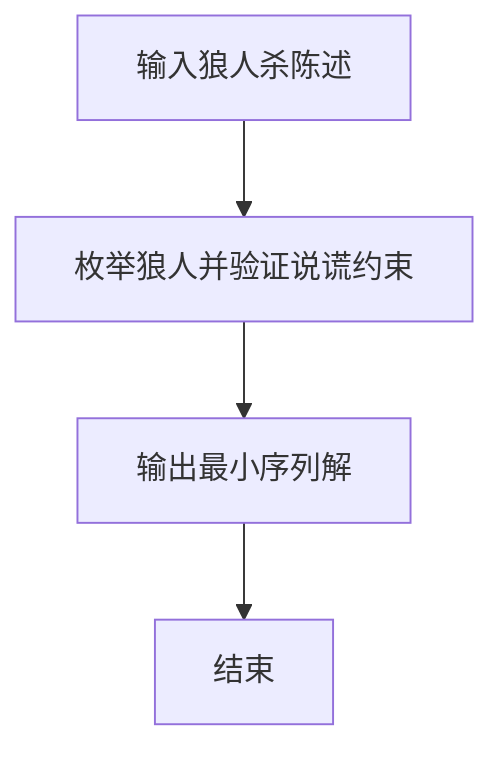

# 1089 狼人杀-简单版

- **分值：** 20分

### 题目描述

以下文字摘自《灵机一动·好玩的数学》：“狼人杀”游戏分为狼人、好人两大阵营。在一局“狼人杀”游戏中，1 号玩家说：“2 号是狼人”，2 号玩家说：“3 号是好人”，3 号玩家说：“4 号是狼人”，4 号玩家说：“5 号是好人”，5 号玩家说：“4 号是好人”。已知这 5 名玩家中有 2 人扮演狼人角色，有 2 人说的不是实话，有狼人撒谎但并不是所有狼人都在撒谎。扮演狼人角色的是哪两号玩家？

本题是这个问题的升级版：已知 $N$ 名玩家中有 2 人扮演狼人角色，有 2 人说的不是实话，有狼人撒谎但并不是所有狼人都在撒谎。要求你找出扮演狼人角色的是哪几号玩家？

### 输入格式：

输入在第一行中给出一个正整数 $N$（$5 \le N \le 100$）。随后 $N$ 行，第 $i$ 行给出第 $i$ 号玩家说的话（$1 \le i \le N$），即一个玩家编号，用正号表示好人，负号表示狼人。

### 输出格式：

如果有解，在一行中按递增顺序输出 2 个狼人的编号，其间以空格分隔，行首尾不得有多余空格。如果解不唯一，则输出最小序列解 —— 即对于两个序列 $A=(a_1,\ldots,a_M)$ 和 $B=(b_1,\ldots,b_M)$，若存在 $0\le k<M$ 使得 $a_i=b_i$（$i\le k$），且 $a_{k+1}<b_{k+1}$，则称序列 $A$ 小于序列 $B$。若无解则输出 `No Solution`。

### 输入样例 1：
```
5
-2
+3
-4
+5
+4
```

### 输出样例 1：
```
1 4
```

### 输入样例 2：
```
6
+6
+3
+1
-5
-2
+4
```

### 输出样例 2（解不唯一）：
```
1 5
```

### 输入样例 3：
```
5
-2
-3
-4
-5
-1
```

### 输出样例 3：
```
No Solution
```


### 解题思路

本题的核心是：枚举两名狼人，扫描所有陈述并统计说谎者及其中狼人说谎人数。程序先读取题目输入，再按照上述规则完成数据处理，最后严格按照题目要求输出结果。实现时应优先根据题目约束选择合适的数据类型和数据结构，避免溢出或不必要的重复计算。

时间复杂度为 O(n³)；空间复杂度为 O(n)。

### 代码流程说明

1. 读入 n 与 n 条陈述。
2. 枚举狼人对，判断每人陈述真假。
3. 恰有 2 人说谎且其中恰有 1 名狼人时输出该对。

### 代码实现

```ruby
# 题目：1089-狼人杀-简单版
# 实现原理：见正文「解题思路」。
# 代码步骤：
# 1. 读取输入。
# 2. 按题意完成核心计算。
# 3. 按题目要求输出结果。
#
tokens = STDIN.read.split.map(&:to_i)
count = tokens.shift
statements = tokens.first(count)
answer = nil
(1..count).each do |first|
  break if answer
  ((first + 1)..count).each do |second|
    wolves = [first, second]
    liars = 0
    wolf_liars = 0
    statements.each_with_index do |statement, i|
      target = statement.abs
      claimed_wolf = statement.negative?
      actual_wolf = wolves.include?(target)
      next if claimed_wolf == actual_wolf
      liars += 1
      wolf_liars += 1 if wolves.include?(i + 1)
    end
    if liars == 2 && wolf_liars == 1
      answer = [first, second]
      break
    end
  end
end
puts answer ? answer.join(" ") : "No Solution"
```

### 代码流程图



### 解题流程图



### 常见易错点

- 陈述目标是编号，+ 表示好人，- 表示狼人。
- 恰好 2 人说谎，且狼人说谎者恰好 1 人。
- 解不唯一时输出字典序最小的狼人对。
