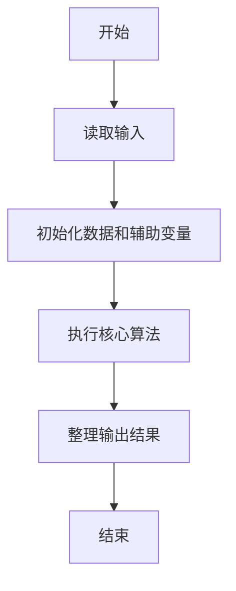
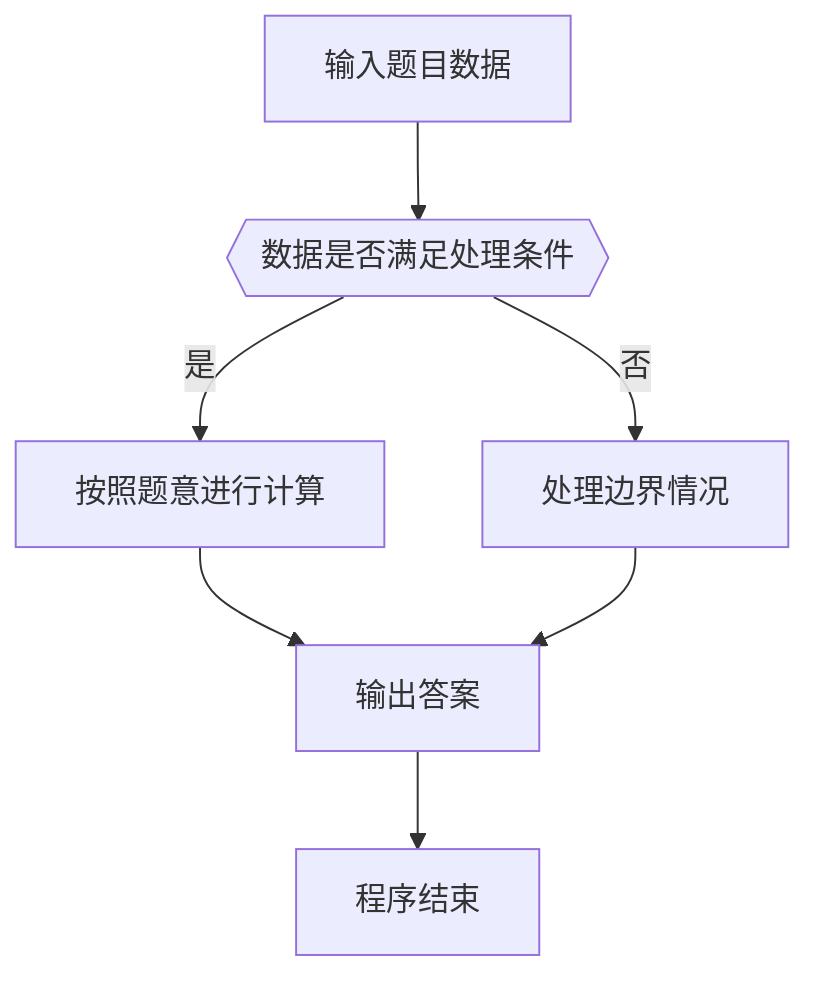

# 1089 狼人杀-简单版

- **分值：** 20分

### 题目描述

以下文字摘自《灵机一动·好玩的数学》：“狼人杀”游戏分为狼人、好人两大阵营。在一局“狼人杀”游戏中，1 号玩家说：“2 号是狼人”，2 号玩家说：“3 号是好人”，3 号玩家说：“4 号是狼人”，4 号玩家说：“5 号是好人”，5 号玩家说：“4 号是好人”。已知这 5 名玩家中有 2 人扮演狼人角色，有 2 人说的不是实话，有狼人撒谎但并不是所有狼人都在撒谎。扮演狼人角色的是哪两号玩家？

本题是这个问题的升级版：已知 $N$ 名玩家中有 2 人扮演狼人角色，有 2 人说的不是实话，有狼人撒谎但并不是所有狼人都在撒谎。要求你找出扮演狼人角色的是哪几号玩家？

### 输入格式：

输入在第一行中给出一个正整数 $N$（$5 \le N \le 100$）。随后 $N$ 行，第 $i$ 行给出第 $i$ 号玩家说的话（$1 \le i \le N$），即一个玩家编号，用正号表示好人，负号表示狼人。

### 输出格式：

如果有解，在一行中按递增顺序输出 2 个狼人的编号，其间以空格分隔，行首尾不得有多余空格。如果解不唯一，则输出最小序列解 —— 即对于两个序列 $A=(a_1,\ldots,a_M)$ 和 $B=(b_1,\ldots,b_M)$，若存在 $0\le k<M$ 使得 $a_i=b_i$（$i\le k$），且 $a_{k+1}<b_{k+1}$，则称序列 $A$ 小于序列 $B$。若无解则输出 `No Solution`。

### 输入样例 1：
```
5
-2
+3
-4
+5
+4
```

### 输出样例 1：
```
1 4
```

### 输入样例 2：
```
6
+6
+3
+1
-5
-2
+4
```

### 输出样例 2（解不唯一）：
```
1 5
```

### 输入样例 3：
```
5
-2
-3
-4
-5
-1
```

### 输出样例 3：
```
No Solution
```


### 解题思路

本题的核心是：枚举两名狼人，扫描所有陈述并统计说谎者人数及其中狼人说谎的人数，输出满足条件的组合。程序先读取题目输入，再按照上述规则完成数据处理，最后严格按照题目要求输出结果。实现时应优先根据题目约束选择合适的数据类型和数据结构，避免溢出或不必要的重复计算。

时间复杂度为 O(n³)；空间复杂度为 O(n)。

### 代码流程说明

1. 读取 1089 狼人杀-简单版 所需的输入数据。
2. 初始化计数器、数组或其他辅助变量。
3. 枚举两名狼人，扫描所有陈述并统计说谎者人数及其中狼人说谎的人数，输出满足条件的组合。
4. 按题目规定的格式输出计算结果。

### 代码实现

```ruby
# 题目：1089-狼人杀-简单版
# 实现原理：
# 本题的核心是：枚举两名狼人，扫描所有陈述并统计说谎者人数及其中狼人说谎的人数，输出满足条件的组合。程序先读取题目输入，再按照上述规则完成数据处理，最后严格按照题目要求输出结果。实现时应优先根据题目约束选择合适的数据类型和数据结构，避免溢出或不必要的重复计算。
# 时间复杂度为 O(n³)；空间复杂度为 O(n)。
# 代码步骤：
# 1. 读取输入并初始化必要的数据结构。
# 2. 按题意完成核心计算，处理边界情况。
# 3. 按题目要求格式化并输出结果。
#
tokens = STDIN.read.split.map(&:to_i)
count = tokens.shift
statements = tokens.first(count)
answer = nil
(1...count).each do |first|
  ((first + 1)..count).each do |second|
    liars = 0
    wolf_liars = 0
    statements.each_with_index do |statement, i|
      wolf = [first, second].include?(i + 1) ? -1 : 1
      said = statement.negative? ? -1 : 1
      if wolf != said
        liars += 1
        wolf_liars += 1 if [first, second].include?(i + 1)
      end
    end
    answer = [first, second] if liars == 2 && wolf_liars == 1
  end
end
puts answer ? answer.join(" ") : "No Solution"
```

### 代码流程图



### 解题流程图



### 常见易错点

- 注意输入数据的范围，选择足够大的整数类型，并正确处理边界值。
- 循环、数组下标和字符串结束位置要严格对应题目定义，避免越界。
- 输出格式必须与题目要求完全一致，包括空格、换行、大小写和特殊符号。
- 如果存在排序、去重、进位、约分或四舍五入等操作，应在输出前统一完成。
