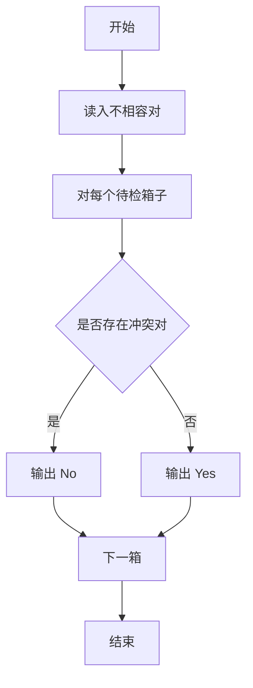
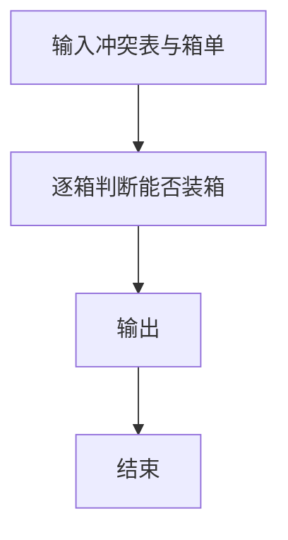

# 1090 危险品装箱

- **分值：** 25分

### 题目描述

集装箱运输货物时，我们必须特别小心，不能把不相容的货物装在一只箱子里。比如氧化剂绝对不能跟易燃液体同箱，否则很容易造成爆炸。

本题给定一张不相容物品的清单，需要你检查每一张集装箱货品清单，判断它们是否能装在同一只箱子里。

### 输入格式：

输入第一行给出两个正整数：$N$（$N\le 10^4$）是成对的不相容物品的对数；$M$（$M\le 100$）是集装箱货品清单的箱数。

随后数据分两大块给出。第一块有 $N$ 行，每行给出一对不相容的物品。第二块有 $M$ 行，每行给出一箱货物的清单，格式如下：
```
K G[1] G[2] ... G[K]
```
其中 $K$（$K\le 1000$）是物品件数，$G_i$ 是物品的编号。简单起见，每件物品用一个 5 位数的编号代表。两个数字之间用空格分隔。

### 输出格式：

对每箱货物清单，判断是否可以安全运输。如果没有不相容物品，则在一行中输出 `Yes`，否则输出 `No`。

### 输入样例：
```
6 3
20001 20002
20003 20004
20005 20006
20003 20001
20005 20004
20004 20006
4 00001 20004 00002 20003
5 98823 20002 20003 20006 10010
3 12345 67890 23333
```

### 输出样例：
```
No
Yes
Yes
```


### 解题思路

本题的核心是：建立不相容物品集合，扫描每箱物品并检查任意冲突对。程序先读取题目输入，再按照上述规则完成数据处理，最后严格按照题目要求输出结果。实现时应优先根据题目约束选择合适的数据类型和数据结构，避免溢出或不必要的重复计算。

时间复杂度为 O(MNK²)；空间复杂度取决于输入规模，主要用于保存题目数据和中间结果。

### 代码流程说明

1. 读入不相容物品对。
2. 对每个箱子检查是否同时含有冲突物品。
3. 输出 Yes/No。

### 代码实现

```ruby
# 题目：1090-危险品装箱
# 实现原理：
# 本题的核心是：建立不相容物品集合，扫描每箱物品并检查任意冲突对
# 时间复杂度为 O(MNK²)；空间复杂度取决于输入规模，主要用于保存题目数据和中间结果。
# 代码步骤：
# 1. 读取输入并初始化必要的数据结构。
# 2. 按题意完成核心计算，处理边界情况。
# 3. 按题目要求格式化并输出结果。
#
tokens = STDIN.read.split
pair_count, query_count = tokens.shift(2).map(&:to_i)
incompatible = Hash.new { |hash, key| hash[key] = {} }
pair_count.times do
  a, b = tokens.shift(2)
  incompatible[a][b] = incompatible[b][a] = true
end
query_count.times do
  count = tokens.shift.to_i
  goods = tokens.shift(count)
  safe = goods.combination(2).all? { |a, b| !incompatible[a][b] }
  puts safe ? "Yes" : "No"
end
```

### 代码流程图



### 解题流程图



### 常见易错点

- 冲突关系是无向的。
- 物品编号按字符串处理更稳。
- 箱子内物品可能很多。
