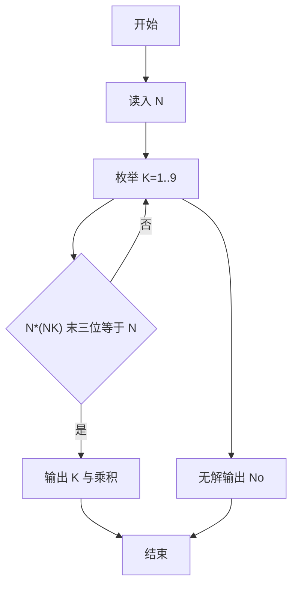
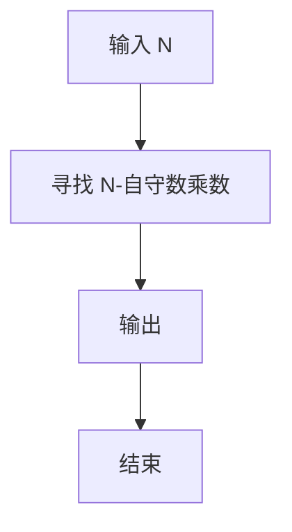

# 1091 N-自守数

- **分值：** 15分

### 题目描述

如果某个数 $K$ 的平方乘以 $N$ 以后，结果的末尾几位数等于 $K$，那么就称这个数为“$N$-自守数”。例如 $3\times 92^2 = 25 392$，而 $25 392$ 的末尾两位正好是 $92$，所以 $92$ 是一个 $3$-自守数。

本题就请你编写程序判断一个给定的数字是否关于某个 $N$ 是 $N$-自守数。

### 输入格式：

输入在第一行中给出正整数 $M$（$\le 20$），随后一行给出 $M$ 个待检测的、不超过 1000 的正整数。

### 输出格式：

对每个需要检测的数字，如果它是 $N$-自守数就在一行中输出最小的 $N$ 和 $NK^2$ 的值，以一个空格隔开；否则输出 `No`。注意题目保证 $N < 10$。

### 输入样例：
```
3
92 5 233
```

### 输出样例：
```
3 25392
1 25
No
```


### 解题思路

本题的核心是：枚举 1 到 9 的乘数，检查乘积的末尾是否等于输入的 N。程序先读取题目输入，再按照上述规则完成数据处理，最后严格按照题目要求输出结果。实现时应优先根据题目约束选择合适的数据类型和数据结构，避免溢出或不必要的重复计算。

时间复杂度为 O(M log K)；空间复杂度为 O(1)。

### 代码流程说明

1. 读入 N。
2. 枚举 K=1..9，检查 N*(NK) 末三位是否为 N。
3. 输出 K 与乘积，无解输出 No。

### 代码实现

```ruby
# 题目：1091-N-自守数
# 实现原理：
# 本题的核心是：枚举 1 到 9 的乘数，检查乘积的末尾是否等于输入的 N
# 时间复杂度为 O(M log K)；空间复杂度为 O(1)。
# 代码步骤：
# 1. 读取输入并初始化必要的数据结构。
# 2. 按题意完成核心计算，处理边界情况。
# 3. 按题目要求格式化并输出结果。
#
tokens = STDIN.read.split.map(&:to_i)
count = tokens.shift
tokens.first(count).each do |number|
  modulus = 10**number.to_s.length
  multiplier = (1..9).find { |value| (value * number * number) % modulus == number }
  puts multiplier ? "#{multiplier} #{multiplier * number * number}" : "No"
end
```

### 代码流程图



### 解题流程图



### 常见易错点

- 只枚举 K=1..9。
- 判断末三位。
- 输出 K 和完整乘积。
