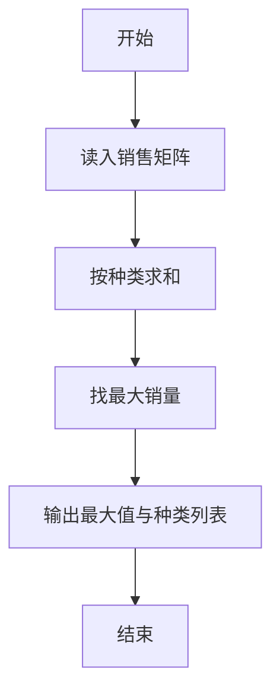
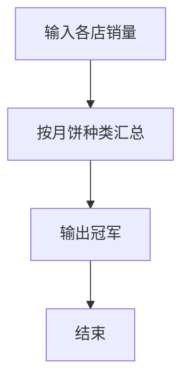

# 1092 最好吃的月饼

- **分值：** 20分

### 题目描述

月饼是久负盛名的中国传统糕点之一，自唐朝以来，已经发展出几百品种。


若想评比出一种“最好吃”的月饼，那势必在吃货界引发一场腥风血雨…… 在这里我们用数字说话，给出全国各地各种月饼的销量，要求你从中找出销量冠军，认定为最好吃的月饼。

### 输入格式：

输入首先给出两个正整数 $N$（$\le 1000$）和 $M$（$\le 100$），分别为月饼的种类数（于是默认月饼种类从 1 到 $N$ 编号）和参与统计的城市数量。

接下来 $M$ 行，每行给出 $N$ 个非负整数（均不超过 1 百万），其中第 $i$ 个整数为第 $i$ 种月饼的销量（块）。数字间以空格分隔。

### 输出格式：

在第一行中输出最大销量，第二行输出销量最大的月饼的种类编号。如果冠军不唯一，则按编号递增顺序输出并列冠军。数字间以 1 个空格分隔，行首尾不得有多余空格。

### 输入样例：
```
5 3
1001 992 0 233 6
8 0 2018 0 2008
36 18 0 1024 4
```

### 输出样例：
```
2018
3 5
```


### 解题思路

本题的核心是：按月饼种类累加销售量，扫描寻找总销量最大者。程序先读取题目输入，再按照上述规则完成数据处理，最后严格按照题目要求输出结果。实现时应优先根据题目约束选择合适的数据类型和数据结构，避免溢出或不必要的重复计算。

时间复杂度为 O(nm)；空间复杂度取决于输入规模，主要用于保存题目数据和中间结果。

### 代码流程说明

1. 读入种类数与店铺数。
2. 累加每种总量。
3. 输出最大销量及对应种类。

### 代码实现

```ruby
# 题目：1092-最好吃的月饼
# 实现原理：
# 本题的核心是：按月饼种类累加销售量，扫描寻找总销量最大者
# 时间复杂度为 O(nm)；空间复杂度取决于输入规模，主要用于保存题目数据和中间结果。
# 代码步骤：
# 1. 读取输入并初始化必要的数据结构。
# 2. 按题意完成核心计算，处理边界情况。
# 3. 按题目要求格式化并输出结果。
#
tokens = STDIN.read.split.map(&:to_i)
types, days = tokens.shift(2)
totals = Array.new(types, 0)
days.times { types.times { |i| totals[i] += tokens.shift } }
maximum = totals.max
puts maximum
puts totals.each_index.select { |i| totals[i] == maximum }.map { |i| i + 1 }.join(" ")
```

### 代码流程图



### 解题流程图



### 常见易错点

- 并列最大要输出所有种类。
- 种类编号从 1 开始。
- 输出格式空格分隔。
