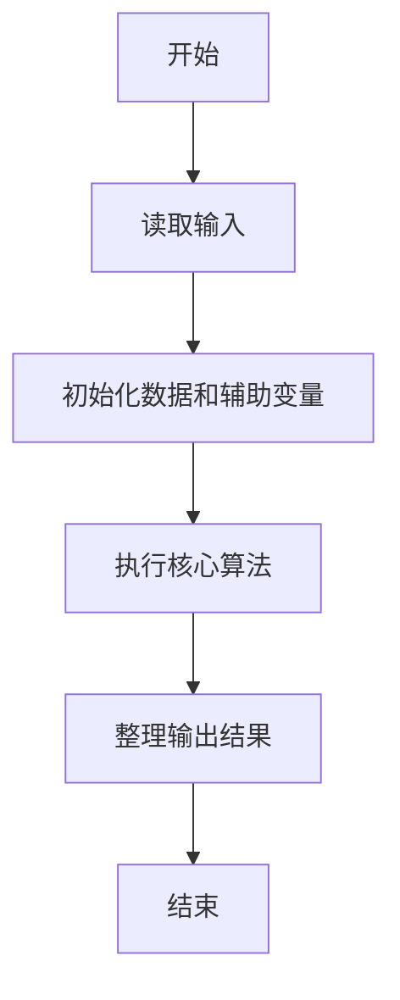
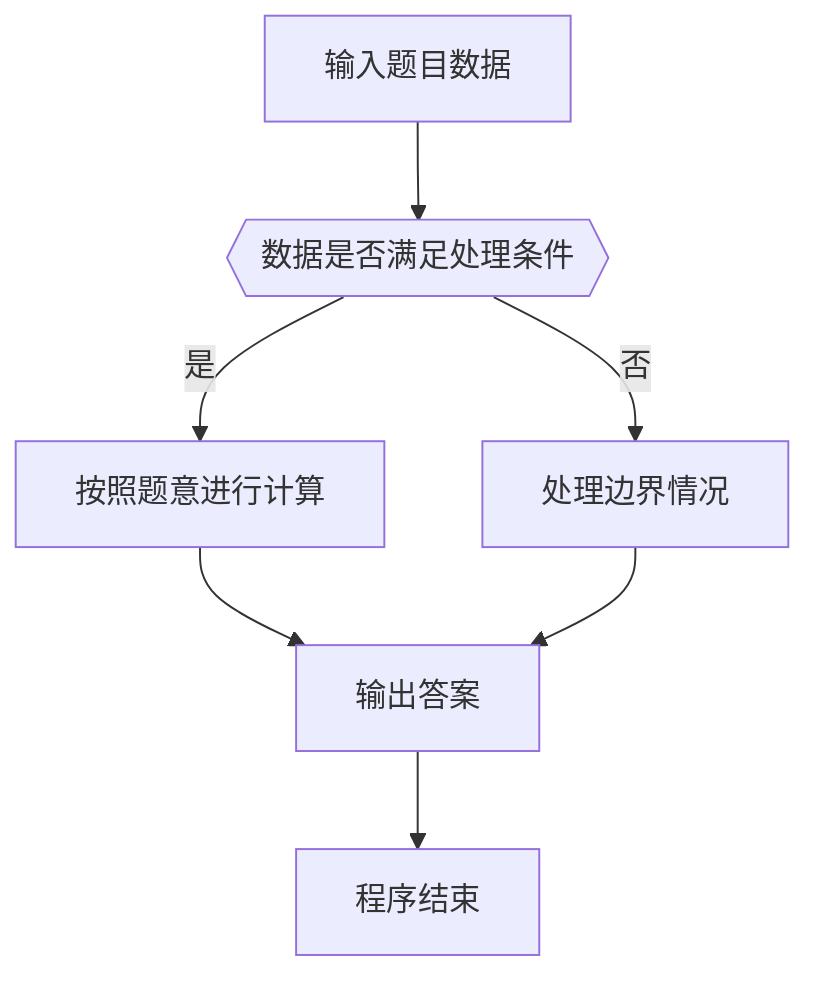

# 1093 字符串A+B

- **分值：** 20分

### 题目描述

给定两个字符串 $A$ 和 $B$，本题要求你输出 $A+B$，即两个字符串的并集。要求先输出 $A$，再输出 $B$，但**重复的字符必须被剔除**。

### 输入格式：

输入在两行中分别给出 $A$ 和 $B$，均为长度不超过 $10^6$的、由可见 ASCII 字符 (即码值为32~126)和空格组成的、由回车标识结束的非空字符串。

### 输出格式：

在一行中输出题面要求的 $A$ 和 $B$ 的和。

### 输入样例：
```
This is a sample test
to show you_How it works
```

### 输出样例：
```
This ampletowyu_Hrk
```


### 解题思路

本题的核心是：先按出现顺序保留 A 的字符，再补充 B 中尚未出现的字符。程序先读取题目输入，再按照上述规则完成数据处理，最后严格按照题目要求输出结果。实现时应优先根据题目约束选择合适的数据类型和数据结构，避免溢出或不必要的重复计算。

时间复杂度为 O(L)；空间复杂度取决于输入规模，主要用于保存题目数据和中间结果。

### 代码流程说明

1. 读取 1093 字符串A+B 所需的输入数据。
2. 初始化计数器、数组或其他辅助变量。
3. 先按出现顺序保留 A 的字符，再补充 B 中尚未出现的字符。
4. 按题目规定的格式输出计算结果。

### 代码实现

```ruby
# 题目：1093-字符串A+B
# 实现原理：
# 本题的核心是：先按出现顺序保留 A 的字符，再补充 B 中尚未出现的字符。程序先读取题目输入，再按照上述规则完成数据处理，最后严格按照题目要求输出结果。实现时应优先根据题目约束选择合适的数据类型和数据结构，避免溢出或不必要的重复计算。
# 时间复杂度为 O(L)；空间复杂度取决于输入规模，主要用于保存题目数据和中间结果。
# 代码步骤：
# 1. 读取输入并初始化必要的数据结构。
# 2. 按题意完成核心计算，处理边界情况。
# 3. 按题目要求格式化并输出结果。
#
first, second = STDIN.readlines.first(2)
seen = (first.to_s + second.to_s).chars.select { |char| char.between?(" ", "~") }.tally
result = +""
(first.to_s + second.to_s).each_char do |char|
  next unless seen[char].to_i.positive?
  result << char
  seen[char] = 0
end
puts result
```

### 代码流程图



### 解题流程图



### 常见易错点

- 注意输入数据的范围，选择足够大的整数类型，并正确处理边界值。
- 循环、数组下标和字符串结束位置要严格对应题目定义，避免越界。
- 输出格式必须与题目要求完全一致，包括空格、换行、大小写和特殊符号。
- 如果存在排序、去重、进位、约分或四舍五入等操作，应在输出前统一完成。
