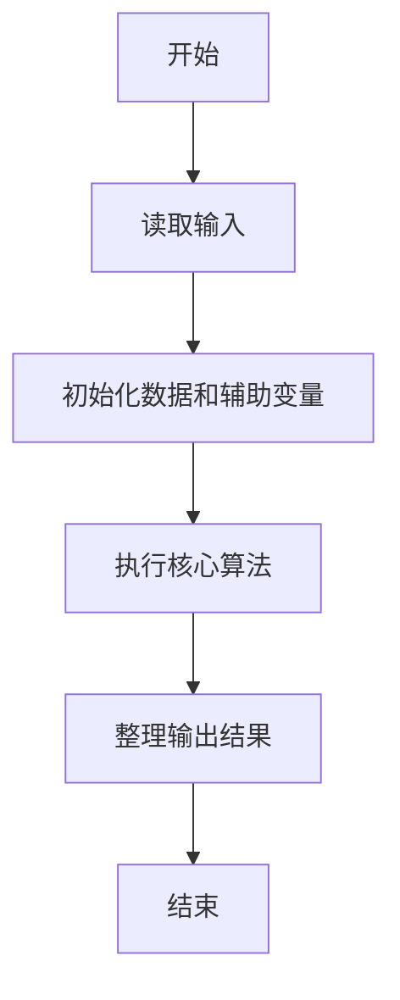
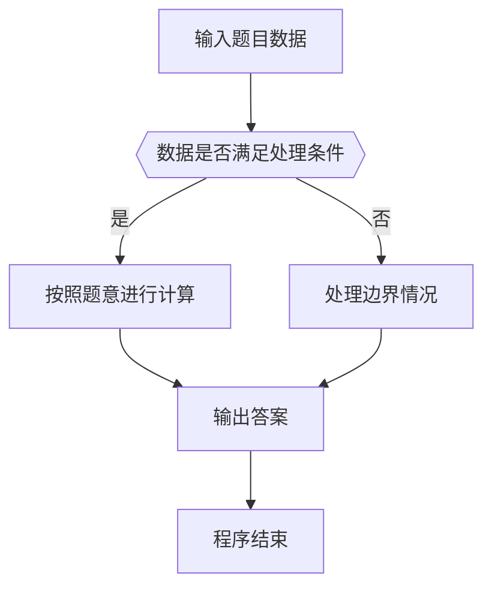

# 1095 解码PAT准考证

- **分值：** 25分

### 题目描述

PAT 准考证号由 4 部分组成：

- 第 1 位是级别，即 `T` 代表顶级；`A` 代表甲级；`B` 代表乙级；
- 第 2~4 位是考场编号，范围从 101 到 999；
- 第 5~10 位是考试日期，格式为年、月、日顺次各占 2 位；
- 最后 11~13 位是考生编号，范围从 000 到 999。

现给定一系列考生的准考证号和他们的成绩，请你按照要求输出各种统计信息。

### 输入格式：

输入首先在一行中给出两个正整数 $N$（$\le 10^4$）和 $M$（$\le 100$），分别为考生人数和统计要求的个数。

接下来 $N$ 行，每行给出一个考生的准考证号和其分数（在区间 $[0,100]$ 内的整数），其间以空格分隔。

考生信息之后，再给出 $M$ 行，每行给出一个统计要求，格式为：`类型 指令`，其中

- `类型` 为 1 表示要求按分数非升序输出某个指定级别的考生的成绩，对应的 `指令` 则给出代表指定级别的字母；
- `类型` 为 2 表示要求将某指定考场的考生人数和总分统计输出，对应的 `指令` 则给出指定考场的编号；
- `类型` 为 3 表示要求将某指定日期的考生人数分考场统计输出，对应的 `指令` 则给出指定日期，格式与准考证上日期相同。

### 输出格式：

对每项统计要求，首先在一行中输出 `Case #: 要求`，其中 `#` 是该项要求的编号，从 1 开始；`要求` 即复制输入给出的要求。随后输出相应的统计结果：

- `类型` 为 1 的指令，输出格式与输入的考生信息格式相同，即 `准考证号 成绩`。对于分数并列的考生，按其准考证号的字典序递增输出（题目保证无重复准考证号）；
- `类型` 为 2 的指令，按 `人数 总分` 的格式输出；
- `类型` 为 3 的指令，输出按人数非递增顺序，格式为 `考场编号 总人数`。若人数并列则按考场编号递增顺序输出。

如果查询结果为空，则输出 `NA`。

### 输入样例：
```
8 4
B123180908127 99
B102180908003 86
A112180318002 98
T107150310127 62
A107180908108 100
T123180908010 78
B112160918035 88
A107180908021 98
1 A
2 107
3 180908
2 999
```

### 输出样例：
```
Case 1: 1 A
A107180908108 100
A107180908021 98
A112180318002 98
Case 2: 2 107
3 260
Case 3: 3 180908
107 2
123 2
102 1
Case 4: 2 999
NA
```


### 解题思路

本题的核心是：按查询类型统计等级、日期总分或考点总量，分别排序或累加。程序先读取题目输入，再按照上述规则完成数据处理，最后严格按照题目要求输出结果。实现时应优先根据题目约束选择合适的数据类型和数据结构，避免溢出或不必要的重复计算。

时间复杂度最坏为 O(mn log n)；空间复杂度为 O(n)。

### 代码流程说明

1. 读取 1095 解码PAT准考证 所需的输入数据。
2. 初始化计数器、数组或其他辅助变量。
3. 按查询类型统计等级、日期总分或考点总量，分别排序或累加。
4. 按题目规定的格式输出计算结果。

### 代码实现

```ruby
# 题目：1095-解码PAT准考证
# 实现原理：
# 本题的核心是：按查询类型统计等级、日期总分或考点总量，分别排序或累加。程序先读取题目输入，再按照上述规则完成数据处理，最后严格按照题目要求输出结果。实现时应优先根据题目约束选择合适的数据类型和数据结构，避免溢出或不必要的重复计算。
# 时间复杂度最坏为 O(mn log n)；空间复杂度为 O(n)。
# 代码步骤：
# 1. 读取输入并初始化必要的数据结构。
# 2. 按题意完成核心计算，处理边界情况。
# 3. 按题目要求格式化并输出结果。
#
tokens = STDIN.read.split
student_count, query_count = tokens.shift(2).map(&:to_i)
students = student_count.times.map { [tokens.shift, tokens.shift.to_i] }
query_count.times do |index|
  kind, value = tokens.shift(2)
  puts "Case #{index + 1}: #{kind} #{value}"
  selected = case kind
             when "1" then students.select { |id, _| id.start_with?(value) }.sort_by { |id, score| [-score, id] }
             when "2" then students.select { |id, _| id[1, 3] == value }
             else students.select { |id, _| id[4, 6] == value }
             end
  if selected.empty?
    puts "NA"
  elsif kind == "1"
    selected.each { |id, score| puts "#{id} #{score}" }
  elsif kind == "2"
    puts "#{selected.length} #{selected.sum { |_, score| score }}"
  else
    selected.group_by { |id, _| id[1, 3] }.map { |school, rows| [school, rows.length] }.sort_by { |school, count| [-count, school] }.each { |school, count| puts "#{school} #{count}" }
  end
end
```

### 代码流程图



### 解题流程图



### 常见易错点

- 注意输入数据的范围，选择足够大的整数类型，并正确处理边界值。
- 循环、数组下标和字符串结束位置要严格对应题目定义，避免越界。
- 输出格式必须与题目要求完全一致，包括空格、换行、大小写和特殊符号。
- 如果存在排序、去重、进位、约分或四舍五入等操作，应在输出前统一完成。
