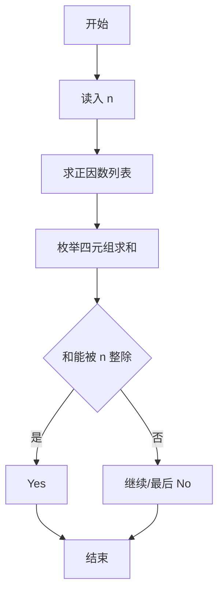
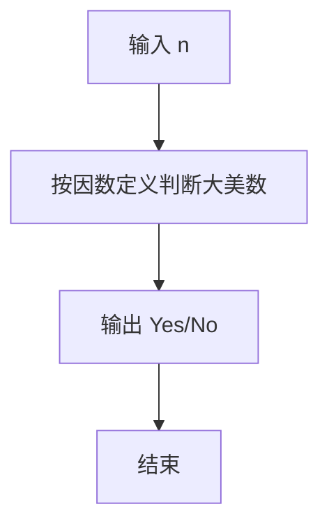

# 1096 大美数

- **分值：** 15分

### 题目描述

若正整数 $N$ 可以整除它的 4 个不同正因数之和，则称这样的正整数为“大美数”。本题就要求你判断任一给定的正整数是否是“大美数”。

### 输入格式：

输入在第一行中给出正整数 $K$（$\le 10$），随后一行给出 $K$ 个待检测的、不超过 $10^4$ 的正整数。

### 输出格式：

对每个需要检测的数字，如果它是大美数就在一行中输出 `Yes`，否则输出 `No`。

### 输入样例：
```
3
18 29 40
```

### 输出样例：
```
Yes
No
Yes
```


### 解题思路

本题的核心是：枚举正因数组合，检查四个不同正因数之和是否能被原数整除。程序先读取题目输入，再按照上述规则完成数据处理，最后严格按照题目要求输出结果。实现时应优先根据题目约束选择合适的数据类型和数据结构，避免溢出或不必要的重复计算。

时间复杂度为 O(n+d⁴)，其中 d 为正因数个数；空间复杂度为 O(d)。

### 代码流程说明

1. 读入 n。
2. 求全部正因数。
3. 枚举四个不同因数判断大美数。

### 代码实现

```ruby
# 题目：1096-大美数
# 实现原理：
# 本题的核心是：枚举正因数组合，检查四个不同正因数之和是否能被原数整除
# 时间复杂度为 O(n+d⁴)，其中 d 为正因数个数；空间复杂度为 O(d)。
# 代码步骤：
# 1. 读取输入并初始化必要的数据结构。
# 2. 按题意完成核心计算，处理边界情况。
# 3. 按题目要求格式化并输出结果。
#
tokens = STDIN.read.split.map(&:to_i)
count = tokens.shift
tokens.first(count).each do |number|
  divisors = (1..number).select { |d| (number % d).zero? }
  beautiful = divisors.combination(4).any? { |group| (group.sum % number).zero? }
  puts beautiful ? "Yes" : "No"
end
```

### 代码流程图



### 解题流程图



### 常见易错点

- 四个因数必须互不相同。
- 因数包括 1 与自身。
- 直接枚举因数更高效。
