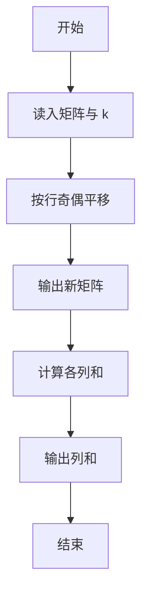
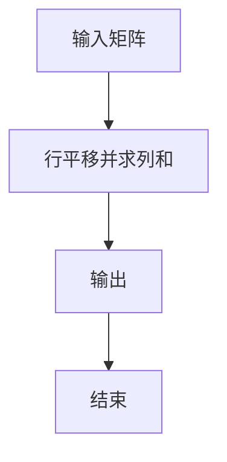

# 1097 矩阵行平移

- **分值：** 20分

### 题目描述

给定一个 $n\times n$ 的整数矩阵。对任一给定的正整数 $k<n$，我们将矩阵的奇数行的元素整体向右依次平移 1、……、$k$、1、……、$k$、…… 个位置，平移空出的位置用整数 $x$ 补。你需要计算出结果矩阵的每一列元素的和。

### 输入格式：

输入第一行给出 3 个正整数：$n$（$n<100$）、$k$（$k<n$）、$x$（$x<100$），分别如题面所述。

接下来 $n$ 行，每行给出 $n$ 个不超过 100 的正整数，为矩阵元素的值。数字间以空格分隔。

### 输出格式：

在一行中输出平移后第 1 到 $n$ 列元素的和。数字间以 1 个空格分隔，行首尾不得有多余空格。

### 输入样例：
```
7 2 99
11 87 23 67 20 75 89
37 94 27 91 63 50 11
44 38 50 26 40 26 24
73 85 63 28 62 18 68
15 83 27 97 88 25 43
23 78 98 20 30 81 99
77 36 48 59 25 34 22
```

### 输出样例：
```
529 481 479 263 417 342 343
```

**样例解读**

需要平移的是第 1、3、5、7 行。给定 $k=2$，应该将这三列顺次整体向右平移 1、2、1、2 位（如果有更多行，就应该按照 1、2、1、2、1、2 …… 这个规律顺次向右平移），左端的空位用 99 来填充。平移后的矩阵变成：
```
99 11 87 23 67 20 75
37 94 27 91 63 50 11
99 99 44 38 50 26 40
73 85 63 28 62 18 68
99 15 83 27 97 88 25
23 78 98 20 30 81 99
99 99 77 36 48 59 25
```


### 解题思路

本题的核心是：按行号判断奇偶方向，计算平移后的列下标并累加元素。程序先读取题目输入，再按照上述规则完成数据处理，最后严格按照题目要求输出结果。实现时应优先根据题目约束选择合适的数据类型和数据结构，避免溢出或不必要的重复计算。

时间复杂度为 O(RC)；空间复杂度取决于输入规模，主要用于保存题目数据和中间结果。

### 代码流程说明

1. 读入矩阵与平移参数 k。
2. 奇数行右移、偶数行左移（按题面）。
3. 输出平移后矩阵与列和。

### 代码实现

```ruby
# 题目：1097-矩阵行平移
# 实现原理：
# 本题的核心是：按行号判断奇偶方向，计算平移后的列下标并累加元素
# 时间复杂度为 O(RC)；空间复杂度取决于输入规模，主要用于保存题目数据和中间结果。
# 代码步骤：
# 1. 读取输入并初始化必要的数据结构。
# 2. 按题意完成核心计算，处理边界情况。
# 3. 按题目要求格式化并输出结果。
#
tokens = STDIN.read.split.map(&:to_i)
size, step, value = tokens.shift(3)
matrix = tokens.each_slice(size).first(size)
answer = Array.new(size, 0)
matrix.each_with_index do |row, i|
  shift = i.even? ? ((i / 2) % step + 1) : 0
  row.each_with_index { |cell, j| answer[j] += i.even? && j < shift ? value : row[j - shift] }
end
puts answer.join(" ")
```

### 代码流程图



### 解题流程图



### 常见易错点

- 平移是循环移动。
- 行号奇偶定义从 1 开始。
- 列和单独一行。
