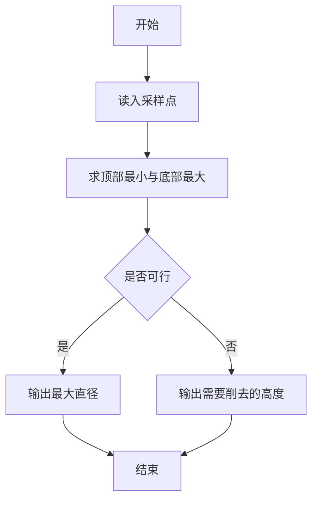
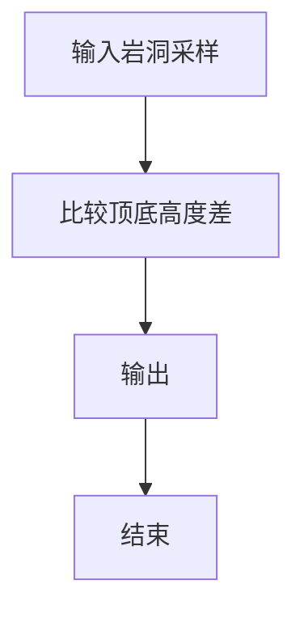

# 1098 岩洞施工

- **分值：** 20分

### 题目描述

要将一条直径至少为 1 个单位的长管道水平送入地形复杂的岩洞中，究竟是否可能？下面的两幅图分别给出了岩洞的剖面图，深蓝色的折线勾勒出岩洞顶部和底部的轮廓。图 1 是有可能的，绿色部分显示直径为 1 的管道可以送入。图 2 就不可能，除非把顶部或底部的突出部分削掉 1 个单位的高度。


本题就请你编写程序，判断给定的岩洞中是否可以施工。

### 输入格式：

输入在第一行给出一个不超过 100 的正整数 $N$，即横向采样的点数。随后两行数据，从左到右顺次给出采样点的纵坐标：第 1 行是岩洞顶部的采样点，第 2 行是岩洞底部的采样点。这里假设坐标原点在左下角，每个纵坐标为不超过 1000 的非负整数。同行数字间以空格分隔。

题目保证输入数据是合理的，即岩洞底部的轮廓线不会与顶部轮廓线交叉。

### 输出格式：

如果可以直接施工，则在一行中输出 `Yes` 和可以送入的管道的最大直径；如果不行，则输出 `No` 和至少需要削掉的高度。答案和数字间以 1 个空格分隔。

### 输入样例 1：
```
11
7 6 5 5 6 5 4 5 5 4 4
3 2 2 2 2 3 3 2 1 2 3
```

### 输出样例 1：
```
Yes 1
```

### 输入样例 2：
```
11
7 6 5 5 6 5 4 5 5 4 4
3 2 2 2 3 4 3 2 1 2 3
```

### 输出样例 2：
```
No 1
```


### 解题思路

本题的核心是：扫描顶部采样点的最小高度和底部采样点的最大高度，用差值判断管道直径。程序先读取题目输入，再按照上述规则完成数据处理，最后严格按照题目要求输出结果。实现时应优先根据题目约束选择合适的数据类型和数据结构，避免溢出或不必要的重复计算。

时间复杂度为 O(N)；空间复杂度取决于输入规模，主要用于保存题目数据和中间结果。

### 代码流程说明

1. 读入顶部与底部采样点。
2. 求 top_min 与 bottom_max。
3. 计算可选直径或需要削去的高度。

### 代码实现

```ruby
# 题目：1098-岩洞施工
# 实现原理：
# 本题的核心是：扫描顶部采样点的最小高度和底部采样点的最大高度，用差值判断管道直径
# 时间复杂度为 O(N)；空间复杂度取决于输入规模，主要用于保存题目数据和中间结果。
# 代码步骤：
# 1. 读取输入并初始化必要的数据结构。
# 2. 按题意完成核心计算，处理边界情况。
# 3. 按题目要求格式化并输出结果。
#
tokens = STDIN.read.split.map(&:to_i)
count = tokens.shift
top = tokens.shift(count)
bottom = tokens.shift(count)
gap = top.min - bottom.max
puts gap >= 1 ? "Yes #{gap}" : "No #{1 - gap}"
```

### 代码流程图



### 解题流程图



### 常见易错点

- 直径由高度差决定，注意非负。
- 不可行时输出削去高度。
- 按样例格式。
