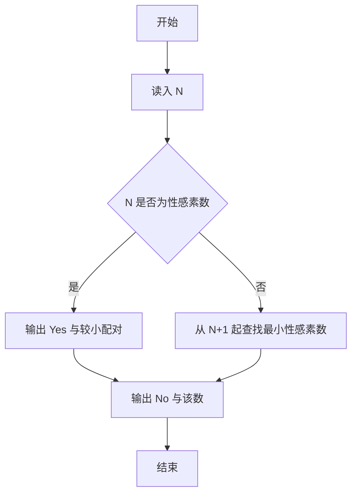
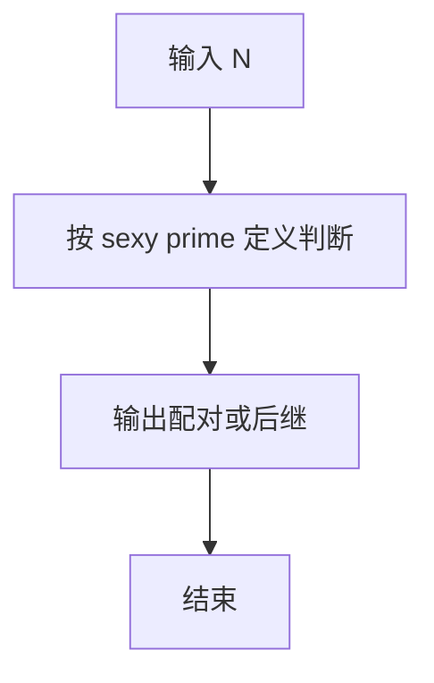

# 1099 性感素数

- **分值：** 20分

### 题目描述

“性感素数”是指形如 $(p,p+6)$ 这样的一对素数。之所以叫这个名字，是因为拉丁语管“六”叫“sex”（即英语的“性感”）。（原文摘自 http://mathworld.wolfram.com/SexyPrimes.html）

现给定一个整数，请你判断其是否为一个性感素数。

### 输入格式：

输入在一行中给出一个正整数 $N$（$N\le 10^8$）。

### 输出格式：

若 $N$ 是一个性感素数，则在一行中输出 `Yes`，并在第二行输出与 $N$ 配对的另一个性感素数（若这样的数不唯一，输出较小的那个）。若 $N$ 不是性感素数，则在一行中输出 `No`，然后在第二行输出大于 $N$ 的最小性感素数。

### 输入样例 1：
```
47
```

### 输出样例 1：
```
Yes
41
```

### 输入样例 2：
```
21
```

### 输出样例 2：
```
No
23
```


### 解题思路

本题的核心是：判断 N 是否为性感素数；是则输出较小配对，否则输出大于 N 的最小性感素数。程序先读取题目输入，再按照上述规则完成数据处理，最后严格按照题目要求输出结果。实现时应优先根据题目约束选择合适的数据类型和数据结构，避免溢出或不必要的重复计算。

时间复杂度为 O(√n)；空间复杂度取决于输入规模，主要用于保存题目数据和中间结果。

### 代码流程说明

1. 读入 N。
2. 若 N 为素数且 N-6 或 N+6 为素数，则 Yes 并输出较小配对。
3. 否则 No，并向后找到最小性感素数。

### 代码实现

```ruby
# 题目：1099-性感素数
# 实现原理：见正文「解题思路」。
# 代码步骤：
# 1. 读取输入。
# 2. 按题意完成核心计算。
# 3. 按题目要求输出结果。
#
number = STDIN.read.to_i
prime = ->(n) { n >= 2 && (2..Math.sqrt(n).to_i).none? { |d| (n % d).zero? } }
sexy = ->(n) { prime.call(n) && (prime.call(n - 6) || prime.call(n + 6)) }

if sexy.call(number)
  partners = []
  partners << (number - 6) if prime.call(number - 6)
  partners << (number + 6) if prime.call(number + 6)
  puts "Yes"
  puts partners.min
else
  candidate = number + 1
  candidate += 1 until sexy.call(candidate)
  puts "No"
  puts candidate
end
```

### 代码流程图



### 解题流程图



### 常见易错点

- N 本身必须是素数才算性感素数。
- 配对取较小者。
- 非 sexy 时答案大于 N。
