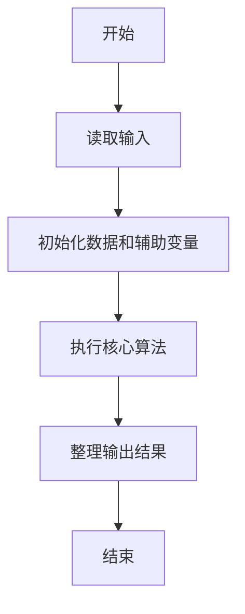
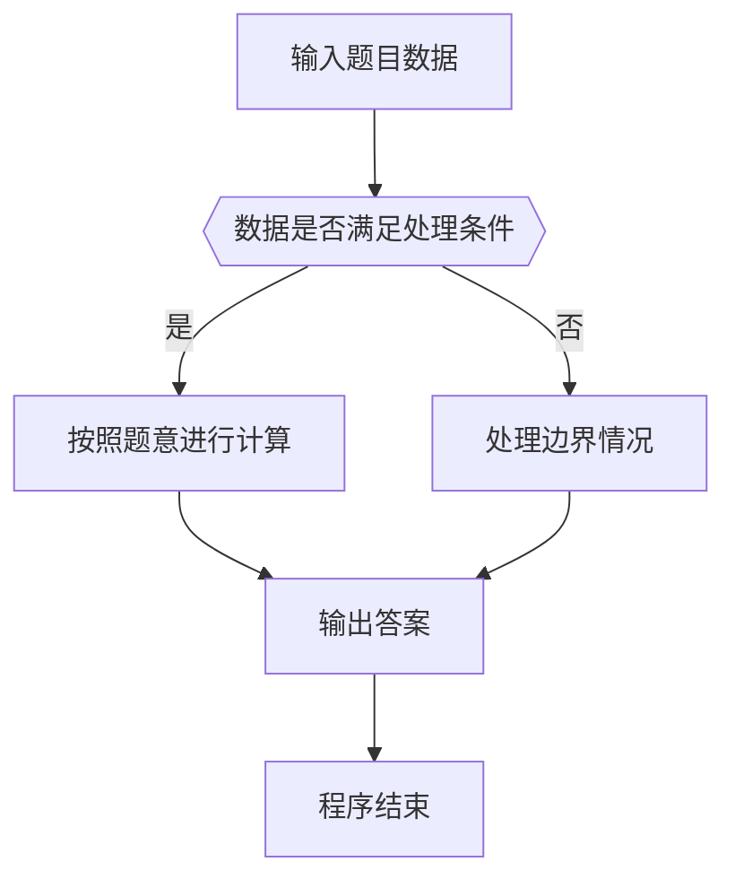

# 1100 校庆

- **分值：** 25分

### 题目描述

2019 年浙江大学将要庆祝成立 122 周年。为了准备校庆，校友会收集了所有校友的身份证号。现在需要请你编写程序，根据来参加校庆的所有人士的身份证号，统计来了多少校友。

### 输入格式：

输入在第一行给出不超过 $10^5$ 的正整数 $N$，随后 $N$ 行，每行给出一位校友的身份证号（18 位由数字和大写字母 X 组成的字符串）。题目保证身份证号不重复。

随后给出前来参加校庆的所有人士的信息：首先是一个不超过 $10^5$ 的正整数 $M$，随后 $M$ 行，每行给出一位人士的身份证号。题目保证身份证号不重复。

### 输出格式：

首先在第一行输出参加校庆的校友的人数。然后在第二行输出最年长的校友的身份证号 —— 注意身份证第 7-14 位给出的是 `yyyymmdd` 格式的生日。如果没有校友来，则在第二行输出最年长的来宾的身份证号。题目保证这样的校友或来宾必是唯一的。

### 输入样例：
```
5
372928196906118710
610481197806202213
440684198612150417
13072819571002001X
150702193604190912
6
530125197901260019
150702193604190912
220221196701020034
610481197806202213
440684198612150417
370205198709275042
```

### 输出样例：
```
3
150702193604190912
```


### 解题思路

本题的核心是：将生日日期转成可比较的整数，分别维护最年长校友和最年长来宾。程序先读取题目输入，再按照上述规则完成数据处理，最后严格按照题目要求输出结果。实现时应优先根据题目约束选择合适的数据类型和数据结构，避免溢出或不必要的重复计算。

时间复杂度为 O(nm)；空间复杂度为 O(n)。

### 代码流程说明

1. 读取 1100 校庆 所需的输入数据。
2. 初始化计数器、数组或其他辅助变量。
3. 将生日日期转成可比较的整数，分别维护最年长校友和最年长来宾。
4. 按题目规定的格式输出计算结果。

### 代码实现

```ruby
# 题目：1100-校庆
# 实现原理：
# 本题的核心是：将生日日期转成可比较的整数，分别维护最年长校友和最年长来宾。程序先读取题目输入，再按照上述规则完成数据处理，最后严格按照题目要求输出结果。实现时应优先根据题目约束选择合适的数据类型和数据结构，避免溢出或不必要的重复计算。
# 时间复杂度为 O(nm)；空间复杂度为 O(n)。
# 代码步骤：
# 1. 读取输入并初始化必要的数据结构。
# 2. 按题意完成核心计算，处理边界情况。
# 3. 按题目要求格式化并输出结果。
#
tokens = STDIN.read.split
school_count = tokens.shift.to_i
school = tokens.shift(school_count).to_h { |id| [id, true] }
guest_count = tokens.shift.to_i
guests = tokens.shift(guest_count)
known = guests.select { |id| school[id] }
selected = (known.empty? ? guests : known).min_by { |id| id[6, 8] }
puts "#{known.length}\n#{selected}"
```

### 代码流程图



### 解题流程图



### 常见易错点

- 注意输入数据的范围，选择足够大的整数类型，并正确处理边界值。
- 循环、数组下标和字符串结束位置要严格对应题目定义，避免越界。
- 输出格式必须与题目要求完全一致，包括空格、换行、大小写和特殊符号。
- 如果存在排序、去重、进位、约分或四舍五入等操作，应在输出前统一完成。
