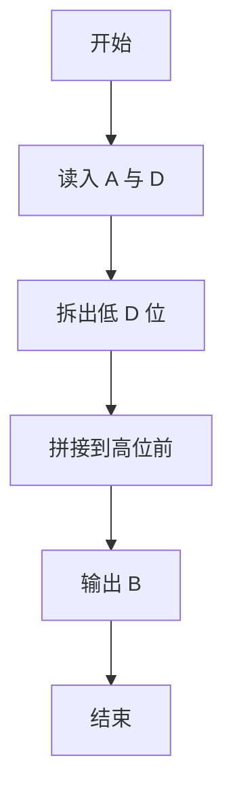
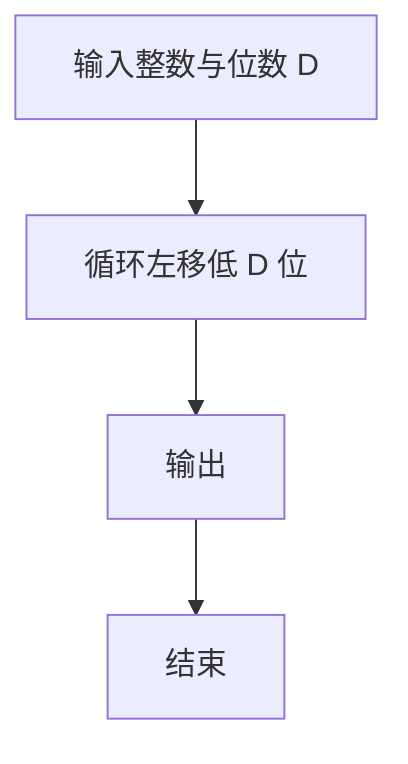

# 1101 B是A的多少倍

- **分值：** 15分

### 题目描述

设一个数 $A$ 的最低 $D$ 位形成的数是 $a_d$。如果把 $a_d$ 截下来移到 $A$ 的最高位前面，就形成了一个新的数 $B$。$B$ 是 $A$ 的多少倍？例如将 12345 的最低 2 位 45 截下来放到 123 的前面，就得到 45123，它约是 12345 的 3.66 倍。

### 输入格式：

输入在一行中给出一个正整数 $A$（$\le 10^9$）和要截取的位数 $D$。题目保证 $D$ 不超过 $A$ 的总位数。

### 输出格式：

计算 $B$ 是 $A$ 的多少倍，输出小数点后 2 位。

### 输入样例 1：
```
12345 2
```

### 输出样例 1：
```
3.66
```

### 输入样例 2：
```
12345 5
```

### 输出样例 2：
```
1.00
```


### 解题思路

本题的核心是：把低 D 位循环左移到高位，其余位保持不变。程序先读取题目输入，再按照上述规则完成数据处理，最后严格按照题目要求输出结果。实现时应优先根据题目约束选择合适的数据类型和数据结构，避免溢出或不必要的重复计算。

时间复杂度为 O(L)；空间复杂度取决于输入规模，主要用于保存题目数据和中间结果。

### 代码流程说明

1. 以字符串读入 A 与 D。
2. 将低 D 位移到最前面。
3. 输出变换后的 B。

### 代码实现

```ruby
# 题目：1101-B是A的多少倍
# 实现原理：
# 本题的核心是：把低 D 位循环左移到高位，其余位保持不变
# 时间复杂度为 O(L)；空间复杂度取决于输入规模，主要用于保存题目数据和中间结果。
# 代码步骤：
# 1. 读取输入并初始化必要的数据结构。
# 2. 按题意完成核心计算，处理边界情况。
# 3. 按题目要求格式化并输出结果。
#
number, digits = STDIN.read.split
digits = digits.to_i
rotated = number[-digits, digits] + number[0, number.length - digits]
puts format("%.2f", rotated.to_f / number.to_f)
```

### 代码流程图



### 解题流程图



### 常见易错点

- 按字符串操作避免位数过大。
- D 可能等于位数。
- 输出无前导零除数字本身需要外。
