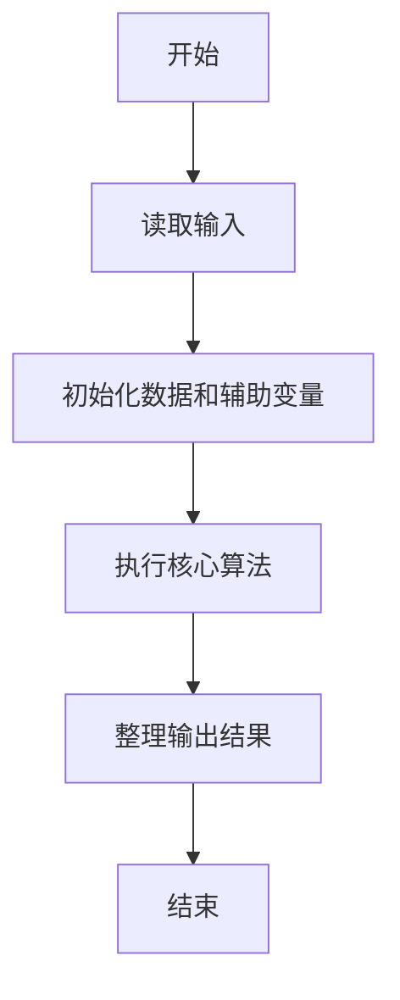
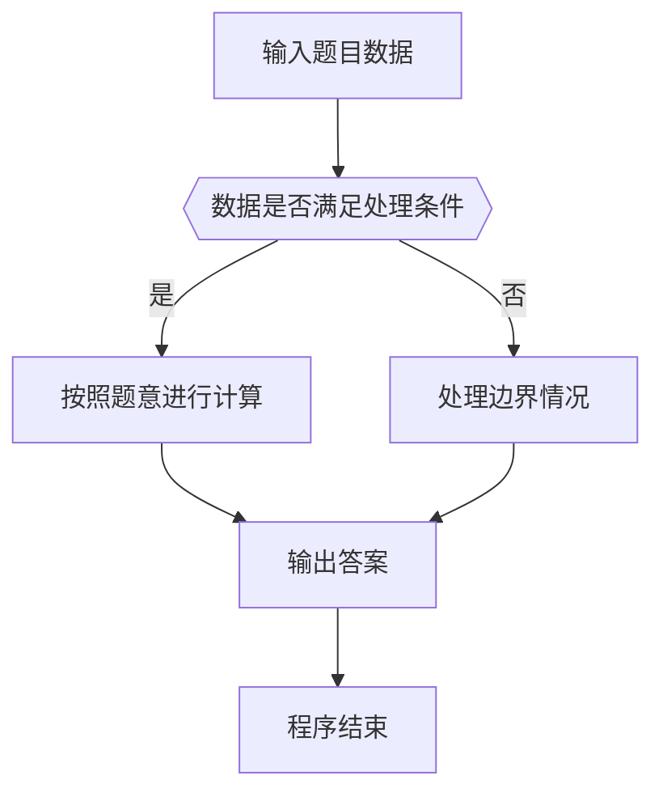

# 1102 教超冠军卷

- **分值：** 20分

### 题目描述

“教育超市”是拼题 A 系统的一个衍生产品，发布了各种试卷和练习供用户选购。在试卷列表中，系统不仅列出了每份试卷的单价，还显示了当前的购买人次。本题就请你根据这些信息找出教育超市所有试卷中的销量（即购买人次）冠军和销售额冠军。

### 输入格式：

输入首先在第一行中给出一个正整数 $N$（$N\le 10^4$），随后 $N$ 行，每行给出一份卷子的独特 ID（由小写字母和数字组成的、长度不超过 8 位的字符串）、单价（为不超过 $100$ 的正整数）和购买人次（为不超过 $10^6$ 的非负整数）。

### 输出格式：

在第一行中输出销量冠军的 ID 及其销量，第二行中输出销售额冠军的 ID 及其销售额。同行输出间以一个空格分隔。题目保证冠军是唯一的，不存在并列。

### 输入样例：
```
4
zju007 39 10
pku2019 9 332
pat2018 95 79
qdu106 19 38
```

### 输出样例：
```
pku2019 332
pat2018 7505
```


### 解题思路

本题的核心是：统计每份试卷的购买人次和销售额，分别找出销量冠军与销售额冠军。程序先读取题目输入，再按照上述规则完成数据处理，最后严格按照题目要求输出结果。实现时应优先根据题目约束选择合适的数据类型和数据结构，避免溢出或不必要的重复计算。

时间复杂度为 O(n)；空间复杂度取决于输入规模，主要用于保存题目数据和中间结果。

### 代码流程说明

1. 读取 1102 教超冠军卷 所需的输入数据。
2. 初始化计数器、数组或其他辅助变量。
3. 统计每份试卷的购买人次和销售额，分别找出销量冠军与销售额冠军。
4. 按题目规定的格式输出计算结果。

### 代码实现

```ruby
# 题目：1102-教超冠军卷
# 实现原理：
# 本题的核心是：统计每份试卷的购买人次和销售额，分别找出销量冠军与销售额冠军。程序先读取题目输入，再按照上述规则完成数据处理，最后严格按照题目要求输出结果。实现时应优先根据题目约束选择合适的数据类型和数据结构，避免溢出或不必要的重复计算。
# 时间复杂度为 O(n)；空间复杂度取决于输入规模，主要用于保存题目数据和中间结果。
# 代码步骤：
# 1. 读取输入并初始化必要的数据结构。
# 2. 按题意完成核心计算，处理边界情况。
# 3. 按题目要求格式化并输出结果。
#
tokens = STDIN.read.split
count = tokens.shift.to_i
best_quantity = [nil, -1, 0]
best_sales = [nil, -1, 0]
count.times do
  id, price, quantity = tokens.shift(3)
  price = price.to_i
  quantity = quantity.to_i
  best_quantity = [id, quantity, 0] if quantity > best_quantity[1]
  best_sales = [id, price * quantity, 0] if price * quantity > best_sales[1]
end
puts "#{best_quantity[0]} #{best_quantity[1]}"
puts "#{best_sales[0]} #{best_sales[1]}"
```

### 代码流程图



### 解题流程图



### 常见易错点

- 注意输入数据的范围，选择足够大的整数类型，并正确处理边界值。
- 循环、数组下标和字符串结束位置要严格对应题目定义，避免越界。
- 输出格式必须与题目要求完全一致，包括空格、换行、大小写和特殊符号。
- 如果存在排序、去重、进位、约分或四舍五入等操作，应在输出前统一完成。
