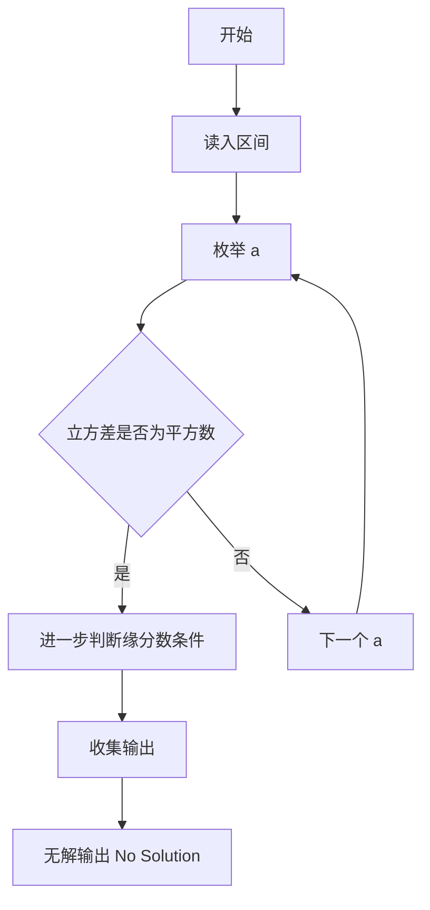
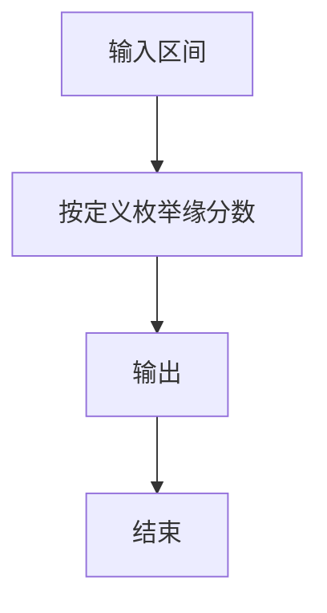

# 1103 缘分数

- **分值：** 20分

### 题目描述

所谓**缘分数**是指这样一对正整数 $a$ 和 $b$，其中 $a$ 和它的小弟 $a-1$ 的立方差正好是另一个整数 $c$ 的平方，而 $c$ 正好是 $b$ 和它的小弟 $b-1$ 的平方和。例如 $8^3 - 7^3 = 169 = 13^2$，而 $13 = 3^2 + 2^2$，于是 8 和 3 就是一对缘分数。

给定 $a$ 所在的区间 $[m,n]$，是否存在缘分数？

### 输入格式：

输入给出区间的两个端点 $0<m<n\le 25000$，其间以空格分隔。

### 输出格式：

按照 $a$ 从小到大的顺序，每行输出一对缘分数，数字间以空格分隔。如果无解，则输出 `No Solution`。

### 输入样例 1：
```
8 200
```

### 输出样例 1：
```
8 3
105 10
```

### 输入样例 2：
```
9 100
```

### 输出样例 2：
```
No Solution
```


### 解题思路

本题的核心是：枚举区间内的 a，检查立方差是否为平方数并可拆成两平方数之和。程序先读取题目输入，再按照上述规则完成数据处理，最后严格按照题目要求输出结果。实现时应优先根据题目约束选择合适的数据类型和数据结构，避免溢出或不必要的重复计算。

时间复杂度为 O((n-m)n)；空间复杂度取决于输入规模，主要用于保存题目数据和中间结果。

### 代码流程说明

1. 读入区间。
2. 枚举 a，计算 a^3-(a-1)^3。
3. 若为平方数且满足缘分数定义则收集输出。

### 代码实现

```ruby
# 题目：1103-缘分数
# 实现原理：
# 本题的核心是：枚举区间内的 a，检查立方差是否为平方数并可拆成两平方数之和
# 时间复杂度为 O((n-m)n)；空间复杂度取决于输入规模，主要用于保存题目数据和中间结果。
# 代码步骤：
# 1. 读取输入并初始化必要的数据结构。
# 2. 按题意完成核心计算，处理边界情况。
# 3. 按题目要求格式化并输出结果。
#
low, high = STDIN.read.split.map(&:to_i)
found = false
(low..high).each do |a|
  value = a**3 - (a - 1)**3
  root = Math.sqrt(value).to_i
  next unless root * root == value
  (1..root).each do |b|
    if b * b + (b - 1) * (b - 1) == root
      puts "#{a} #{b}"
      found = true
    end
  end
end
puts "No Solution" unless found
```

### 代码流程图



### 解题流程图



### 常见易错点

- 立方差公式不要展开错。
- 平方数判断与后续拆分条件。
- 按 a 递增顺序输出。
