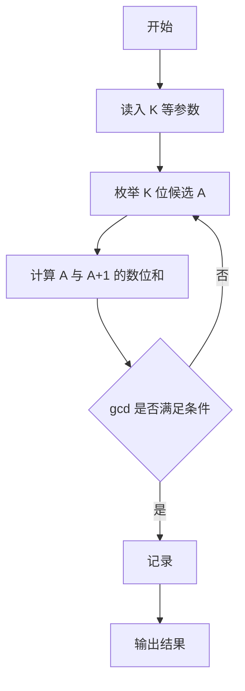
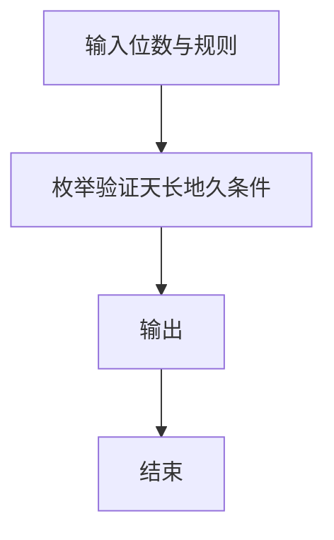

# 1104 天长地久

- **分值：** 20分

### 题目描述

“天长地久数”是指一个 $K$ 位正整数 $A$，其满足条件为：$A$ 的各位数字之和为 $m$，$A+1$ 的各位数字之和为 $n$，且 $m$ 与 $n$ 的最大公约数是一个大于 2 的素数。本题就请你找出这些天长地久数。

### 输入格式：

输入在第一行给出正整数 $N$（$\le 5$），随后 $N$ 行，每行给出一对 $K$（$3<K<10$）和 $m$（$1<m<90$），其含义如题面所述。

### 输出格式：

对每一对输入的 $K$ 和 $m$，首先在一行中输出 `Case X`，其中 `X` 是输出的编号（从 1 开始）；然后一行输出对应的 $n$ 和 $A$，数字间以空格分隔。如果解不唯一，则每组解占一行，按 $n$ 的递增序输出；若仍不唯一，则按 $A$ 的递增序输出。若解不存在，则在一行中输出 `No Solution`。

### 输入样例：
```
2
6 45
7 80
```

### 输出样例：
```
Case 1
10 189999
10 279999
10 369999
10 459999
10 549999
10 639999
10 729999
10 819999
10 909999
Case 2
No Solution
```


### 解题思路

本题的核心是：按位数枚举候选 A，检查 A 与 A+1 的数位和的最大公约数。程序先读取题目输入，再按照上述规则完成数据处理，最后严格按照题目要求输出结果。实现时应优先根据题目约束选择合适的数据类型和数据结构，避免溢出或不必要的重复计算。

时间复杂度为 O(10^K K)；空间复杂度取决于输入规模，主要用于保存题目数据和中间结果。

### 代码流程说明

1. 读入位数 K 与参数。
2. 枚举 K 位数 A。
3. 计算数位和 gcd，满足条件则计数/输出。

### 代码实现

```ruby
# 题目：1104-天长地久
# 实现原理：
# 本题的核心是：按位数枚举候选 A，检查 A 与 A+1 的数位和的最大公约数
# 时间复杂度为 O(10^K K)；空间复杂度取决于输入规模，主要用于保存题目数据和中间结果。
# 代码步骤：
# 1. 读取输入并初始化必要的数据结构。
# 2. 按题意完成核心计算，处理边界情况。
# 3. 按题目要求格式化并输出结果。
#
tokens = STDIN.read.split.map(&:to_i)
cases = tokens.shift
digit_sum = ->(number) { number.to_s.chars.sum(&:to_i) }
prime = ->(n) { n >= 2 && (2..Math.sqrt(n).to_i).none? { |d| (n % d).zero? } }
cases.times do |index|
  length, sum = tokens.shift(2)
  puts "Case #{index + 1}"
  answer = false
  output = []
  build = lambda do |position, remaining, number, digit_sum_value|
    if position == length
      next unless remaining.zero?
      next_sum = digit_sum.call(number + 1)
      gcd = sum.gcd(next_sum)
      if gcd > 2 && prime.call(gcd)
        output << "#{next_sum} #{number}"
        answer = true
      end
      next
    end

    minimum_digit = position.zero? ? 1 : 0
    maximum_digit = [9, remaining].min
    (minimum_digit..maximum_digit).each do |digit|
      rest = length - position - 1
      next unless remaining - digit >= 0 && remaining - digit <= rest * 9
      build.call(position + 1, remaining - digit, number * 10 + digit, digit_sum_value + digit)
    end
  end
  build.call(0, sum, 0, 0)
  puts output
  puts "No Solution" unless answer
end
```

### 代码流程图



### 解题流程图



### 常见易错点

- 数位和计算不要漏位。
- A+1 可能进位增加位数。
- 按题面输出计数或具体数。
