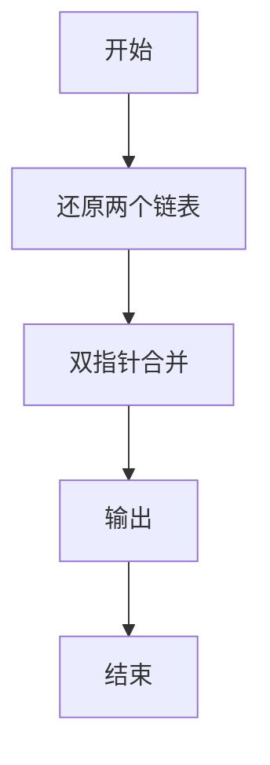
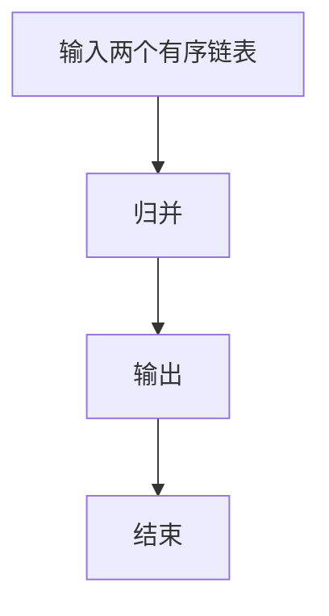

# 1105 链表合并

- **分值：** 25分

### 题目描述

给定两个单链表 $L_1 = a_1 \to a_2\to \cdots \to a_{n-1}\to a_n$ 和 $L_2 = b_1 \to b_2\to \cdots \to b_{m-1}\to b_m$。如果 $n\ge 2m$，你的任务是将比较短的那个链表逆序，然后将之并入比较长的那个链表，得到一个形如 $a_1 \to a_2 \to b_{m} \to a_3 \to a_4 \to b_{m-1}\cdots $ 的结果。例如给定两个链表分别为 6→7 和 1→2→3→4→5，你应该输出 1→2→7→3→4→6→5。

### 输入格式：

输入首先在第一行中给出两个链表 $L_1$ 和 $L_2$ 的头结点的地址，以及正整数
$N$（$N\le 10^5$），即给定的结点总数。一个结点的地址是一个 5 位数的非负整数，空地址 NULL 用 `-1` 表示。

随后 $N$ 行，每行按以下格式给出一个结点的信息：

```
Address Data Next
```

其中 `Address` 是结点的地址，`Data` 是不超过 $10^5$ 的正整数，`Next` 是下一个结点的地址。题目保证没有空链表，并且较长的链表至少是较短链表的两倍长。

### 输出格式：

按顺序输出结果链表，每个结点占一行，格式与输入相同。

### 输入样例：
```
00100 01000 7
02233 2 34891
00100 6 00001
34891 3 10086
01000 1 02233
00033 5 -1
10086 4 00033
00001 7 -1
```

### 输出样例：
```
01000 1 02233
02233 2 00001
00001 7 34891
34891 3 10086
10086 4 00100
00100 6 00033
00033 5 -1
```


### 解题思路

本题的核心是：分别读取两个有序链表，使用双指针按升序合并并输出。程序先读取题目输入，再按照上述规则完成数据处理，最后严格按照题目要求输出结果。实现时应优先根据题目约束选择合适的数据类型和数据结构，避免溢出或不必要的重复计算。

时间复杂度为 O(n+m)；空间复杂度取决于输入规模，主要用于保存题目数据和中间结果。

### 代码流程说明

1. 还原两个链表。
2. 双指针合并。
3. 输出合并后序列。

### 代码实现

```ruby
# 题目：1105-链表合并
# 实现原理：
# 本题的核心是：分别读取两个有序链表，使用双指针按升序合并并输出
# 时间复杂度为 O(n+m)；空间复杂度取决于输入规模，主要用于保存题目数据和中间结果。
# 代码步骤：
# 1. 读取输入并初始化必要的数据结构。
# 2. 按题意完成核心计算，处理边界情况。
# 3. 按题目要求格式化并输出结果。
#
tokens = STDIN.read.split
head_a, head_b, count = tokens.shift(3)
values = {}
next_nodes = {}
count.to_i.times do
  address, value, next_address = tokens.shift(3)
  values[address] = value
  next_nodes[address] = next_address
end
walk = lambda do |head|
  result = []
  while head != "-1"
    result << head
    head = next_nodes[head]
  end
  result
end
list_a = walk.call(head_a)
list_b = walk.call(head_b)
if list_a.length >= list_b.length
  long_list = list_a
  short_list = list_b.reverse
else
  long_list = list_b
  short_list = list_a.reverse
end
order = []
long_list.each_slice(2).with_index do |slice, i|
  order.concat(slice)
  order << short_list[i] if short_list[i]
end
order.each_with_index { |address, i| puts "#{address} #{values[address]} #{i + 1 == order.length ? '-1' : order[i + 1]}" }
```

### 代码流程图



### 解题流程图



### 常见易错点

- 只输出链上的结点。
- 保持升序。
- 空链表边界。
