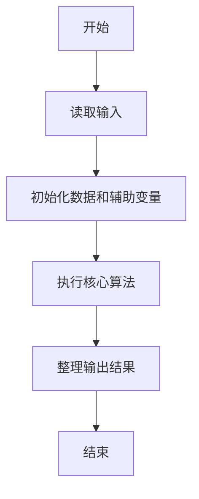
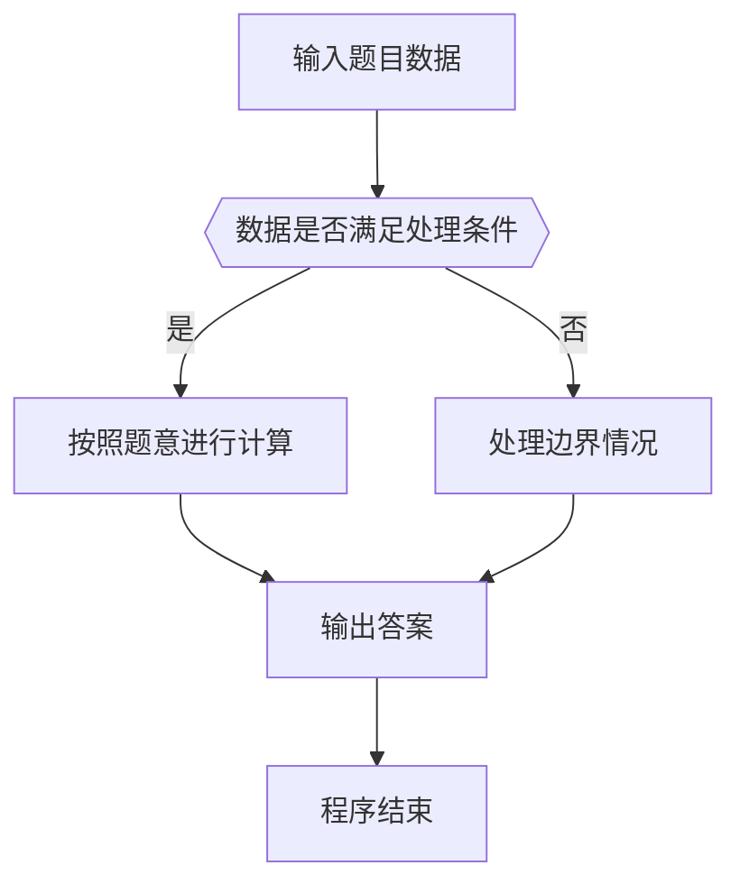

# 1106 2019数列

- **分值：** 15分

### 题目描述

把 2019 各个数位上的数字 2、0、1、9 作为一个数列的前 4 项，用它们去构造一个无穷数列，其中第 $n$（$>4$）项是它前 4 项之和的个位数字。例如第 5 项为 2， 因为 $2+0+1+9=12$，个位数是 2。

本题就请你编写程序，列出这个序列的前 $n$ 项。

### 输入格式：

输入给出正整数 $n$（$\le 1000$）。

### 输出格式：

在一行中输出数列的前 $n$ 项，数字间不要有空格。

### 输入样例：
```
10
```

### 输出样例：
```
2019224758
```

**题外话：**这个数列中永远不会出现 `2018`，你能证明吗？


### 解题思路

本题的核心是：保存最近四项，按题目递推式生成后续项并输出指定项。程序先读取题目输入，再按照上述规则完成数据处理，最后严格按照题目要求输出结果。实现时应优先根据题目约束选择合适的数据类型和数据结构，避免溢出或不必要的重复计算。

时间复杂度为 O(n)；空间复杂度取决于输入规模，主要用于保存题目数据和中间结果。

### 代码流程说明

1. 读取 1106 2019数列 所需的输入数据。
2. 初始化计数器、数组或其他辅助变量。
3. 保存最近四项，按题目递推式生成后续项并输出指定项。
4. 按题目规定的格式输出计算结果。

### 代码实现

```ruby
# 题目：1106-2019数列
# 实现原理：
# 本题的核心是：保存最近四项，按题目递推式生成后续项并输出指定项。程序先读取题目输入，再按照上述规则完成数据处理，最后严格按照题目要求输出结果。实现时应优先根据题目约束选择合适的数据类型和数据结构，避免溢出或不必要的重复计算。
# 时间复杂度为 O(n)；空间复杂度取决于输入规模，主要用于保存题目数据和中间结果。
# 代码步骤：
# 1. 读取输入并初始化必要的数据结构。
# 2. 按题意完成核心计算，处理边界情况。
# 3. 按题目要求格式化并输出结果。
#
count = STDIN.read.to_i
values = [2, 0, 1, 9]
(count - 4).times { values << values.last(4).sum } if count > 4
puts values.first(count).map { |value| value % 10 }.join
```

### 代码流程图



### 解题流程图



### 常见易错点

- 注意输入数据的范围，选择足够大的整数类型，并正确处理边界值。
- 循环、数组下标和字符串结束位置要严格对应题目定义，避免越界。
- 输出格式必须与题目要求完全一致，包括空格、换行、大小写和特殊符号。
- 如果存在排序、去重、进位、约分或四舍五入等操作，应在输出前统一完成。
