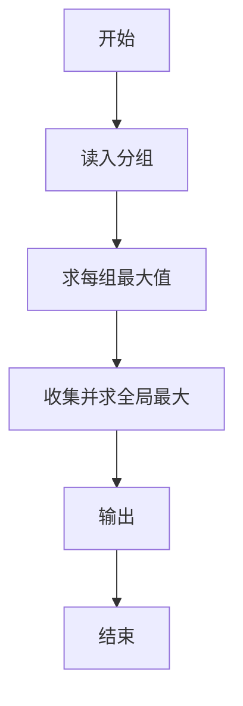
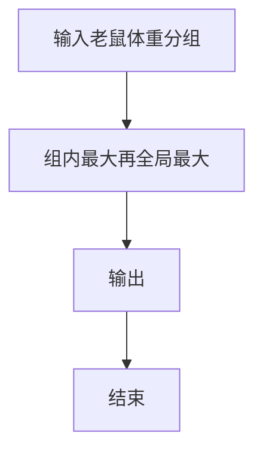

# 1107 老鼠爱大米

- **分值：** 20分

### 题目描述

翁恺老师曾经设计过一款 Java 挑战游戏，叫“老鼠爱大米”（或许因为他的外号叫“胖胖鼠”）。每个玩家用 Java 代码控制一只鼠，目标是抢吃尽可能多的大米让自己变成胖胖鼠，最胖的那只就是冠军。

因为游戏时间不能太长，我们把玩家分成 $N$ 组，每组 $M$ 只老鼠同场竞技，然后从 $N$ 个分组冠军中直接选出最胖的冠军胖胖鼠。现在就请你写个程序来得到冠军的体重。

### 输入格式：

输入在第一行中给出 2 个正整数：$N$（$\le 100$）为组数，$M$（$\le 10$）为每组玩家个数。随后 $N$ 行，每行给出一组玩家控制的 $M$ 只老鼠最后的体重，均为不超过 $10^4$ 的非负整数。数字间以空格分隔。

### 输出格式：

首先在第一行顺次输出各组冠军的体重，数字间以 1 个空格分隔，行首尾不得有多余空格。随后在第二行输出冠军胖胖鼠的体重。

### 输入样例：
```
3 5
62 53 88 72 81
12 31 9 0 2
91 42 39 6 48
```

### 输出样例：
```
88 31 91
91
```


### 解题思路

本题的核心是：逐组扫描老鼠体重，记录每组最大值，并在所有组冠军中取最大者。程序先读取题目输入，再按照上述规则完成数据处理，最后严格按照题目要求输出结果。实现时应优先根据题目约束选择合适的数据类型和数据结构，避免溢出或不必要的重复计算。

时间复杂度为 O(NM)；空间复杂度取决于输入规模，主要用于保存题目数据和中间结果。

### 代码流程说明

1. 读入分组数据。
2. 每组求最大体重。
3. 输出各组最大值与全局最大。

### 代码实现

```ruby
# 题目：1107-老鼠爱大米
# 实现原理：
# 本题的核心是：逐组扫描老鼠体重，记录每组最大值，并在所有组冠军中取最大者
# 时间复杂度为 O(NM)；空间复杂度取决于输入规模，主要用于保存题目数据和中间结果。
# 代码步骤：
# 1. 读取输入并初始化必要的数据结构。
# 2. 按题意完成核心计算，处理边界情况。
# 3. 按题目要求格式化并输出结果。
#
tokens = STDIN.read.split.map(&:to_i)
count, rounds = tokens.shift(2)
strongest = Array.new(count, 0)
count.times { |i| strongest[i] = tokens.shift(rounds).max }
puts strongest.join(" ")
puts strongest.max
```

### 代码流程图



### 解题流程图



### 常见易错点

- 每组至少一只。
- 输出顺序是各组最大值再总最大。
- 空组边界。
